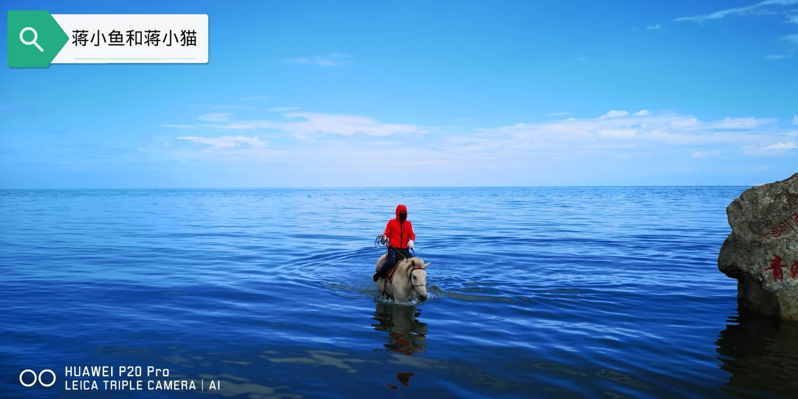
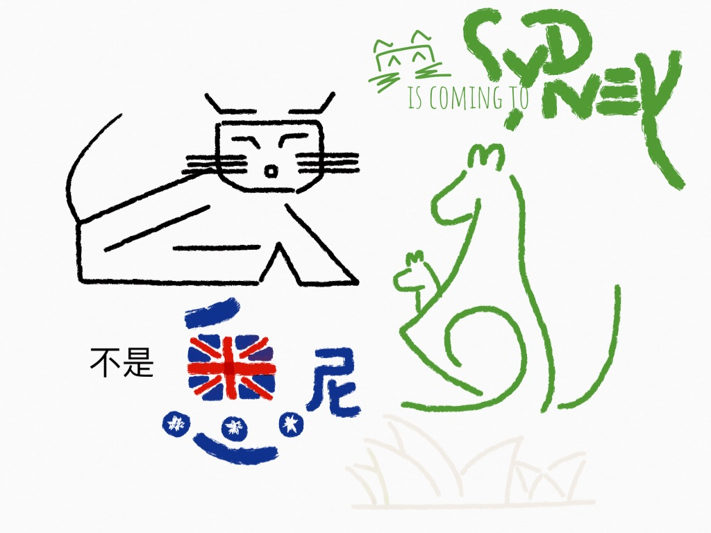
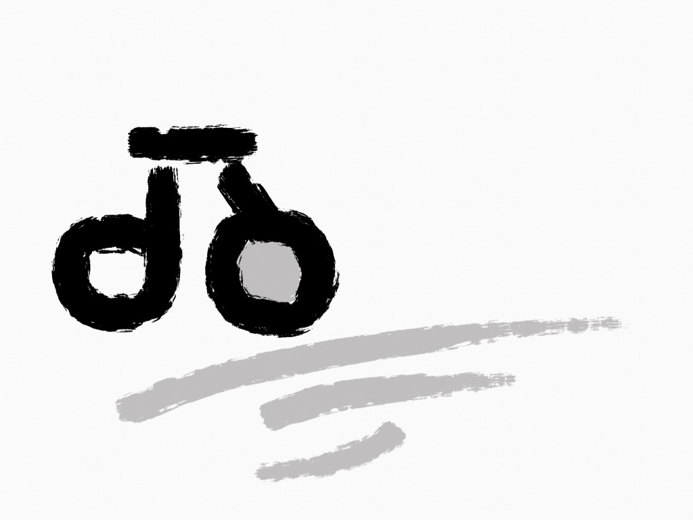

# 一路向西 ❶ 缘起

“……融四岁，能让梨。”

念到这里，蒋小猫停了下来，忍不住瞪了眼悠哉游哉的蒋小鱼，

> 孔融像你这么大的时候，……

话刚出口，他猛然想起，小时了了的孔融到了自己眼下这般年纪，早已是当时名士，不仅文章出色，而且政声卓著。他被黄巾军围攻，向刘备求救，刘备居然受宠若惊：“孔北海居然知道天下还有个刘备呢”，赶紧发兵解围，由此可见其地位尊崇。再看看自己，蒋小猫便发作不起来，生生将多余的话咽了回去，也不理会蒋小鱼的口头禅——“什么？”

四十岁是一道坎。蒋小猫站在坎上左顾右盼，左边是一丛丛的青蒜，右边是一垄垄的生姜，不知道自己算哪根葱？想想自己一事无成，便再也没有勇气以青年自居了。

中年的蒋小猫不油腻，依然是个清汤寡水的宅男。在他的眼里，小说、小食、小雨天，就是适意的人间。旅行这件事，费时、费力、又费钱，万不得已而为之。不过，自从蒋小猫把自行车当成通勤工具之后，远在四千里外的青海湖就成了他心中的圣地，虽然他连青浦和滴水湖都不曾骑行过。

有一个骑自行车的日本人写过一本关于旅行的书，叫做[《最危险的厕所和最美丽的星空》](http://product.dangdang.com/24186576.html)。蒋小猫虽然没有涉足过越南的草丛，没有踏入过乌兹别克斯坦的木造小屋，也没有在嗯嗯时与布基纳法索的野猪对峙过，但是书里描述的这种无法抵抗的恐怖力量，他并不陌生。不论是城镇还是乡村，至今不乏这等令人望而却步、但又必须造访的大小建筑，它们形态迥异而内涵相似，长年累月积攒着可怕的能量，随便掏空一个，都足以杀死贾瑞一百次。

蒋小猫算是吃得起苦的。话虽如此，在蒋小猫关于生活的所有不如意中，腌臜的厕所是最不堪忍受的，无论头顶的星空多么绚烂。于是他有充分的理由相信，旅行，就是跟自己过不去！何况……美丽的青海湖荡漾在海拔三千米的高原上，就算地球变暖，两极融溶，她依然在。所以，虽然念兹在兹，但凡还能拖延下去，蒋小猫是不会动身的。

阿Q素来觉得“革命党便是造反，造反便是与他为难”，凭他自己，是万万攒不起造反的念头，直到有一天，“来了一阵白盔白甲的革命党……叫道，阿Q！同去同去！于是一同去”。蒋小猫也在等待。可惜，不要说西部草原，就算东方绿洲，冬去春来，也没有等到哪个人真的愿意与他同去。

冥冥之中自有天意。也许是真的到了该动身的时候，机会自然而然地出现了。八月里，蒋小猫兀的听得有人跟他讲，

> 喂，西宁，一同去？

他同躺在土谷祠里的阿Q一样，“思想也迸跳起来”，于是像被踩了尾巴似地叫了起来，

> 同去同去！

就这么答应了？就这么答应了。要是用“不鸣则已，一鸣惊人”来形容，那未免太抬举他了，他不过是偶尔会作出一些出格的事罢了。

猫捉老鼠的时候，谁也搞不清楚他是玩耍，还是玩命？蒋小猫工作的时候，也搞不清楚自己是开心，还是操心。总之日复一日，他还从未起过停下来的念头。这回，他决定给自己放个长假。

蒋小猫从未请过这么长的假！  
蒋小猫从未走过这么远的路！  
蒋小猫，再会！  
蒋小猫，记得，你还要回来上班！

> 你要去悉尼？   
> 不是 XI-NI，是 XI-NING。

-------

[版本声明](../LICENSE/zh_cn.md) | [LICENSE](../LICENSE/en_us.md)