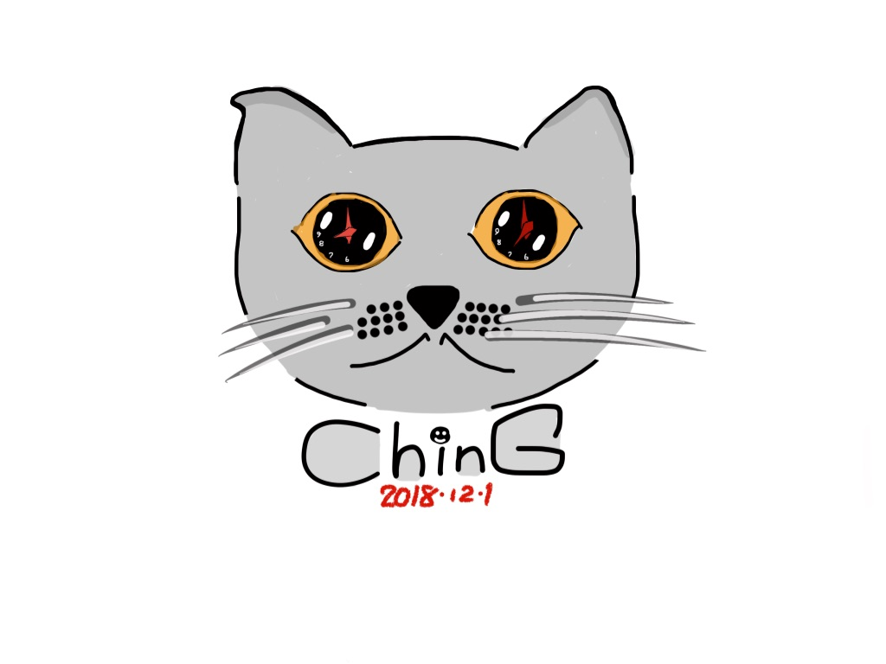
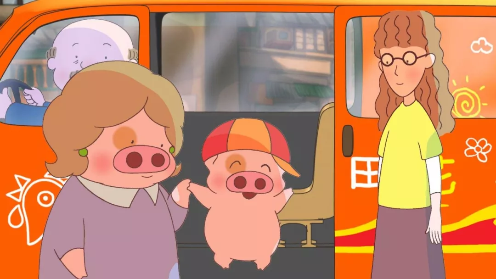
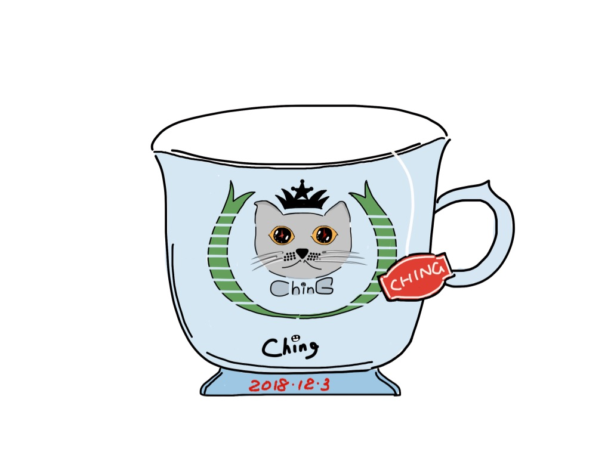

# 我讨厌你，迟钝的蒋小猫

__打架我不在行（hang），吵架我也不在行（hang）。__ 原因无它，对手总是不按套路来。

上溯到上个世纪八十年代，我曾经行（xing）过。

那会儿，我是中国少年先锋队 [小方城™](./middle-school.md) 小学大队的人，和大队长、大队副在一个班上。有一回去附近村子的同学家里玩，就在希望的田野上，一个比我高大半个脑袋的孩子挡住了去路，凶巴巴地冲我嚷嚷，“让开，信不信我揍你？” __你说什么，我没听错吧？新中国成立四十年了，咱俩素不相识，你个小恶霸居然想要恃强凌弱？__ 

我变得胆小懦弱，那都是长大以后的事。当时，我对于“和平与发展是当今世界的两大主题”的论断深信不疑，对于我国专政机关无与伦比的威慑力崇拜有加。戴着小队长的袖标，浑身散发着正义的味道，我比美国队长更加无畏。

喵——的，接班人只讲道理、不识时务，我就不让。这种态度自然不能解决问题。于是他轻描淡写地踢了我一脚，我也理直气壮地踢回他一脚。接着他又毫不犹豫地踢了我一脚，我再不加思索地踢回他一脚。就这么着，两个人在仅能立足的田埂上你一脚，我一脚，你来我往，怎么也得有几百个回合。僵持了个把时辰，天色渐晚，对方一声不吭地扭头走掉了，连一句 LOOK OUT 都没有留下。

在这顿莫名其妙的遭遇战中，我自觉是正义的一方。可是小孩子打架，哪有什么天时地利人和，“身大力不亏”才是四海皆准的真理。按照彼此的身材比例，如果对方 ALL IN，我只有被摁在地上吃土的份儿。然而不管怎么样，在武力挑衅之下没有委屈求全，侥幸全身而退，这一把应该算是我赢了吧？

我们居然很快又在小方城小学的操场上不期而遇，却各自收敛了眼神，彼此只当作不相识。嗣后，他没有再找我的麻烦，我也没有让社团替我出头。这一场狭路相逢，无论当时还是嗣后，双方都保持了极大的克制，自始至终都没有动手，一切都是按规矩办的。可惜的是， __打那以后，这么讲究的对手，这么一丝不苟的套路，我就再也没有遇到过。__

  
（图片截取自电影《我是谁》）  
当时的画风就是这样。我们过招的速度没有这么快，出腿的力道也没有这么刚，但是武术的形意是相通的。

人心不古，套路式微，那都是客观原因。__我后来在各种有形的和无形的交手中总是落入下风，主要的和主观的原因，却要归咎于我的迟钝。__

我们这个国家，历史悠悠不绝，文明源远流长，上下五千年，大伙儿什么没见过？知道世事并无绝对，一切皆有可能，所以讲究的是 __事不做绝，话不说死__。所谓迟钝，换一种稍微委婉一点的说法，就是听不懂言下之意。各种点到为止、甚至言不及义的含蓄，常常将我陷入深深的懊恼之中，不能自拔。

我乃是浸淫在本地的风土人情中泡发的，不是什么舶来的国际友人，当然知道女孩子说“侬是个好宁”是违心的安慰，老板娘说“您真会侃价”是刻意的讨好，这些就像 1+1=2 一样简单。只不过，并非所有的含蓄都这般明了。事到临头，关心则乱，我所看到的和听到的都变得一片混沌。有道是 __“只在此山中，云深不知处”__。

接下来，我要写三个故事，证明我的迟钝，绝非自谦。

## 一个灯的故事

__有一种话叫不言而喻。__ 明白人都应该懂，而我偏偏没整明白。

很久很久以前，有一次，我请一个颇有好感的女孩子看电影。看完电影，她说要去买点日用品。我陪她去了超市，她买了一个台灯，我送她和她的台灯回家，接着我打道回府。整个过程就像把大象放进冰箱一样简单明了，没有丝毫反常。

那阵子我借住在 L 兄的宿舍，他把平时用来堆放杂物的上铺给我腾了出来，表明我的地位略高于锅碗瓢盆。当天正值寒假，宿舍尚未通电，我是像夜行贼一样潜进楼，摸黑爬上铺的。这个细节，证明本故事著录有序，并非杜撰。

隔了几天，她在 MSN 上问我，“知道那天晚上，为什么没让你送我上楼吗？”

可能有人不知道 MSN 是什么？我们提到 MSN 的时候，实际上指的是 MSN Messenger，这是一个古老的即时通讯解决方案，从美国发源，在中国落幕。我们现在依然在用的 Skype，和他有些渊源，算是继承了一部分财产的异父异母兄弟。这个细节，证明本故事的的确确发生在很久很久以前。

可是这算什么问题呢？在本国语境里，地无分南北，“不上去坐会儿吗？”在哪儿都是一句客套话，通常和“你可以走了，别磨蹭，麻溜地！”是一个意思。照理，情节发展到此处，双方是有必要虚与委蛇地客套一下。不过，我是谁啊？您要是真这么问，我可能就真不客气了。寒夜凛凛，孤男寡女，成何体统？所以，于你呢，省了这一套也在情理之中。于我呢，送到楼下，看你进楼、上楼，等你进门、关门，明知治安甚靖，还是虚伪地在电话里确认过您没在楼道里被歹徒劫持，也算仁至义尽。再说，这旮旯并非繁华闹市，不容易打到车，我还让出租车在门口候着呢。拖太久，万一司机不耐烦跑了，我可就得吹着冷风走十几里地才能回去。

不过，既然人家这么问了，其中必有蹊跷。自我反省与自我批评这件事，我还是善长的。古老的即时通讯工具的好处就在这里：它可以很即时，也可以很从容，容我慢慢地想。我搜肠刮肚了一番，下了以诚相待的决心，然后小心翼翼地开讲。

> 是不是我在电影院门口跟票贩子讨价还价，太不体面，让您觉着难堪了？

那个家伙缠着我，非要将他手里的兑换券按面值卖给我，让我拿兑换券去窗口换票，一边叨叨，“帮帮忙呗，行个方便”。

也不知是怎样的鬼使神差，这句话勾起了我遥远的回忆。当初还在 小方城™ 混日子的时候，有一回赶上几个流浪艺人在街心花园表演，我也兴冲冲地上去围观。哇噻，空掌劈砖，砾屑横飞，厉害厉害！艾玛，白刃穿臂，鲜血淋漓，刺激刺激！正在兴头上，冷不丁地一个大圆盘怼在我面前，上面散落着钢崩和纸钞若干，一尺之内，一个脸色阴沉的小个子用刀把敲打着圆盘，盯住我说，“帮不帮忙？”

我错愕了，仿佛预感到如果不顺从他的要求，那么下一个就该轮到我上场表演了。自忖没有空手入白刃的能耐，那一瞬间，我丧失了美国队长的勇气，乖乖地从兜里掏出了仅有的五毛钱，心有不甘地丢在他在圆盘上。五毛啊，知不知道，整整五毛啊！等我略略回过神来，他已经踅到另一边去了。我气极了，自己明明是来帮个人场的，没想到却帮了钱场。这哪里是流浪艺人？分明是浪人！

这么多年过去了，还给我来这套？！

压抑多年的怨气让我失去了理智，蹭地一下火就上来了。方便个鬼啊，当我是面呢！是不是训练有素的黄牛？懂不懂便宜均沾的道理？是不是摆明了看我带着个女孩子，欺负我抹不开面子跟他讲价？我当然不能纵容这种与猫谋皮的行为。别拉我，这不是几块钱的事，我今天就是要和他论一论这个道理。一番唇枪舌剑之后，自然是两败俱伤：他没行成方便，我也没占到便宜。

圣人说过，“夫唯不争，天下莫能与之争”。这件事，是我错了！

__呸，才不是！__

> 那是因为我打车的时候，挑了一块二的夏利，没选一块六的富康，让您坐得不自在了？

自从十块钱一口价的黄色大发退隐后，某地的出租车市场流行高低搭配，天津夏利每公里收费一块二毛，神龙富康每公里收费一块六毛。同行相轻，开富康的顶瞧不起开夏利的，开夏利的也不待见开富康的。事实上这两货虽然个头略有差别，长相大差不差，一律是红色，一律是两厢，双车傍地走，安能辨它是贵贱？但是放心，我能！

> 看见夏利司机居然戴着白手套，  
> 富康司机不服气了，  
> “嗬，开个破夏利还穿着白袜子！”

我做兼职的时候，时薪并不算高，不过老板注重效率，希望我们不要把时间白白浪费在路上，慷慨地承诺可以报销出租车费。恭敬不如从命。过了几个月，管财务的大姐不乐意了：“你们这些小孩，打车也就算了，别老打一块六的呀。”大姐说得在理。在富康司机们无数白眼的滋养之下，我渐渐练就了一副火眼金睛，远远地就可以在车流中锁定夏利。

然而工作是工作，生活是生活，我不该把工作中那一套搬到生活中来。

圣人还说过，“唯小人与女子的钱不能省”，太对了。这件事，是我错了！

__嗯，也不对！__

我实在没有办法更坦诚了，那就请多指教吧。真正的原因居然是，买台灯的时候我袖手旁观，没有主动付账，让她觉得见外了。

我的天，有花堪折直须折，有话当说直须说。为什么不当场把家伙亮出来，我难道胆敢不交钱吗，干嘛要事后开冷枪呢？为什么您把那英吉利的法兰西的西洋话说得这么顺溜，思维方式却依然是根深蒂固的东方式？为什么呢？

我得想办法补救一下。一个台灯当然不在话下，莫说一个，就算十个，一百个，一千个，一万个，也买了。于是满怀希冀地问：“那你，还需要一个台灯吗？”

__哼，不需要！__

于是就没有然后了。从那以后，我们也没有再见过，我感到很遗憾。

（反面还有）

## 一块表的故事

__有一种事叫只可意会。__ 天知地知，你知我知，笑而不语皆君子，我却非要把话说出来。

这个故事同样发生在很久很久以前。好在，它没有因为年代久远而变得冗长。故事有点忧伤，但是很短，就两句话：

> 是真的吗？  
> 千真万确！

我刚刚开始领工资的时候，想给自己添置一块自动手表，这种流连在动静之间的机械结构，让我极为迷恋。当时的某宝还是冒险家的乐园，我在上面相中了一款漂亮的浪琴表，标价三百元。我没看错，就是三百，整的。

我的外公曾经珍藏着一块半个世纪前的摩凡陀表，那是比他的已是老古董的德国自行车更加珍贵的宝贝。许多次他拿在手里，一边摩挲，一边感叹：“这可是好东西，可惜就是不走字了。”他那样郑重其事的态度，让我在以后的很长时间里，都以为摩凡陀是那种鲜为人知的顶级货色，它那拗口的名字，恰如百达翡丽和江诗丹顿一样，象征着高贵的身份和低调的奢华。

其实浪琴也是正儿八经的瑞士品牌，档次与摩凡陀相比并不逊色，一对儿都是瑞士国际钟表协会认可的二货。就算是在十几年前，三百元，对于一块浪琴表来说，仍然是一个低到令人咋舌的价格，但凡不是天真到不可救药的人，都不会当真。

然而世界上就是有这么一种人，他们的天真与善良并不沾边，却比小天还要单纯。

  
那一刻我一定是被梦想窒息，大脑缺氧了，才会问出那种问题。

我已然陶醉在那环环相扣的曼妙身姿之中，非常、非常、非常愿意相信，这一切都是真的：手表是真的，价格也是真的。我抿了抿嘴，鼓足勇气，向店家提出了那个愚蠢至极的问题，而对方的答复无疑是一种明目张胆的羞辱——无论他认为我是明知故问，还是蒙在鼓里。

至今回忆起来，我仍然对自己当初的天真耿耿于怀。然而，当时明明正对羞辱，我却丝毫不以为忤。这笔交易最终并没有达成，并不是因为我怀疑商人的真诚，而是被一条朴素的法则左右了我的选择：  
  
> 我有经验，
> 太好的事情轮不到我。  
>（台词摘自《还珠格格》）

我知道，对于这段经历，大概不会有人同情我。世上有些逻辑就是这么奇怪：说了假话的人往往不会受到谴责，信以为真的人却常常遭到嘲弄。

我后来多花了一百，购得一块身世清白的海鸥手表。她稳重厚朴，走时精确，我断断续续佩戴至今。从那之后，我就断了对奢华手表的念想。

（明日再来）

##  一杯茶的故事

有一种人叫不可理喻。我就是那种人。

看我，看我的眼睛，你看到了什么？时间，对不对？这是一个与时间有关的故事。

我非常喜爱的漫画 麦兜 系列中，有一位其貌不扬却心地善良的 Miss Chan。在春田花花幼稚园，她是除校长外唯一的老师，所以无论是教英文，发点心，还是给麦兜把尿以及清洗厕所，她都要亲力亲为，偶尔还要为揭不开锅的学校垫付水电费。在麦兜的心里，她又是除妈妈外唯一的女性，麦兜走出家门，走出幼稚园，见到的每一位女性，永远都是 Miss Chan 的模样。

> __我个名叫麦兜兜  
> 我老师叫 Miss Chan Chan__  
> 歌词摘自《麦兜与鸡》。图片取自 麦兜 电影，左起：  
> 校长（也许只是长得像校长的司机），妈妈，麦兜，Miss Chan

我也曾经交往过一位良师益友——Mr. Chan。他用特别的方式给我上过一课，让我懂得：有的机会，错过了就是错过了，再怎么努力也得不到。你以为我会因此受益终生？不存在的，这个教训对我后来的人生一点儿用也没有，唯一的用处是让我永远记住了 Mr. Chan。

这个故事仍然发生在很久很久以前，比前面两个故事还要更远一点，也第一个故事更长一些。我承认，尽是些陈芝麻烂谷子的事儿，因为太近的事我都记不清楚了。

故事的地点是在咖啡馆。标题里的“一杯茶”其实是咖啡，并且不是一杯而是两杯，这么写纯粹是为了追求对仗的工整。不过，的确有人清心寡欲，在茶馆里喝茶，在咖啡馆里也喜欢喝茶，不见得是因为多么钟爱茶的清雅，只是不待见咖啡的浓郁。所以，这个标题算是源于生活，并不离谱。

故事的时间是在我即将被从象牙塔中扫地出门，沦入风尘的前夕。

故事的人物当然就是我和 Mr. Chan。Mr. Chan 姓陈，这好像是废话，但并不是，因为恰好摩凡陀和德国自行车也姓陈。

陈先生是货真价实的青年才俊，不仅学识渊博，说话好听，而且西装革履，风度翩翩，模样像他口袋里的美元一样好看。我其实已经无法想起陈先生究竟长什么样，但在回忆的时候，总是不由自主地把他想象成某个电影明星的模样，并且坚信他本人的倜傥有过之而无不及。

彼时，陈先生从美利坚学成归国，和他的西式派头一并带回来的，还有金额可观的软件订单。他正打算拉起一支队伍，将本地浮躁青年的无处挥霍的聪明劲儿，浓缩成一行行的代码，打包贩售到大洋彼岸去。在金融危机之前，这无疑是一桩稳赚不赔的好生意。

故事的起因就是因为陈先生在学校 BBS 上发布了一条招聘信息，恰好被我看到。在帖子里，未来的公司像极了宅男的世外桃源：敞亮的 LOFT，舒适的沙发，前卫的吧台，还有各色游戏设施和随手可取的美食……看到这副光景，习惯了格子间的小鸡仔儿，忍不住欢呼着，扑楞着翅膀想要飞起来。不得不说，陈先生不仅精通商务，而且深谙人性，现今 IT 行业流行的办公环境，和他当初所描述的样子别无二致。只不过后来的事实表明，盲目发帖是一种高风险的操作，一不小心就会引发恩怨。

陈先生对我投去的简历很有兴趣，决定和我见一面，接头的地点约在某个 CBD 的星巴克，时间是某一天的上午十点。没问题，这很陈式。

意外接连发生了。到了约定的那一天，我在迷迷糊糊中醒来时，已是十点。这个时间，我应该衣冠整齐地坐在咖啡馆里，和陈先生相谈甚欢才对，为什么会半裸身体坐在床上发楞？不到一秒钟，我就清醒了，果断地抄起手机，拨通了陈先生的电话，不容分说，请他务必等我半小时。这是我第一次拨通陈先生的电话，慌乱之余，都未及领略他富有说服力的男中音。

我花一分钟穿戴，花一分钟下楼，花八分钟骑车赶到校门口，毫不迟疑拦下了第一辆出租车，顺手一指，“往前，走！”

那天的交通状况意外地好，我却有一种不详的预感。一刻钟后，我终于确认，方向反了！也就是说，在陈先生翘首以盼——我姑且这么想象——的期间，我和他非但没有越来越近，反而渐行渐远。此时再回头，已经太迟了。我有气无力地让司机靠边停车，呆呆地在路边站了会儿，然后艰难地爬上了天桥。迎着凛冽的冷风，沿着滚滚的车流，我一边望向陈先生的方向，一边掏出手机，再次拨通了他的电话。我向陈先生解释，我没有办法及时赶到，这绝不是故意的怠慢，而是因为我犯了一个全天下路盲都会犯的错误。身为一个有自知之明的路盲，我心知这个解释很难让正常人接受，然而陈先生平静地接受了。他淡淡地讲：“我接下来还有安排，那我们以后有机会再约。”

绅士不打诳语，你说再约，我就信了。过了一周陈先生依然杳无音信，我于是给他打了第三个电话。

第二次接头就这样顺利地敲定了，地点依然在那家星巴克，时间是下午两点。这一回我决心痛改前非，提前一个小时便抵达了咖啡馆。在这种场合，未来的雇主请未来的雇员喝上一杯，那是天经地义的。可惜我来得太早，此刻形单影只，只好自己掏腰包，点了一杯最便宜的美式咖啡。美式真的很苦，尤其是那一杯，喝得出心痛的感觉。我塌陷在窗边的沙发上，享受着宽大的落地玻璃过滤后的阳光，一边小心地啃着纸杯，一边幻想起未来的纸醉金迷，心情大好，便觉得一切都是值得的。

世纪初的星巴克还不像现在这么喧闹，客人很少，很安静，是个陶冶情操的好地方。陈先生还没到的时候，有个姑娘走过来怯生生地问我，“请问，您是来见网友的吗？”我想了想，我和陈先生是在 BBS 上相识的，说是网友也没错啊。要是平时，我大概会刻薄地揶揄几句：没错，我等的人，她叫夏利。但是那天非同寻常，我在等陈先生啊！我不愿意惹事生非，便极力模仿陈先生的口吻，淡淡地说：“不是。”她的样子，好像是松了口气？什么意思！真没意思！

陈先生推门进来的样子潇洒极了，简直可以用熠熠生辉来形容。整个咖啡馆里只有我一个孤独的单身男人，他轻盈地穿越桌椅板凳的丛林，径直向我走来。握住他温绵的右手，我感觉自己的前途一片光明。

那天我和陈先生果然谈得非常愉快，尤为关键的是，谈话的最后，我们谈到了钱。太白有云：
> 廉夫唯重义，骏马不劳鞭。  
> 人生贵相知，何必金与钱？  
>（李白，《赠友人三首》）

君子重义而轻利，钱从来都不是一个原则性的问题。所以谈到钱，其实是一个非常积极的信号，意味着谈判进入了最后的的阶段，双方已经解决了所有实质性问题，无限接近于达成协议。下至买卖，上至嫁娶，莫不如此。

陈先生问我，想要多少钱？我比划了一下说，这个数。这个数不算小，按当时的物价水平，够我每天吃一顿豪华海鲜自助，还能略有盈余。这个数也不算过分贪心，后来我的第一份正式工作合同所约定的薪资，还略高于此数。

陈先生又问我，为什么要这些钱？我解释说：我准备买一个房子，niet，不是 house，我还没那么穷奢极侈。蜗居足矣，apartment，懂？我算过了，有了这笔收入，我就不用为房贷发愁了。吃饭的问题就不用操心了，您那里什么都有，不是么？

听到这里，陈先生显然是被我的憧憬打动了，他有点动容地耸了耸肩，表示将认真地考虑我的要求。

杯中的咖啡一饮而尽，我们起身就此别过。临走的时候，我留意到刚才那位姑娘正和一个男子相对而坐。那家伙分明比我更丑，大约就是她心心念念的网友罢？她游移的眼神，波光潋艳而层次分明，无奈的给了网友，怨毒的给了我，艳羡的全部给了陈先生。我报之以幸灾乐祸的微笑，心情愈加晴好。

我忘了问陈先生，他打算考虑多久？又过了一周，我终于又按捺不住了。在晃晃悠悠的地铁上，我第四次拨通了陈先生的电话。也许是车厢的嘈杂影响了我们的交流，陈先生的声音似乎有点不那么淡定和自然，这但并没有妨碍我们第三次约定接头的时间和地点。这将是我们的第二次见面，也是迄今为止的最后一次。

后来，一个从事人力资源工作的朋友深表同情地对我讲，像这种情况，“其实一般都是不再联系了”。说直接点，我压根儿就不应该打第四通电话，我和陈先生也压根儿也不应该有第二次见面。这一切都是多余的！是啊，在我们含蓄的日常中，沉默，不就被认为是最委婉、最体面、最不施伤害的拒绝吗？这么浅显的道理，我怎么就不能接受呢！偏偏要把留有余地的势均力敌，鼓捣成不可收拾的一败涂地。

我和陈先生终究还是又见了一面，还是下午两点，还是在星巴克。陈先生不是一个人，他是和他的合伙人一起出现的。在我期待的目光中，他娓娓道来，非常清楚地表达了拒绝的意思：我很好，但是这样一个结果，全都是因为我的错。

陈先生说，在我的第一次失约之后，他们就已经觅得了合适的人选。之所以又答应和我见面，是因为回国以来，从未见过像我这样坦（hou）率（yan）执（wu）著（chi）之人，令他十分好奇。为了表达对等的尊重和诚意，他认为有必要再见一面，然后当面 reject 我。

听完陈先生的话，我并没有感到失望或失落，反而如释重负，和陈先生相视而笑。这是一场完美的报复，而我也终于不必再为当初的失约而内疚了。

这个故事发生在深秋。

三个月后，陈先生给我发过一封恭贺新春的邮件，行文情真意切，并非群发的那种，而我则礼貌地给予了回复。当然，也可能是我记错了，情真意切的是我，而礼貌回复的是他。总之，之后，我们就真的不再联系了。

（THE END）

-------
“我”是蒋小猫，蒋小猫却不是我。以上全是胡言乱语，请勿对号入座。  
[版本声明](../LICENSE/zh_cn.md) | [LICENSE](../LICENSE/en_us.md)