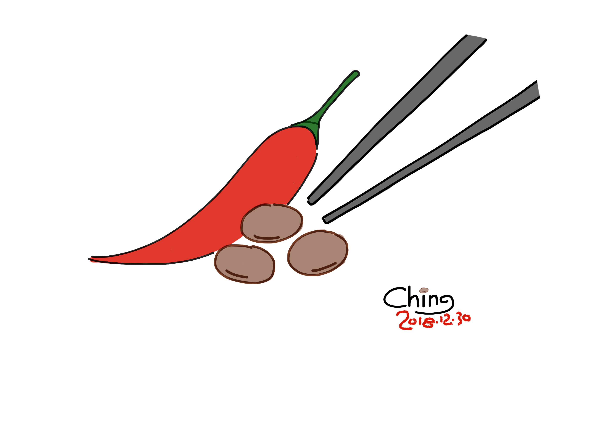
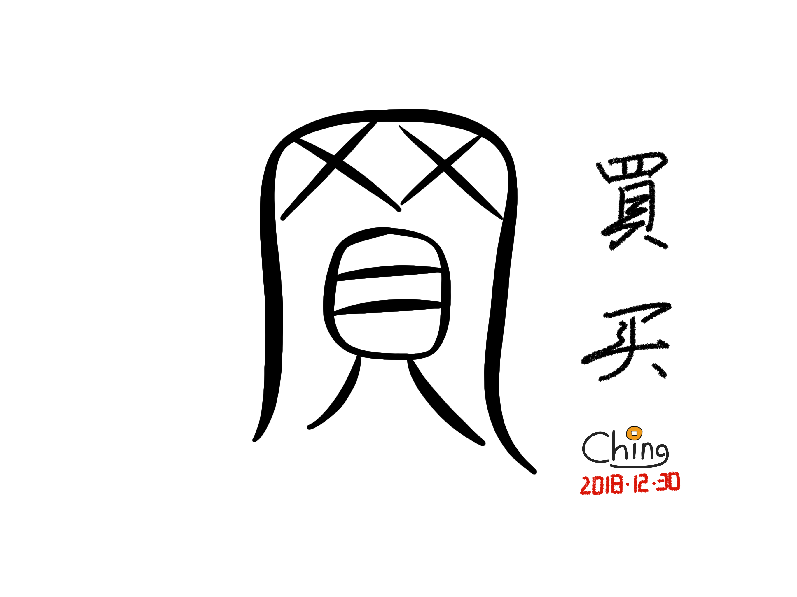
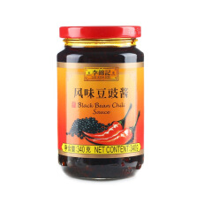

#	如果不吃辣酱豆，我还能吃什么？

我一直觉得，写作和炒菜是相通的。

天才的厨师，不怎么挑剔原料，信手拈来，一道开水白菜也可以在国宴中扮演主角。上好的厨师，追求上等的取材，胸有成竹，什么样的山珍海味都保证物尽其用。中游的厨师，讲究菜谱的传承，按图索骥，无论三牲五鼎还是八盘八碗都摆得出来。下等的厨师，眼观鼻，鼻观口，口观心，心里全是油盐酱醋糖，至于做的是鲍鱼还是豆腐，那反而不是什么要紧的事儿。至于像我这样不入流的，只知道“咸了放糖，干了加水”，在点火的那一刻，完全不晓得一会儿端出去的会是什么，随机应变吧。虽然做菜不行，但是我也有我的长处，我把锅铲碗盘洗得特别干净。

我写作和炒菜一样没有章法，所以，也请不要见怪。这不是檄文，也不是软文，这只是一篇有味道的杂文。

近几天，一篇题为《百亿保健帝国权健，和它阴影下的中国家庭》的报道，引起了广泛的共鸣。如果你已看到此处，有闲如斯，那么这种社会热点的来龙去脉想必也已了然。丁香医生的这篇檄文，矛头直指直销行业巨头权健。在 Direct Selling News 最新的 DSN Global 100 榜单上，Quanjian 以7.86亿美元的2017年度销售收入（revenue）排在全球第29名，而在一些国内网站上登载的榜单中，它的销售规模数倍于此。名列前茅的权健一时为千夫所指，连累上下左右的直销公司也收到了许多关注和问候。

交易本是互通有无、增益彼此的好事。两千多年前，司马迁大人在《史记·货殖列传》就说过：“故待农而食之，虞而出之，工而成之，商而通之。此宁有政教发征期会哉？”意思是，不管第一产业、第二产业，还是第三产业，都是自然而然、天经地义的事。生活在社会化大生产的时代，承认交易的价值对于理性人来说，不是什么难事。

然而两千多年来，儒家文化的传统是重农抑商，无论坐贾还是行商，买卖人在历史上不怎么受主流社会的待见。“買”是个会意字，本议就是捞钱，兼有买卖两重意思。后来加了个专业人“士”的帽子，造了个“賣”字，将买和卖区分开来。买的不如卖得精，业余的买家面对职业的卖家，自然是没什么胜算，那种看不惯他、又干不掉他、偶尔还有求于他的不甘心，简直折磨人。更何况直销这种商业模式，不像小白兔那么自觉，多少有点专吃窝边草的嫌疑。

上世纪九十年代中期，Amway——来自美利坚的直销行业先行者——忽如一夜春风来，吹进了神州大地的千家万户。至今，安利的销售规模不仅在全球首屈一指，在国内也常年占据三甲。Anyway，一家公司的名字，能在我们的日常用语中被作为动词使用而毫无违和感的，除了百度和Google，在我的印象中，就只有安利！如此深入人心，该作何评价？那就仁者见仁了。

直销以减少流通环节而著称，按照平常的认知，其产品应该与价廉物美划等号。然而，知名的直销大佬几乎都在售卖（超）高毛利润——有些简直是暴利——的产品，从日用化工产品，到化妆品，再到保健品。是非如此不足以覆盖其独特的销售成本，还是另有原因？值得深思。

我不喜欢直销。一个不入流的厨师，当然不能代表广大人民群众，但是这件事上与我持同样态度的，相信不在少数。在这些榜单中，无限极这家公司格外引起了我的注意。不是因为体量巨大，也不是因为名字好听，而是因为它和李锦记的深厚渊源。

说到这里，我要自觉地给大家安利一下李锦记风味豆豉酱。很多人奉老干妈为生命中不可或缺的辣味儿，我不知道他们最爱的是她家的谁？但在我这里，LEE KUM KEE Black Bean Chili Sauce 才是！

  
LKK BBCS，我的最爱！红金渐变底色的瓶贴，别有一种尊贵的韵味。

我爱吃辣，并不是从李锦记开始的。但在第一次尝试了 LKK BBCS 的味道之后，我就深信，它将是我生命中钟爱的最后一款辣酱。至今已逾廿年，未改初衷。

这货价格不菲，几乎要比老干妈的同类产品贵上一倍。起初我把酱当馅儿，是因为抠，结果发现并不省钱：就着二两一个的大白馒头，我蹲在马路牙子上一会会儿能耗掉半瓶，抵得上在学校食堂里吃牛肉拉面的开销。可我没有怨言。

现在，家里的餐边柜中常年排放着四、五瓶李锦记风味豆豉酱。厨房里的盐偶尔会断档，而 LKK BBCS 不会。每当食之无味的时候，我就默默地转身取出一瓶，拧开瓶盖，挖出一勺，堆在饭上，以此表达对于不合口味的菜肴的无声的抗议。后来，蒋小鱼也学会了这一招，假如桌上没有她喜欢吃的菜，她就会小声嚅嗫：我可以吃辣酱豆吗？

爱屋及乌，从我插手厨房的采购事务开始，不止是 LKK BBCS 源源不断地进货，其他调味品——生抽以及老抽，麻油以及蚝油，海鲜酱以及沙茶酱——但凡李锦记有供给的，都渐渐换成了它家的。在我的认知里，BBCS 之于 LKK，如同房车业务之于劳斯莱斯，虽然奢华却并不赚钱，乃是服务于维系品牌美誉度之需。

劳斯莱斯真正赚大钱的产品是航空发动机，这么高大上的玩意儿，自然与豪华房车相得益彰。但假如有一天劳斯莱斯开始雇人到农村去，到田野去，去推销无所不能、一买永逸的拖拉机，那些坐在 Phantom 或者 Cullinan 里的车主们会作何感想呢？

起初有人将无限极和李锦记扯在一起，我是将信将疑的。后来，我找到无限极官方网站，我打开“公司介绍”，我看到它公然标榜：
> 无限极（中国）有限公司﹝简称“无限极（中国）”﹞是李锦记健康产品集团旗下成员，……
> 来源：http://www.infinitus.com.cn/zxcj2.0/zjwxj/gsjs/jtjs/

我的内心是失落的。我已经无心再去作进一步的考证：很多时候，白纸黑字未必真；但也有的时候，无人证伪已坐实。

可是，难道，我从此就不吃辣酱豆了吗？

前面的例子举得不好。兰博基尼就是靠拖拉机起家的，并不妨碍它成为世界顶级的超级跑车品牌。谋事在人，人各有志，每一个行业的存在自有其独特的逻辑，也有其生存的法则。我情愿与不情愿，都只是我自己的事。

[版权声明](../LICENSE/zh_cn.md) | [LICENSE](../LICENSE/en_us.md)

[参数资料]
1. https://www.directsellingnews.com/dsn-announces-the-2018-global-100/