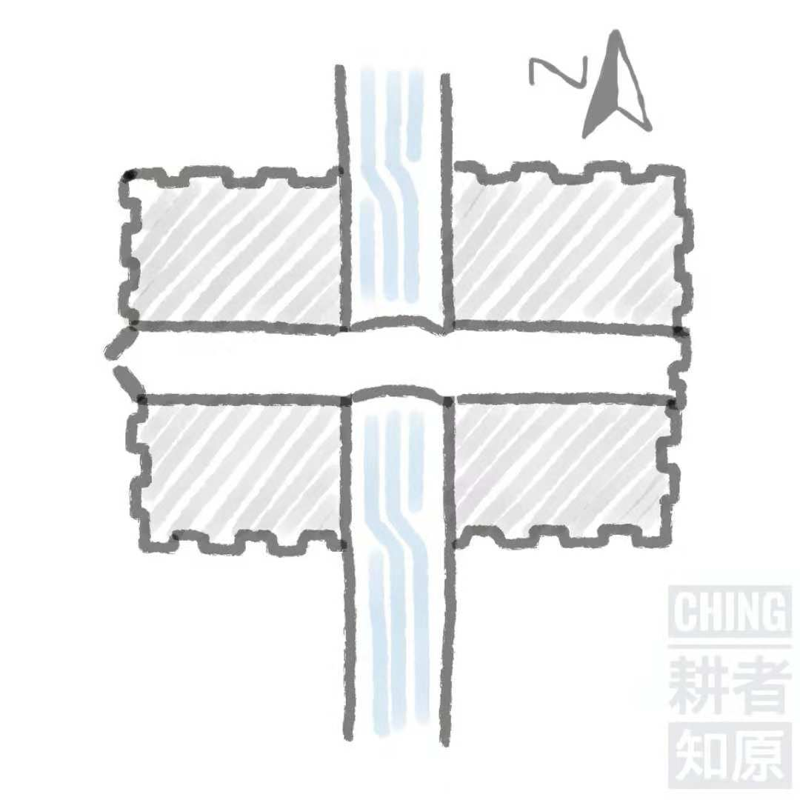

# 洞穴里的记忆捕手 之 猫的小方城中学（上）

有人对我说，他的记性很差，六月以远的事便记不清楚了。什么意思？我用力想了想，自己没有欠他的账，所以他不是在暗示我还钱。我又更用力地想了想，他也没有欠我的钱，所以并不是在文艺地赖账。容我再想想，等一等，我们前面在聊什么，怎么就说到过去了？

我想，我的记性一定是极差的，忘性一定是极大的。但是这点又很难证实：记忆如此空虚，究竟是因为遗忘的太多，抑或是经历的太少？几十载风土人情，在我的脑子里，仿佛是远古时代遗留下来的岩画，一幕幕支离破碎，似曾相识又十分抽象。

远西大国活着的先知——麝香先生——曾经说过：人类只有十亿分之一的运气，生活在一个真实而非虚拟的世界里。

  
*图片系合成，素材取自 www.independent.co.uk 网站视频*

你们难道从来没有担忧过，自己的过去是否真的存在？假如过去压根不存在，那么现在也相当值得怀疑，麝香先生的话，就很可能是真的。一个显而易见的证据是，我们，号称拥有高等智慧的顶级灵长类生物，却总是会许多次跌落同一个陷阱，一犯再犯，明知故犯，永远也无法纠正。这难道不就是程序中的 BUG 吗？如果麝香先生的十亿分之一奇迹没有降临，我的宿主大概是一台速度很慢，内存很小，硬盘不太可靠的老旧计算机。他们一定是在实施迁移之后，忘了删除旧的数据，才留下了现在的“我”。

有时，我独自坐在幽暗不知深浅的记忆岩洞里，摩挲着石壁上的凹凸，试图想起点什么。

二十多年前，我应该是在东部发达地区的相对欠发达县域的曾经发达小镇的中学读书。

在上世纪水运尚发达的年代，小镇曾是运河交通要地，虽然没有“门泊东吴万里船”的张扬，毕竟身在鱼米之乡，往来客船不息，工商业也颇有些声色。后来汽车替代了船舶，河道渐渐荒废了，小镇也日益平庸。随之而来的是填河筑路，于是“上塘”、“下塘”成了让我这一辈小孩子们费思量的街名。路是有了，却只有两路公共汽车，一路驶向本县的县城，一路驶向邻县的县城。白天每隔半小时，也许是一小时，便各有一班分别从南方和北方相向开来，在同一个拐点离开省道后，沿着同一条支路向西二里抵达小镇，再沿着方圆不足一里的镇中心兜一圈，放下一拨人，载上另一拨人，复又向两个县城的方向驶去。这样的流量，比起我的公众号当然好得太多，但要维系小镇往昔的热闹，却又差得太远。于是出了本县和邻县，便鲜有人听说过小镇的名字，更不要说省外同胞了。

当其时，小镇人口将将过万，尚有三年制初级中学和六年制中学各一所，算是落日余晖。本镇及周边十二至十八岁的青年才俊，大多罗致其中。两所中学，一所在镇西头，规规矩矩地给自己取名“红光”。另一所在镇东头，理所当然地以正位凝命，直将小镇的名字拿来用了，那便是我的中学。为尊者讳，姑且称之为 __小方城中学__。小镇的名字其实比“小方城”更加滑稽，虽然我们早已司空见惯，但若是一个外乡人站在学校门口，伴随着映入眼帘的学校招牌，扑面而来的想必是一股浓浓的、与“栓柱和铁蛋”无二的乡土气息。我对此倒没有不满，毕竟全国各地的“红光中学”不知凡几，而我的中学的名字独一无二。

在正对校门的教学楼的立面上，贴着八个烫金大字：勤奋、朴实、团结、进取，是为校训。许多年过去了，我连当时一家人蜗居的公寓楼幢都已印象模糊，却对这则低调无华的校训牢记如初，那是因为在我的记忆岩洞里，小方城中学始终是一个如乌托邦一般神奇的存在。

彼时学校占地方圆半里。此地乃是江南，道法自然，并不以横平竖直为美，然而小方城中学的校园格局却相当方正，俯瞰下去，呈现出一个工整的 __申__ 字：一条不宽不窄的运河，贯穿南北，而校内另有一条略窄于运河的水泥路，横跨东西。

喏，大概就是这个样子的。

在东方大国，文人好水是有传统的。老子说，“上善若水”。孔子说，“智者乐水”。就连风水一行，也传承着“未看山时先看水”的理念。自古以来，无论安营扎寨，还是修城造府，可以不依山，不能不傍水，实在没有水，挖一个也算。一旦被困在无水之山，骁勇如关羽为了保全嫂嫂，也不得不低头，而纸上谈兵的马谡连自己也保不住，只有一死。水系关乎是非成败，奇怪的是，有名的校园里的有名的水，却常常是佚名的，不知何为？譬如，清华园中的荷塘，便唤作荷塘，燕园里的未名湖，便唤作未名湖。这就像把黄狗叫做阿黄，把黑猫叫做小黑，只能勉强当作一个指代，都算不得是个正儿八经的名字。作为 __申__ 字那一竖的运河，也是这般低调，当初我并不知道她的名字，后来也没有人告诉过我。与荷塘和未名湖不同的是，运河不仅没有名字，也没有故事，偶尔舟船经过，从哪里来，往何处去，都与校园里的我们没有半毛钱的关系。中考结束之后，一摞摞印刷的或手写的字纸，被调皮的同学倾倒在运河里，无风的河面一时泛白，宛如潮水。不知运河读懂否？不过这些都不是我干的。

镇上虽然有两所中学，小方城中学却只在西侧留有一个大门，出入都须由此，其余皆有高墙，墙外多是旷野。如果不慎在校外与社会青年结下梁子，那便大大的不妙。那个年月的校门口，衣着光鲜的大哥们倚着豪车守候女学生的事，并没有，袒胸露乳的混混们三五成群围堵男学生的事，是有的。放学别走？那也不是办法。幸好校训并不总是被辜负，同学们还比较 __团结__，有时提前得了风声，便将惹了事的围在中间挤出门去，乌泱泱的一团，对方也只能虚张声势地恐吓一番作罢。打人未必是真的打人，吓人那可是真的吓人。好在社会发达，治安日靖，没几年这样的事就几乎不再发生了。

这个唯一的大门宽近二丈，以外是街道，以内便是校园的主路——在我的记忆里，它与运河一样无名。主路与门同宽，伸到校训下面向右转紧接着再向左转，然后笔直向东。路的尽头没有门，而是一座老旧的坑道式厕所。酷爱胡思乱想如我，居然从来没有联想过这样的安排，其中有什么深刻的寓意？直到后来看了《肖申克的救赎》，若有所思。

沿着主路，学校隐隐然一分为二，南部是初中，北部是高中。午间，初中的同学要跨过主路，去位于北部的食堂填饱肚子。每年，高中的同学会跨过主路，到位于南部的实验室解剖青蛙。基本上就是这样，双方维持着互通有无的和平局面。现在想起来，这其实是一种非常难得的状态。

入学没多久，赶上学校大兴土木。于是我从河西搬到河东，又从河东搬回河西，在辗转腾挪之中打发了三年。然后便往前挪了几十米，开始了我高中生涯。

*（未完待续）*
*“我”是蒋小猫，蒋小猫却不是我。以上全是胡言乱语，请勿对号入座。*

-----

前天，李咏先生病逝的消息从大洋彼岸传来，网络上激起惋惜的声音涟涟。昨天，金庸先生辞世的宣告如一声惊雷，惊醒了许多人沉睡已久的武侠梦。李先生得年五十，查先生享年九十四，都是才华横溢，更兼人情练达，叹天道有常，然命格无双。“人最宝贵的东西是生命，生命属于人只有一次。一个人的一生应该是这样度过的……”，奥斯特洛夫斯基的这段名言，于七〇后、八〇后，人人耳熟能详。对于这个命题，查先生回答得简单干脆：“大闹一场，悄然离去。”窃以为，李先生和查先生都做到了，做的相当体面。

我看过李先生的节目，也读过查先生的书，虽然不是粉丝和书迷，却对他们各自非凡的天赋羡慕不已。人的本领，有与生俱来的，有后天习得的。相比之下，我更爱命中注定，不好孜孜以求，怎奈天资平平，所以一事无成。

我小的时候，家里藏书的作者大都已经作古。所以查先生的书，我是在前文所记述的年代，从一个要好的朋友那里借来读过的。他和我一道在小方城中学念书。他有全套的金庸小说，收藏得极为仔细。他行事磊落，颇有侠义之风，我也受过不少恩惠。他和我一样，蹉跎至今。我比他强一点，我会骑自行车。

[版权声明](../LICENSE/zh_cn.md) | [LICENSE](../LICENSE/en_us.md)