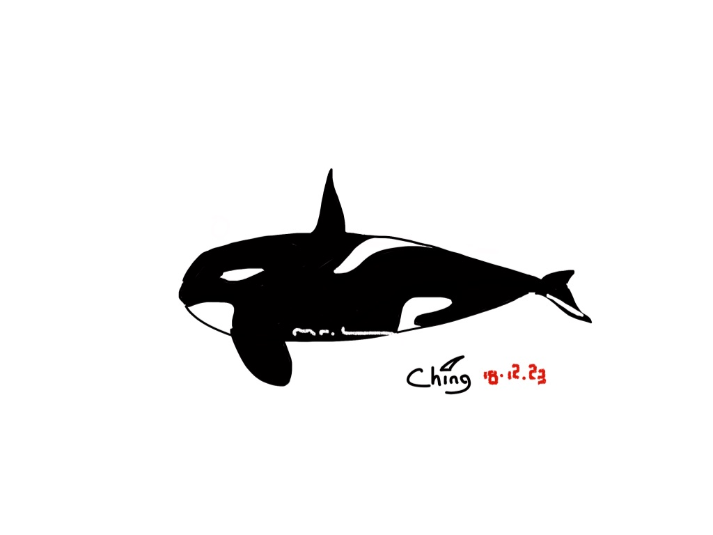
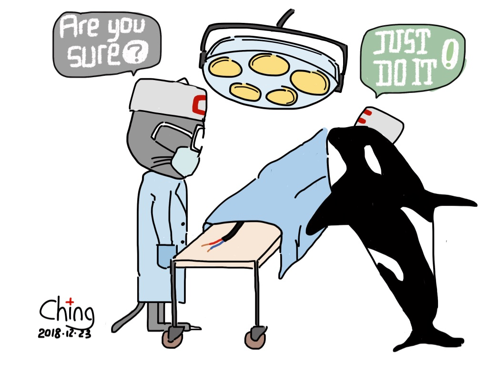

# 蒋小猫的朋友圈 ① 纪念 L 君

__L君不是故人。__ 他还活着，而且活得很活泼。我本来应该在许多年之后，再撰文纪念他，但是我有点儿等不及了。

__L君不是帅哥。__ 个子和我不相上下，身材和我不相上下，长得和我不相上下——假如我没有脱发的话，这话其实也还说得过去。世界上因为外表不如意大利人而不如意的男人，如过江之鲫，__我们同病相怜，我却不是因此而纪念他。__

__L君出自书香门第。__ 他家学渊源，琴（chui）棋（la）书（tan）画（chang）都会几手，坊传多年前曾以男高音引吭一曲，技惊四座，可惜我没有见识过。有一天我见他背着一把吉他，于是我也买了一把吉他；我不见他弹，于是我也不弹。他的案头常年摆放着一本人民音乐出版社廿多年前出版的小书，就压在他的八英寸史丹利扳手下面，这是确有其事的。书的名字略长，曰《流行音乐与爵士乐和声学》，不知该如何断句。在L君的指点下，我小心地研习过此书第一篇第一章的前两个小节，受益匪浅，后来遇到 Mary Had A Little Lamb 这样高难的曲子，我也能够读谱，已经在幼儿园深造的蒋小鱼因此不能鄙视我。__L君颇有古风，而我恰好附庸风雅，我却不是因此而纪念他。__

  
上图左起：  
伟大的钢琴家牛顿  
伟大的作曲家普朗克  
伟大的小提琴家爱因斯坦  
无所不能的 Mr. L

伟大的钢琴家牛顿开创了经典力学，伟大的作曲家普朗克发明了量子力学，伟大的小提琴家爱因斯坦建立了相对论。__L君既通韵律，自然也晓数理。__ 他能展开泰勒的级数，能看懂傅立叶的套路，也能在雅各布的矩阵中辗转腾挪，犹似闲庭信步。在他痴迷无人机和机器人的时候，承蒙他看得起，一度想和我探讨自动控制领域的几个基础问题。按说我应该会的，但我真的已经不会了——也可能除了应付考试，从来就没真的会过——，我感到有点过意不去。__L君的好学不倦让我自惭形秽，我却不是因此而纪念他。__

只是有才华也就罢了，穿衣显瘦的 __L君还相当有运动天份。__ 他会打乒乓球。哦，这你也会？那你有没有优秀到能够吸引异性主动约你打球的程度呢？他有！他会水，是金海豚级的业余游泳选手，浪起来的速度已是平常人走路所不能及。这些或许都不算什么，他还会功夫，这就不得了了！90 PSI 的自行车轮胎在我看来硬得像石头一样，他却能用两根手指轻松捏扁，这让我感到相当地惊讶，然后默默地打开淘宝，取消了胎压计的订单。据说灯塔国大统领川普生得孔武有力，仗着手上有股子蛮劲，常常借握手的机会把人捏得面红耳赤。低调的L君从不以强凌弱，__江湖上没有他的传闻，我却不是因此而纪念他。__

能文能武且温润如玉，__这样的L君，没有道理不讨女孩子喜欢。__ 然而据未经考证的消息，JAVA 程序员出身的L君，出道以来写过的对象不可胜数，自己却依旧孑然一身，没有对象。俗话说得好，“不做中，不做保，不做媒人三代好”，我并非惟恐不乱的好事之徒。在我认识的人群中，__L君是极个别我想为之介绍对象的男人之一，只是苦于缺乏机缘，我却不是因此而纪念他。__

__我要大张旗鼓地纪念L君，是因为他挽救了小黑__——我的 MagicShine MJ-900 车灯。

在我所有的骑行装备里，小黑是最让我以为物有所值的之一。前几天，它的连接电池的导线断了一根。断线本来不要紧，断在根处，就要了命了。

这种不幸的局面已非钳子和胶布所能挽救，惟有电烙铁才能。高中和大学，我两次金工实习做的小锤子，都得了最高分，足以说明我动手能力不差，多少有点做钳工的底子。可是电焊实操得了多少分？我却完全不记得了，可见不怎么样。八年前家里的空调故障，自信满满的我自以为清楚状况，因为懒得拆机，居然想用仰焊的方式来更换控制芯片，结果因为焊接技术不过关，维修失败，主板报废。从那之后，我就老老实实地收起了电烙铁，如今已经找不到了。所谓焊钢易，焊电路板难，蒋小猫此言不虚。

黯然神伤，我把这个坏消息广而告之，却没有人对我表示同情。一向精打细算着过日子的W君安慰我说，能用钱解决的事都没什么大不了的，再买一个就是了。“那今晚怎么办？”我把小黑的残骸锁在了抽屉里。那晚，没有小黑，一路黑黑。我于是屈从了W君的意见，又默默地打开淘宝，下了一个新的订单。

第二天，我已经不抱希望，与小黑素昧平生的L君却没有放弃，给我带来了全套的维修装备。在他的鼓励下，我还是动手了。小黑打开心扉，露出拇指大的集成电路板的那一刻，我和L君面面相觑，意识到这是一台高风险的手术。

能者多劳，__最后主刀的还是L君。他成功了！__ 小黑重新点亮的那一刻，我流下了眼泪——1200 流明不是盖的，离得太近，差点被晃瞎了。

现在，我有了一对小黑。人生就是如此跌宕起伏，以为一无所有，结果竟是有余，真是万万没想到。__谢谢你，L君！__

----

现实中的L君，不仅是个了不起的电焊技工，未来还相当有可能是个了不起的科幻作家。

[版权声明](../LICENSE/zh_cn.md) | [LICENSE](../LICENSE/en_us.md)