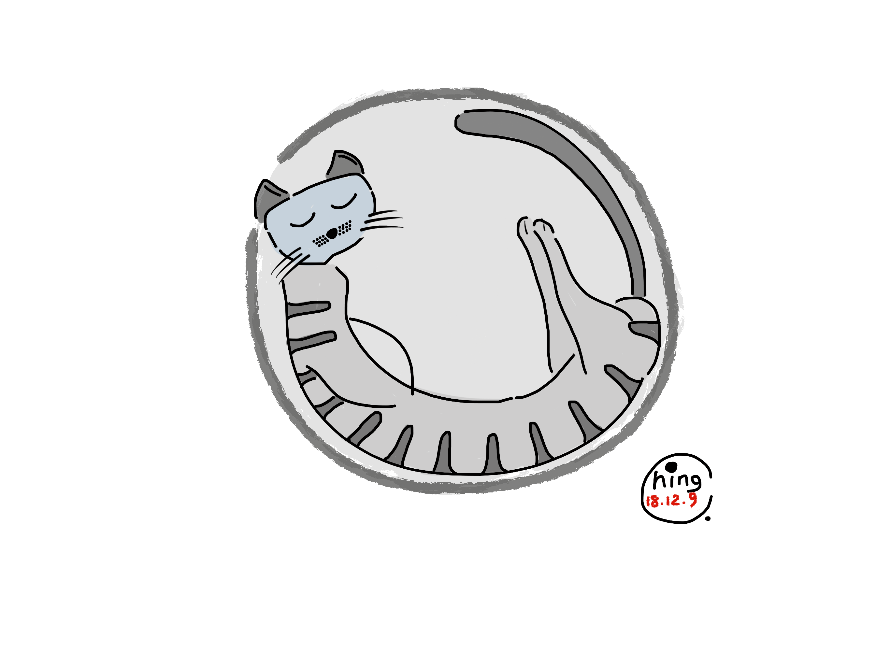
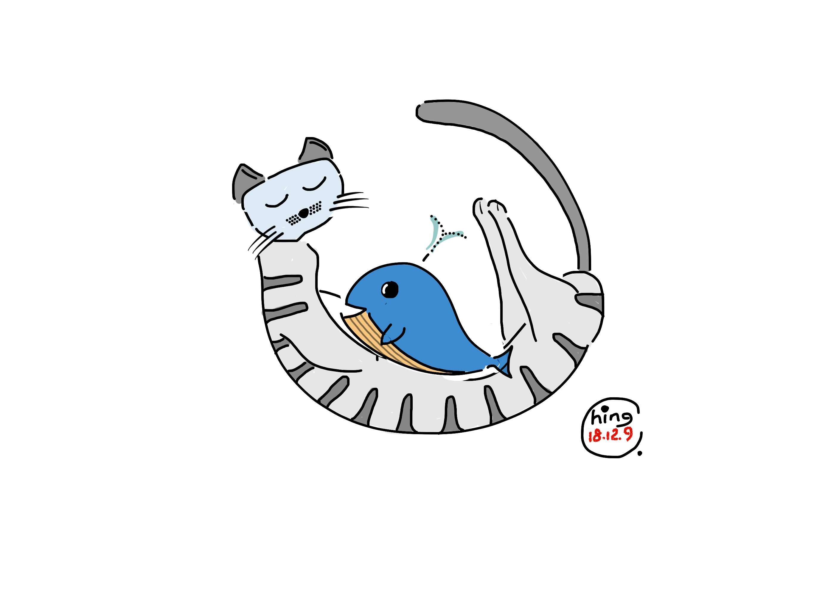
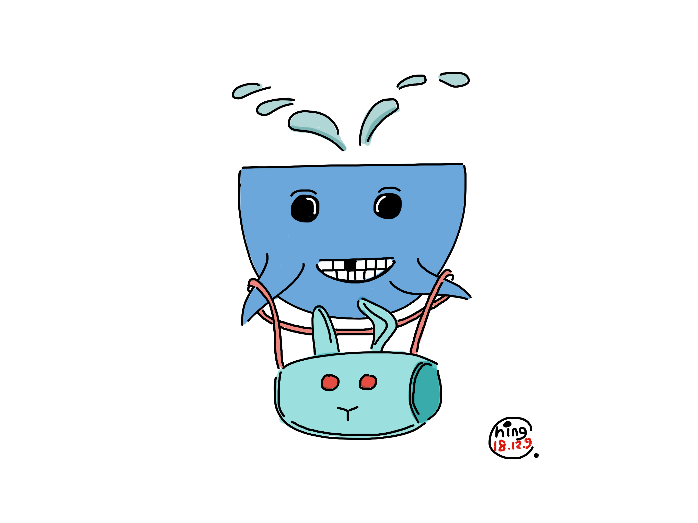
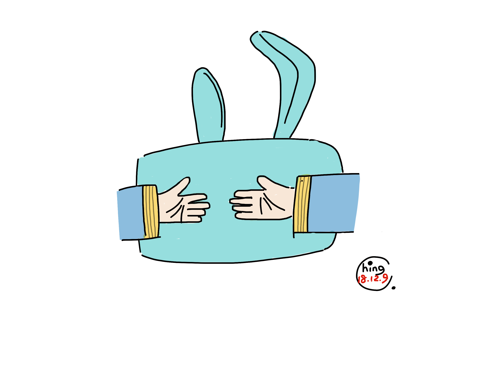

# 鱼之歌 ① 哎呦喂呀一个球

  
__哎呦喂呀一个球  
肚里睡着大懒猫__

  
__哎呦喂呀一只猫  
怀里抱着鱼宝宝__

  
__哎呦喂呀鱼宝宝  
揣着一只兔包包__

  
__哎呦喂呀兔包包  
藏着一双小爪（zhao）爪（zhao）__

距今约一万年前——也可能是两万年前——，纵横世界以百万年计的第四纪大冰期宣告结束。随着领地的消亡，孤独的冰川霸主猛犸象也一步一步走向了末日，而地球在恐龙时代之后，再次迎来了勃勃生机，特别值得一提的是，自命不凡的人类即将登上历史舞台。

四十亿年来，我们的地球是见过大场面的，气候变化不过是地球在大气层中发的一点小脾气。然而无所不能的人类，无论是过去、还是现在，对于地球的这点小脾气却一点脾气也没有。生活在北纬二十三点五度和北纬六十六点五度之间的人们，每三百六十五天至三百六十六天不等，总要集体经历一次记忆的轮回。夏而忘春之离冬之乐，冬而忘秋之去夏之欢，年复一年，没有哪一年不是如此。

昨日今天，突如其来的雪，突如其来的冷，这个冬天也许格外的酷。吃完午饭，蒋小猫和蒋小鱼在铺上滚作一球，便有了这首歌。

[版权声明](../LICENSE/zh_cn.md) | [LICENSE](../LICENSE/en_us.md)