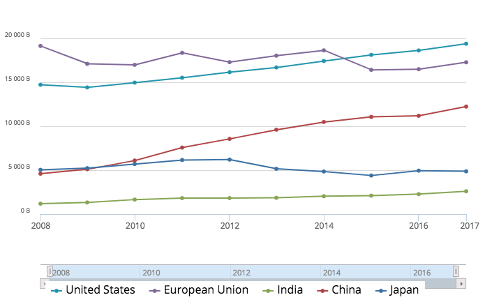

# 你炒股吗？

今天，2018年10月11日，这是一个相当不与人为善的问题，无法不让人怀疑其中饱含着幸灾乐祸的恶意。

我羞于回答这个问题，倒不是因为不敢面对自己在股市中亏损的现实。一则，我的本钱太少，就我那仨瓜俩枣，凑一小碟凉菜都不够，实在配不上“炒”这么个火爆的字眼。二来，自从股灾发生以来，我笃信“没有买卖，就没有伤害”，老老实实蛰伏着，俨然一盘扣肉的模样，“炒”也不是我做菜的风格。我就像被掀翻在沙滩上的海龟，一动也不能动，一动也不敢动，生怕错过了任何一个借以翻身的浪头。潮汐和着砂砾来来回回地摩挲着背壳，巨浪却始终没有到来，海岸线反而离我越来越远了。我想起来，我所在的地方——长江三角洲——，是全世界最好的冲积平原！

幸福源于比较，此地尤尚此风。来自中国证券登记结算有限公司的公开信息显示，2018年8月期末，自然人投资者人数合一亿四千二百四十三万一千六百。市场氛围如此低迷，时隔一月，这个数字估计略多不多。另一方面，依据国家统计局的口径，2016年末我国总人口为十三亿八千二百七十一万，按照千分之五的增长率，今天还应再多个千八百万。两相比较，十居其一的股民，是妥妥的孟什维克。以少数人的痛苦，兑换多数人的快乐，固然不符合共和的精神，但是好在痛苦没有白费。这么一说，今天应该算是一个开心的日子，你同意吗？

:( :) :) :) :) :) :) :) :) :)

今天，“受美股拖累”成了股评家们最爱用的开场白。我躺在沙滩上晒太阳的这几年里，美股一直在偷偷摸摸地上涨。涨就涨吧，我们也不眼红，看惯了大起大落，几厘几厘地涨，根本不屑一顾：这也叫涨吗？可是但凡美股哪天下跌，就没有哪一次不拖累我们的，这就有点气人了。前一交易日，美股三大指数下跌了百分之三到百分之四不等。今天，上证指数、深证成指、创业板指分别下跌了百分之五到时百分之六不等。你看，何止是拖累？分明是把我们拖下水，还在头顶踩了一脚！

美国人嫉妒我们，并不是他们吃饱了撑的。过去十年来，在世界主要经济体中，美国、中国和印度都保持了增长，而其他国家则乏善可陈，走下坡路的也为数不少。如果不是以中国作为参照，美国比十年前更加强大。如果不是有中国屹立东方，印度是最成功的发展中国家。什么叫战略竞争对手？这才是战略竞争对手啊。对手之所以想方设法地与我们为难，恰恰是因为我们正焚膏继晷地令他们焦虑。不得不说，厉害了，我的国。股市嘛，远不是全部。

  
（数据来源：[世界银行官方网站](http://databank.worldbank.org)）

关于股市，容我再讲一个让我忧伤的笑话——
> 患者：大夫，我回去用了你给我的药水，脱发变得更严重了，都快秃了。  
> 游医：就这对了。脱，使劲脱，然后就不脱了。

我都已经不担心我的头发了，你还在担心明天的股市吗？

还记得爱因斯坦的小板凳吗？你以为这是世界上最糟糕的小板凳？“不，不是的，这里还有两个更糟糕的。”股市的厉害，不输传说中的爱因斯坦，怎能不让人肃然起敬呢！

[版权声明](../LICENSE/zh_cn.md) | [LICENSE](../LICENSE/en_us.md)