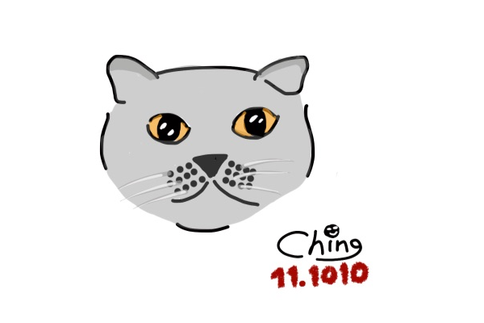
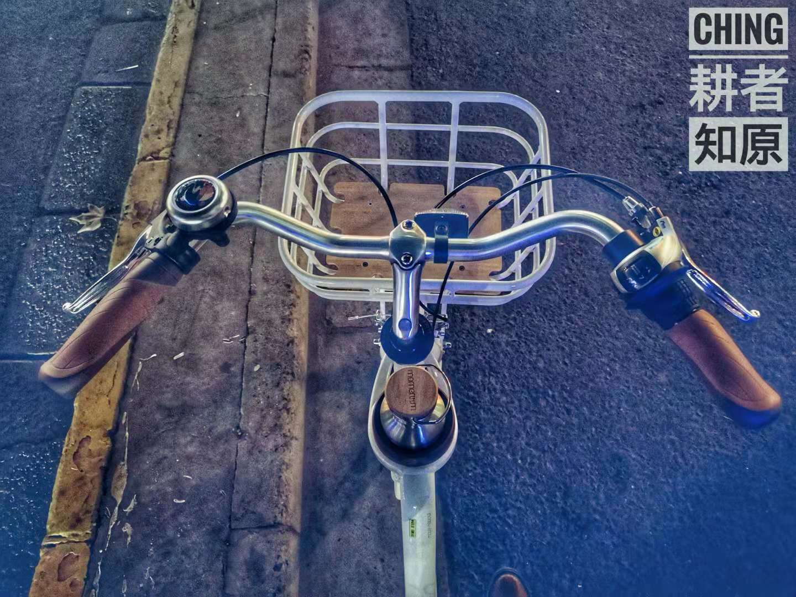

#   -日记- 我和我的小白

今天的日记很短，因为妙，不可言。

喜提新车，配件在途。入夜路试，行程15000米，配速3'20"，体验上佳。

姿态稳定，动力顺平，齿轮安静。两个字，舒适！

颜色淡雅，曲线优柔。一个字，美！

她是一台坤车，我却深深为她的魅力所折服。

许多人表示惊讶：  
> 你的小青呢，凤凰变麻雀啦？  
> 这货也就三百块，不能再多了，再多就傻了。  
> 这是什么，你从哪儿整回来一个共享单车？  
> 这是你的车？哈哈哈哈哈——

尽管大笑吧，我想说：我们不一样。

糜费相似，大飞哥撸了英国短毛，小北君入手了 SWITCH，而我选择了你，亲爱的小白。

  
SWITCH 我不想画！

专业骑友们看了又看，交口称赞，一致同意，这是一台物有所值的好车。  
> 但是我们不会买！

我讪讪地笑，我想说：我们不一样。

我的喜悦不可理喻，可我依然开心得不得了。

> 成年人的世界里没有容易二字。

我的喜悦来得如此容易，也许是因为，我尚未成年。

我掀起她的盖头，只给你们看一眼。

#I-LOVE-CYCLING#

[版权声明](../LICENSE/zh_cn.md) | [LICENSE](../LICENSE/en_us.md)