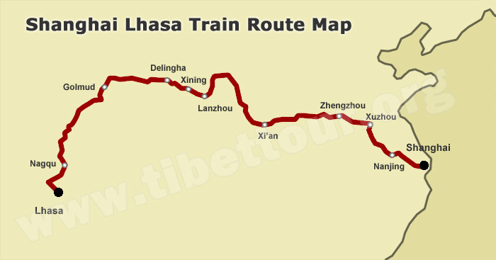

# 初别青海湖（北海道攻略）

##  引言

青海湖，北海道，一个是异乡，一个是异国，皆令我魂牵梦萦。虽则一个深居内陆，一个地处汪洋，然而在我的想象之中，无问西东，都是有故事的地方。

去年初秋，天还没有凉下来的时候，我就放下拐杖，一瘸一瘸、况且况且地去了青海。

  
Z164 线路图  
from www.tibettour.org

青海湖很远，青海却很近。Z164 次列车在夜色中驶离位于市中心的车站，由南京越长江，经徐蚌至郑镐，恰是午时。西安往西，八百里秦川，弹指一挥间。尔后自宝鸡穿秦岭余脉，直抵天水，再无天险。前面便是西安与西宁的中点，兰州的东大门——定西。过了兰州，再有三个小时，列车就缓缓停靠在西宁站。这里是青藏天路的起点，也是我的终点。

西宁很近，名字里却带着遥远和静谧的味道。虽然只是匆匆一夜，却让我觉得，这是一个呆上一辈子也可以的城市。青海或三亚？还是青海吧！

西宁是世俗的城，也有宗教圣地。在这里，肉身和魂魄，都有所付托。

>   ……  
>   世界上七千个地方  
>   我们定居哪儿？  
>   告诉我，答案是什么  
>   你喜欢去哪  
>   青海或三亚 ……  
>   —韩寒，《我喜欢上你时的内心活动》

青海湖就远了，最近处自西宁也有两个小时的车程。住在城里的人，未必常去。

虽然不能骑行，青海湖边的旅程，依然让我有生之年第一次体会了旅行的幸福。快乐像湖水没过马蹄一般浸润了我粗糙的灵魂，感觉妙不可言，以至于出发前就准备要写的游记，一直未有下文。

当时我想，——也可以去北海道吧！

于是，羊咩咩咩咩咩的时候，我冲他脱口而出：去北海道吧！

也许，就在四月。一起去吗？一起去吧！

##  初别青海湖（北海道攻略）

青海很近，青海湖很远  
我在相册中指指点点  
有时回忆，总是怀念

日本很小，北海道很大  
我在地图上涂涂画画  
心原意马，不知去哪

  
Hokkaido, Japan  
from japan-rail-pass.com

飞啊，飞  
四五小时   
直抵千岁  

札幌铁塔耸立依旧  
绘梨子  
却不再有

应该向西吗？  
寻往藤井树的家乡——小樽  
在运河岸边徜徉  
在八音钟堂流连

西斜南下  
直抵函馆本线的尽头  
听海猫召唤薰的灵魂  
入夜的函馆山下  
灯火蜿蜒铺散  
仿佛火山魅影

  
JR HOKKAIDO PASS  
from japan-rail-pass.com

或者向东罢？  
春天的富良野  
薰衣草尚未盛开，雪却化了  
“雪間より薄紫の芽独活哉”，几时可见

东向北行  
美瑛町的青池  
仿佛袖珍的青海湖  
名字似你  
静谧像你  
醉人如你

四月的北国，北国的四月  
哦——  
哪一个更美

##  后记

绘梨子是谁，藤井树是谁，海猫和薰又是怎么回事？我想解释，又觉得多余。

札幌的铁塔，小樽的运河，函馆的夜色，都是闻名遐迩的人造的景致。甚至富良野的薰衣草原，亦是如此。我想放几张照片，也觉得多余。

惟有青池是天然的。

这片不大的池塘，同海西的茶卡盐湖一样，诞生了无数绝美的画面。OS X Mountain Lion 的桌面之一 Blue Pond 即取景于此，是其中的佼佼者。看惯了镜头下的美，真实的青池是否会令人失望？

隔着屏幕浏览的青池，或是青绿，或是靛蓝，总是冰凉。直到今天早晨，我看到下面这一张。依然是冷冷的色调，可我却觉得有些温暖。

如果不去见过，那么，这就是青池定格在我心里的样子。

  
雪灯りも風情があります  
from jalan.net

[版权声明](../LICENSE/zh_cn.md) | [LICENSE](../LICENSE/en_us.md)