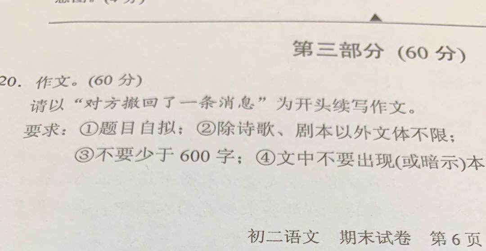

# 零分作文 ① 对方撤回了一条消息

（图片来源于网络）

这个题目让我跃跃欲试。然而冥思苦想了十分钟，除了抄写一遍题目指定的开头，再也写不出一个字来。如果真的是在考试，那么我已经挂了。俗话说，一不作，二不修。看来，初二是一条分水岭。

__本文纯属虚构。__  
--以下正文--

>   我歌月徘徊，  
>   我舞影零乱。  
>   醒时同交欢，  
>   醉后各分散。  
>   唐·李白《月下独酌》

1月3日22点22分，“玉兔二号”顺利抵达月球背面，人类第一次触及这片神秘的区域。

这半个月，天气很胶着。城市上空的冷空气和热空气像一对儿刚进入第一回合的拳击手，谨慎地试探着对手的虚实，摩擦不断，淫雨霏霏。

门窗紧闭。L型的客厅里，陈千里蹲在写字台边的四方凳上盯着电脑显示屏两眼放光，和不知所谓的人聊得热火；老陈盘在飘窗的垫子上，孜孜不倦地缝补着已经被我扔了两回的袜子。电脑是我的，袜子也是我的，而我却只能窝在他俩之间的沙发上，就着聊胜于无的电视剧，一颗接一颗地嚼花生米打发时光。有时，我转头乜一眼陈千里，转头乜一眼老陈，再转头乜一眼陈千里：这俩人怎么看怎么让我不痛快，但又没到可以摔锅打碗的地步，只好忍着。

__『对方撤回了一条消息』__

硕大的显示屏上弹出的这条消息时，陈千里正扭头咧嘴冲我笑呢。

一个多月前，我穿坏了陈千里心爱的兔牌小牛皮鞋，引发了这场旷日持久的冷战。原本就有隔阂的空间分裂成两个重叠的世界，而我们彼此都成了对方世界里的幽灵。在我看来，这纯粹是个意外。我的脚小，他又大了，虽然稍稍有点挤脚，我以为借来穿一天也许不会被察觉。哪晓得回来的路上，右边的鞋底儿一声不吭就掉了一半，差点没把我给绊倒。出门在外，合久必分，鞋底儿迟早是要掉的。左边先掉，还是右边先掉，又有什么分别呢？不巧让我赶上了，而已，这并不是我的错！我拿出藏在书柜角落里的补鞋胶，用了足有小半瓶，把掉了底的右脚粘得牢牢的，比左边还要结实。然而并没有什么用，我心想，陈千里肯定会发现的，发现了还是要生气的。第二天早上，我抢先对他说：你要是生气，可以不跟我说话，直到不生气了再说。我只是想吓吓他，他却真的再也没有跟我说过话。每天，我眼睁睁地看着他出现、消失，就是没有办法和他说上话。我装作若无其事，其实脖子都粗了。

现在，这个幽灵终于又活过来了，下一秒就要开口说话了。这一刻我就像一个潜伏多年行将接头的特务，表面上不动声色，暗地里心潮澎湃。

他要是说：我太饿了。我就立刻从内衬着四十度海绵的硬梆梆的沙发垫上弹起来，去菜市场幸会新鲜的佩奇，挑三段带软骨的肋排，回来厨房啪啪啪剁成半截手指长的一小段一小段，洗净煮透。然后铺开老抽陈醋、黄酒白糖，默念着二三一四的秘方，炒一锅我最拿手的糖醋排骨。盘子不能是冷的，要用开水烫过，让糖醋汁在盘面上呈现出自然流淌的写意劲儿，凝成厚黑的一砣就不好看了。趁着刚装盘的热乎劲儿，洒上新鲜的白芝麻和葱末儿，催发出一股子自然而然、熟而不腻的气质。“嗟，来食”，我居高临下地说。那香喷喷、酸溜溜、甜滋滋的味道，也许不足以征服一颗冷漠骄傲的灵魂，但是用来掩盖讲和时的尴尬，却再适合不过了。

他要是说：我闷坏了。我便拉他去轧马路。从北向南，一路走个不停，经过马戏城也不停，经过大悦城也不停，一直走到人民广场，径直去了兔牌的专卖店。我指着他的脚丫子，对笑魇如花的店员小姐姐说，照这个样式来四只！小姐姐笑，我笑，他也笑。穿上崭新的一模一样的棕色小牛皮鞋，我们坐车去兰生大厦，乘电梯上三十九楼，在旋转餐厅里点一份铺陈在氤氲的干冰上的糖醋排骨——这道菜我尝过，蒋小鱼尝过，我觉得陈千里也应该尝一尝这个味道。一边吃着，一边转着，当餐桌第二次转到西北偏北的位置时候，“归去来兮，田园将芜胡不归”，我高屋建瓴地说。这时候他已经晕头转向，而嘴里塞满了肉，只能勉强点头，没有办法作出其他的回应。

他要是说：你远一点！我就继续陶醉在肥皂剧里，装作什么也没听见。但凡我要是回他一句，就算我输！

然而我还是输了。__有那么一瞬间，他的表情似乎凝固了一般。__ 然后，他一言未发，又舒展开僵硬的笑容，接着转回头去面向屏幕，只给我留下一个踡曲的侧写。

『对方撤回了一条消息』
『对方撤回了一条消息』
『对方撤回了一条消息』

显示屏上接二连三地闪烁着同样的提示。虽然压根儿不知道“对方”是个什么主儿，撤回的又是什么东西，但是目睹陈千里陷入这种不同寻常的、显然不太愉悦的局面，我还是不由自主地幸灾乐祸起来，花生也嚼得愈加欢快了。

哒咄哒哒，哒哒哒，咄咄咄哒，哒。陈千里飞快地操弄着键盘，声音沉稳而有节奏，既没有击键不到位而听起来发虚的嗒嗒声，也没有用力过猛的刺耳的呯呯声。一如既往的淡定，一如既往的从容。他弹的是十面埋伏吗？我有点儿吃不透他。

我从来就没有吃透过他。原来，陈千里是不存在的，存在的是蒋青原。有一回，我应蒋青原的邀请去学校出席家长会的时候，在教室里公然睡着了，据说还发出很大的呼噜声。台上的老师想装作没看见都做不到，只能拜托旁边的家长挽救我。在呼噜中被叫醒，当时的场面想必不太好看。这还不算，几分钟后，更糟糕的事情发生了，我又睡着了！这回老师没再发话，直到结束也没人敢出手相助。家长会后，我没有出名，蒋青原出名了。没办法，谁让学校是他的地盘呢。我并非第一次在重要场合打瞌睡，但是这一次不幸的意外所引发的严重后果，完全出乎我的意料：蒋青原决心要改名换姓。他听过公子重耳被自己老爹攻打、迫于无奈亡秦的故事，觉得很是契合自己的际遇，便在作业本的封面上端端正正地写下了“陈千里”三个字，意思是东方重耳。坦白说，要不是后来他自鸣得意地解释给我听，我还真猜不出此中真义，想当然地以为他只不过是随了老陈的姓。

且不说改成了什么，单就改名这件事本身，还不够让我火大的吗？我义正辞严地质问他：“大丈夫行不更名，坐不改姓。你这算什么意思？”他倒是不慌不忙，幽幽地说：“睡着的时候就不一定了。”我本想给他解释，坐不改姓的坐，是连坐的意思，就是砍头。砍头不比瞌睡厉害一万倍？但是这样一来，奉辞伐罪变成说文解字，不免失了锐气。想想算了，毕竟这件事是我理亏，反正户口本在我手上，就随他去折腾吧。

我不再偷瞄陈千里聊天。转过头来，老陈正望着窗外自言自语：“地上湿嗒嗒的，这是又要下雨了呀。”这是什么话？难道不是因为刚刚下过雨，所以地上才是湿的吗？老陈一向神神叨叨的，我懒得接她的话碴。

电视上又开始插播广告。免费的电视真是看不得，一分钟前才放过广告，又开始放广告了。“所以美丽，因为有你。”这广告语也是颠三倒四，狗屁不通。

百无聊赖之际，我懒懒地仰倒在靠垫上，目光移向了挂在墙上的丽盛挂钟。6，嗒，嗒，嗒，嗒，5，嗒，嗒，嗒，嗒，4，……我好像看到宝蓝色的秒针在倒退，怎么回事？我闭上眼睛，再缓缓地睁开，它还是在倒退。坏了？

坏了！我的脑海里突然闪现出一个词：坍缩！

电视屏幕底下弹出一条文字新闻：嫦娥四号将于1月3日启程回归地球。

我瘫倒在沙发上。难道这才是坍缩的真相？不是机械的逆流，而是因果的倒转！

可是为什么我的意识如故？青原，在那个不再存在的未来，你究竟想对我说什么？

[版权声明](../LICENSE/zh_cn.md) | [LICENSE](../LICENSE/en_us.md)