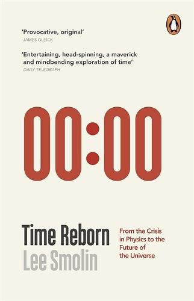
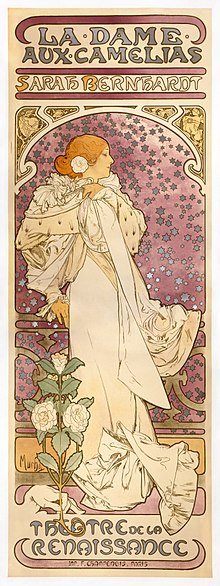
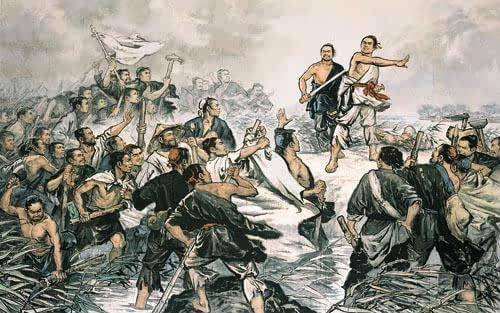

# 零分作文 ① 对方撤回了一条消息 | 点评：在愚昧之巅纵情歌唱

> Whence things have their origin  
> Thence also their destruction happens  
> According to necessity  
> For they give to each other justice and recompense  
> For their injustice  
> In conformity with the ordinance of Time  
> —— *by Anaximander (Greek: 610 - 546 B.C.), On Nature*

> 万物相生相灭  
> 皆依自然之必须  
> 有赖时间之秩序  
> （译文是从《时间重生》中译版内页中抄下来的）  

  
《时间重生》封面（图片源于网络）

## 在愚昧之巅纵情歌唱

和庄园里的某些动物不一样，我，蒋小猫，<del>打钱，</del>是有自知之明的。

一直以来，我觉得自己尽管乏善可陈，起码还有一点好处年复一年地遗传了下来，就是从不刻意拔高自己。比方说，每当登记体格的时候，我都老老实实地在身高一栏填上 175，那其实是我竖了一整天之后的数字。如果将我平放在柔软的席梦思床垫上，静置八小时然后再测量，尚可以录得一至一点五厘米不等的增长。亚父曰：__竖子不足与谋！__ 这一厘米的出入，于我的社交格局大有损益，但我从不觊觎。

然而我还是骄傲了！刚写完[《对方撤回了一条消息》](collapse.md)，我的内心是洋洋得意的：这么曱（cuo）甴（ka）的题目，居然也能应付下来，还写得有模有样，真棒。

伟大的改革家马丁·路德警告说：__“我们需要一个大磨盘挂在脖子上以使我们保持谦卑。”__ 所言极是！

  
马丁·路德（图片源于网络）

当我的耳朵充斥着雷鸣的时候，闪电已经归于沉寂；当我的头脑装满了谦逊的时候，美德正在将我抛弃。事实证明，我脖子上的磨盘还不够大，没能阻挡我像一头蠢驴一样昂起脑袋嗷嗷叫唤。然而大家的反应令我失望，很失望，非常失望，简直大失所望！

虽然借着种子读者的卖力推荐，这篇作文的阅读量差强人意，甚至超过了我身为蒋小鱼的御用写手，呕心沥血、几易其稿乃成的[《垃圾去哪儿了》](waste-storing.md)，然而觉得 __好看__ 的人数却创下了历史新低，

三百多人读过，只有屈指可数的七个“好看”，这是什么概念呢？大家点开文章，看了两眼，有客气的，便说“不知所云”，然后关掉了；有不客气的，就骂“神马玩意”，然后也关掉了。如此周而复始，每隔七七四十九人，才有一个人下马看花，勉为其难的说一声，“还行”。孙猴子在太上老君的炼丹炉里呆了七七四十九天，炼成了火眼金睛。而我勾引了七七四十九个读者，才炼成了一个“好看”。这是甚么滋味？更不要说，七君子里，还有几个是我软磨硬泡来的。我很想问问剩下的几位，你们是否出于同情？对于自己独特的欣赏角度和与众不同的品味，你们又是否自知？

前几天，某位大咖犀利地指点众生：__“很少人知道自己在愚昧之巅。”__ 我爬在愚昧的树梢上纵情歌唱，直到有人拿弹弓射我，我才知道。于是又灰溜溜地溜了下来，拍拍爪子，当作什么都没发生过一样。

是猫总要爬树的，不然和一只老虎有什么分别呢？在这片愚昧的森林中，不管选择哪棵树，结果都是一个味道。下次，我会爬得更快些！

## “千里”之行，始于“足下”

我把作文写成了小说，以为能得个优，再不济也是个良，结果却是不及格。然而我并没有娇叱一声，“好气哦”，一边把作业本撕得粉碎，而是默默地打开零钱包，给自己打赏了一块钱。

骆宾王作《咏鹅》的那一年，七岁。就算他家里没有大鹅，只有大鸡，相信也会有一首《咏雉》，“喔，喔，喔”地
活在我们的语文课本里。

莫扎特开始谱写传世的交响曲的那一年，十岁。而且是第一、第二、第三交响曲，连发三弹。 

再来看看作家，即便如年少成名的的小仲马，在写完《茶花女》的那一年，也已经二十四岁了。如果不是遇到挚爱的玛丽，再给二十年，他也还是写不出这样征服人心的作品。  

  
《茶花女》海报（图片源于网络）

可见世界上有天生的诗人和音乐家，却不曾听说过天生的小说家。小说虽小，微言大义。人生不曾脱胎换骨过，何以著小说？写得不好，那是再自然不过的事，实在没有可丢人的。

“文王拘而演周易，仲尼厄而作春秋。”原来，蒋小猫成天价骑着自行车游手好闲，活该写不出好东西。好在去年骨折了！

##  时间成就了我们，还是我们塑造了时间？

  
陈胜、吴广起义（图片源于网络）

公元前，陈胜说：“王侯将相，宁有种乎。”

新世纪，雷军说：“站在风口上，猪都会飞。”

讲的是同一个道理，那就是 __时势造英雄！__ 正所谓“天下大势，浩浩荡荡，顺之者昌，逆之者亡”，斗转星移，日月更迭，不以个人意志为转移。

习惯了因因果果，便觉得世界理当如此，否则便是荒诞不经。可是果真如此吗？假如时间逆转，因果倒置，世界将会怎样？

人生不是艰难的修行，而是返老还童的旅行。亲人们都是不期而至，而余生皆可预期，别离皆有计划。

日久生情将取代日久生厌，成为常态。恋人之间经过痛苦的相逢和磨合，渐入佳境，情到最浓时，挥一挥衣袖，从此是路人，彼此无牵挂。

劳动褪去谋生的色彩，自觉的劳动成为主流。大多数人先拿钱，再上班。有些无良的老板，付完钱之后还要等上很久，人家才过来给他干活。

……

这样的世界，不合理吗？

##  致敬《坍缩》

毫无疑问，[《对方撤回了一条消息》](collapse.md)受到了刘慈欣的中篇小说《坍缩》的启迪，在此表达敬意。

我是在读过《三体》之后，才去读了刘慈欣的其他作品，《坍缩》是其早期的作品。与场面宏伟、构思精密、哲理深邃、文笔老练的《三体》相比，后者更像是一篇不成熟的习作，这也充分说明，伟大的小说家是千锤百炼而成的。

