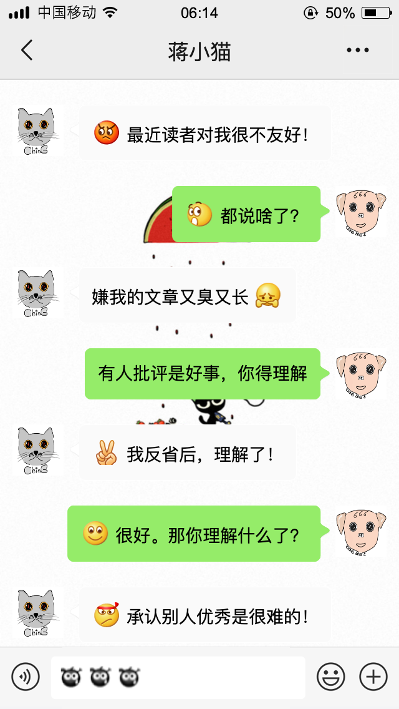

# 蒋小猫和读者 ① 灵魂拷问

> 谦虚是不可能的，这辈子都没法谦虚！  
> ——蒋小猫

## 对话之一

> 从前的日色变得慢  
> 车，马，邮件都慢  
> 一生只够爱一个人  
> ——木心《从前慢》

从前的文字很少，诗歌、小说、散文都少。能够执笔，就已经是极不容易的事，比执子之手更不容易。文章遗世的背后，要么是极大的幸运，要么是极大的牺牲。幸运如洛阳纸贵的故事不常见，而牺牲常见。

从前的书刊更少，油墨、铜字、纸张都少。不是千挑万选，不经反复推敲，几乎没有付梓的可能。字体的式样也有限，宋体、黑体、楷体、仿宋，不外乎这么几种。无论哪一种，都代表着不容置疑的优秀。能写一手漂亮的仿宋字，堪当人肉印刷机之用，也是别具一格的才华。

白纸黑字，曾经是一种信仰；
不惜字纸，曾经是一种罪过；
长篇大论，曾经是一种荣耀。

尔今的日子变得快，翻云覆雨，一日三秋。大家的时间都很宝贵，无暇咀嚼，只要干货。误人时间如同伤人性命，所以专业的写手的专业的长文，都要非常专业地在开头处标明“此文共****字，阅读约需*分钟”，以示光明磊落，悉听尊便，绝对没有谋财害命的企图，而往后都是两相情愿。

情书都没人愿意细细地读了，谁还稀罕看我这些酸不拉唧的东西？何况我写那么长！简直不知趣。

我相信，至今，我每写一篇所花的时间，远远超过我的读者（们）为此耽误的人生的总和。我不知该问心无愧，还是自惭形秽。

我都有点不想加上“们”这个字，就好像我有很多读者似的，其实少得可怜。我不想说究竟有多少，反正还到不了股份有限公司的发起人数的上限。

你（们）明明不喜欢我，我却还是傻乎乎地爱着，惨兮兮地写着，眼巴巴地盼着。我不是作（zuò）家，我是作（zuō）家！

## 对话之二

我其实写得并没有你们批评的那么差。

我的文字里，藏了许多梗。这些梗交叉错落，形成了三层不同的意思。表皮是大家都看得到的样子——尽管你们更喜欢以管窥猫，连皮都不看整张的——，只有极少数人愿意且能尝得出肉味，而深入骨髓的滋味，怕是只有我一个人懂。

有人夸我的文字有死去的大师的味道，我不觉得晦气，毕竟文字和精神是不死的，但也没有多么得意，因为拾人牙慧没有意思。

有人说我的文字有活着的网红的模样，我不觉得受用。我用生命写作，是想要成为你刻骨铭心的人，而不是追逐不可一世的红。

我不在乎像谁，我想要无二独一！

征服不了世界，  
征服不了你（们），  
我只服我自己！

