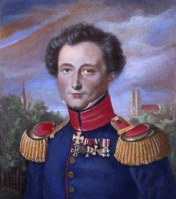
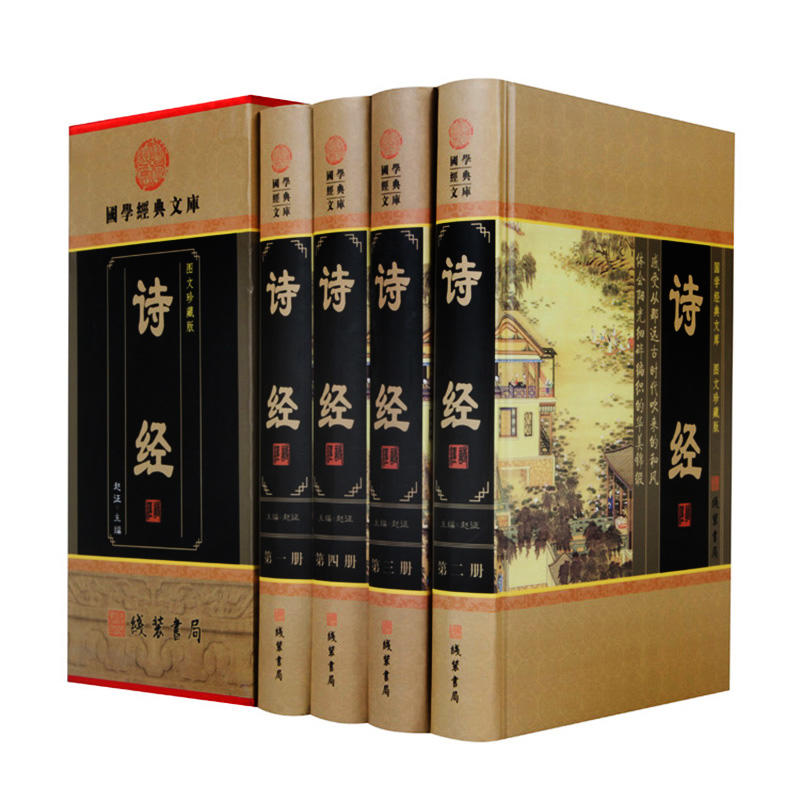
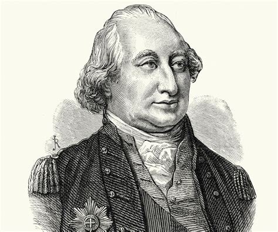
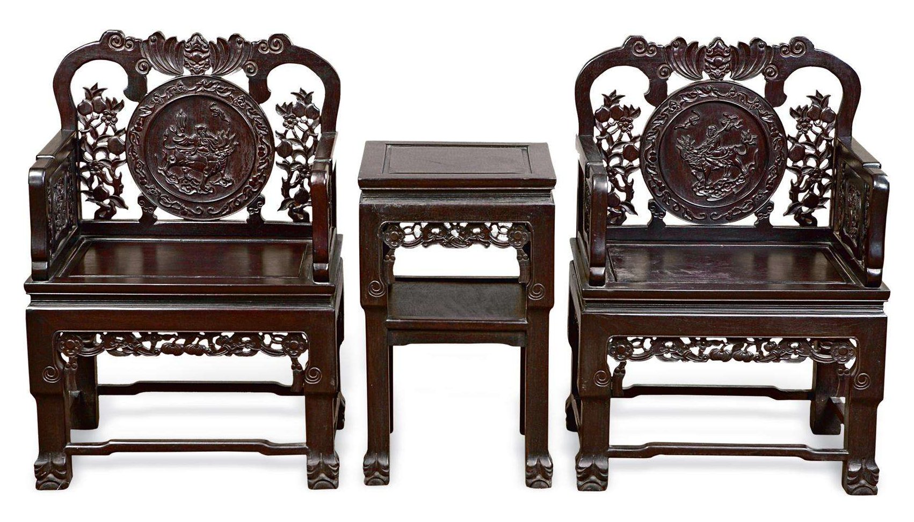
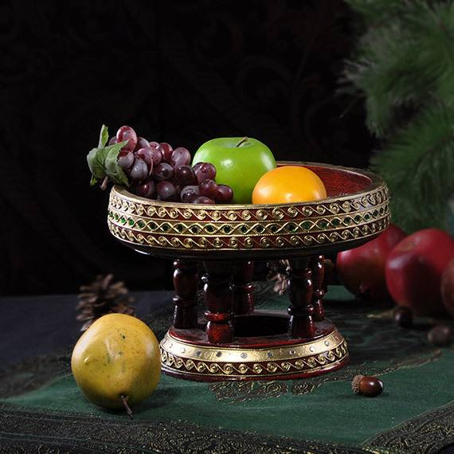

# 掀桌子的艺术

本文图片均来源于网络。  
内容纯属胡扯，看完别掀桌子。

过年，是一次盛大的迁徙。随着返乡回家和走亲访友的大潮一并流动的，不只是人口和物资，还有文化。主流的和中二的，新兴的和传统的，有时水乳交融，有时泾渭分明，有时相见恨晚，有时不如怀念。伟大的迁徙，无不伴随着波澜壮阔的冲突和征服。

克劳塞维茨认为，战争是政治的延续。而我说，掀桌子冲突的延续。

> The greatest enemy of a good plan is the dream of a perfect plan.  
> -- *by __Karl Philip Gottfried von Clausewitz__*    
> 求全者，作死也。  
> -- 卡尔·菲利普·戈特弗里德·冯·克劳塞维茨（翻译：@蒋小猫）

不要被一派祥和、其乐融融的氛围所迷惑，觉得过年期间就该天下太平。突然间碰上桌子翻了的场面，你就手足无措，不知怎么收场。

深入理解冲突的本质，随时作好掀桌子和被掀桌子的准备，有助于我们在文明的盛宴中占据一个有利的位置。掀桌子通常不是沟通的终结：越冲突，越有戏，这事没完，还有得谈。相反，沉默才是无可救药的。

谁家还没个桌子？不过，动手之前，有必要搞清楚，哪些桌子可以掀，哪些桌子不可以掀。桌子的大小、形制、高矮，都不重要，关键要看桌子边围着的哪些人，桌子上摆着的什么事。

## 孤家寡人的桌子掀不得，掀了也是自取其辱

打比方说，客厅里撸猫的、聊天的、打牌的、看戏的，热闹的紧，唯独你一个人闷在书房里，假装看书，没人搭理，越想越冷，越冷越气，哗啦一下掀翻书桌，墨汁涂地。有人探头进来：__“咋回事？还以为你中风了呢，怪吓人的。”__ 你怎么解释？还不得说句不小心，然后自己默默地收拾。

这个时候，拍案而起才是正确的做法。别上手，疼！最好用成套的《辞源》或者线装书局的《诗经》四卷本，高高举起，重重砸下，大部头有大动静。如果没有，那么《现代汉语词典》或者《朗文高阶英汉双解词典》也还算趁手。拍完，背朝着门，负手而立，摆好造型等着就行了。

又比方说，饭桌上啜茶的、饮酒的、喝汤的、吃肉的，不亦乐乎，唯独你一个人还在厨房里，蒸炸烹炒，没有帮手，越想越热，越热越火，哗啦一下掀翻传菜的小桌，膏粱四溢。有人探头进来：__“怎么这么不小心？大象进了瓷器店了？”__ 这话你怎么接，拿锅铲砸他脑袋吗？辛苦了那么久，奈何虎头蛇尾，换来前功尽弃。

那怎么办？别动桌子，可以摔锅打碗啊。先摔锅盖，等有人进来，再摔锅子。这一阵叮呤哐啷，意思表达淋漓尽致，一会儿捡起来洗洗，还不影响继续炒菜。

## 四仙桌轻易不能掀，掀了就没意思了

你想啊，四人围坐研究国粹的半道儿，能掀桌子吗？赢了的不能掀，输了的更不能掀！

赢了还要掀桌子，这不叫见好就收，这叫蹬鼻子上脸，是不给别人机会翻本的意思。虽然说牌桌上无父子，下了牌桌，还是要继续做兄弟的，万万不能做得太绝。

  
> These colonials are our brothers.  
> When this confict is over,   
> we'll rebuild commerce with them.  
> -- *by __General Charles Cornwallis__*

输了就要掀桌子，那不叫壮士断腕，那叫输人又输阵，传出去落下个心胸狭隘的坏名声，往后还能不能一起打牌了？尤其重要的是，麻将是声响的艺术。你一掀桌子，一顿劈哩叭啦，国粹拌着国骂，隔壁小孩还以为你胡了把大四喜，成群结队奔过来讨钱买糖吃。你怎么办，不尴尬吗？

  
大四喜！此牌可加计混一色

大过年的，百无禁忌，于是旁观的人——甭管是老娘还是老婆——，就更没理由掀桌子了。

所以，只要坐上麻将桌，你可以认为自己暂时是安全的。不过，打牌就好好打牌，多吃多碰多喝茶，少扯犊子少闲话，别净整那些有的没的。是非说多了，性质就变了，牌桌也就不是牌桌了。

## 茶几最好也不要掀，你算老几你掀茶几？

你要知道，茶几是客厅重器。

在传统的中式客厅里，为了遏止掀桌子的冲动，茶几被严丝合缝地摆放在两张厚重的太师椅中间。交谈的双方成对而坐，一左一右，各自用肘子压住桌面，其状亲密无间，实则彼此防备。你如果想要掀翻茶几，先得起身将太师椅搬到一旁，然后气沉丹田，劲运双臂，大喝一声，“起——”

起不起得来，还得看造化。在你搬椅子的工夫，茶几另一侧的人必然也没闲着，全身的力量已经集中到了肘子上，稳稳地压住了茶几，更不要说还有茶几本身的份量可以依仗。除非内力远胜对方，以下犯上的难度可想而知，大概率是起不来的。顺便说一句，通常那椅子用料扎实，极具份量，万一是黄花梨木制的就更不得了，搬的时候务必小心别闪了腰，茶几没来得及掀起，反倒落了笑话。

所以有文化的人，知道其中的厉害，就算窝了一肚子火，也不会动了掀茶几的念头。有人笑话读书人手无缚鸡之力，此言大谬：你没掀过，不知道几斤几两。

中国的传统文化里，关于如何制怒，那是有一套的，如春风化雨般细致入微，既讲究又含蓄。日常佩戴的玉扳指和玉手镯，是一例；上面提到的待客的陈设，是另一例。像林则徐那样高调地挂起“制怒”的牌匾，——我猜——实则有着警告肖小的用意：我林某人做事只讲道理，不论亲疏，最好别惹我。

西式的茶几看着平淡无奇，其实也有心机。其高不过膝盖，上面摆着果盆，果盆里装的可能是苹果和橙子，也可能是葡萄和桂圆。要掀这种茶几，首先你得卑躬屈膝才办得到。掀完拔脚想走，可是各种圆不溜丢的东西滚得到处都是，半天停不下来，你走都走不掉。场面有多滑稽，你该情何以堪？

所以，不管是别人家的茶几，还是自己家的茶几，不管是中式的，还是西式的，最好都别掀。

## 这也不行，那也不行，那就这么算了？

也不是啦，只不过掀桌子这件事，真的有点讲究。讲究什么？快而有力，烈而有节。

时机很重要。

情绪的爆发虽如疾风骤雨，情绪的酝酿和发酵却似灰蛇草线，有迹可寻。真正因为一言不合就掀桌子的事，其实很少。往往言者一而再，再而三，没完没了，滔滔不绝，此时闻者已经面有愠色，而旁听者面面相觑、暗叹不妙。那么，是时候掀桌子了吗？

且慢，此刻形势已经了然，一切都摆在明面上：双方摆开了阵仗，中立国的维和部队也已进场。这意味着，动手的最佳时机已经不复存在。你已经占据了道义上的制高点，保持克制，你可以博得大家的同情；一旦动手，反而输了。

过程很重要。

苛刻地说，掀桌子就是一瞬间的事儿，根本不应该有什么过程。要以迅雷不及掩耳盗铃之势，一蹴而就，趁着旁人呆若木鸡的时候，立马消失。留下一桌人慢慢咀嚼，慢慢回味，然后恍然大悟：该掀，掀得好，换我也掀。

掀桌子就掀桌子，别恋战。什么之乎者也，什么抄家伙上，都是画蛇添足。掀桌子不是文戏，不是武戏，是杂技！

结果也重要。

掀桌子不是打砸抢，只顾痛快，不问后果。末了，桌子还得有人扶起来，各位还得一起坐下来。这个场子还能不能圆，怎么圆，谁来圆？你应该在动手之前就想清楚。

> __口诀·掀桌子__  
> 选择时机应当出其不意  
> 一旦出手必似电光火石  
> 掀完桌子要能全身而退  
> 烟消云散仍可把酒言欢  
> -- __@蒋小鱼和蒋小猫__ 的蒋小猫

## 说来说去，还是不行？

行（hang）！

有一种桌子完美地避开了各种禁忌，那就是吃饭的圆桌——底小面宽，掀起来不费力。

不过，也不是随时随地都可以掀。

吃火锅的时候不能掀，太危险。吃着火锅喝着歌呢，上来就把人桌子掀翻，那是电影里才有的事，是你死我活的节奏。你不想闹出人命，是吧？

没上热菜前不能掀，有理也不行。大家都饿着呢，总不能一口热乎的没吃，就被你把这顿饭搅黄了，冷了肚皮凉了心。你也不想引起众怒，对吧？

吃到一半，也不能掀。桌上堆满杯盘碗盏，碗里尽是海参鲍翅，掀了必然一地鸡毛。你赔？

酒过三巡，菜过五味，更不能掀。就算说了什么让你难堪的话，酒后失言而已，你去跟谁较真？

结果你还是把桌子给掀了？你存心的吧！

## 掀桌子是礼部的事儿

很多人认为掀桌子是兵部的事儿。看到这里你该明白，我的意思是，这件事儿该归礼部管。

掀桌子，是一次隆重的仪式，必有所依。

> 勇而无礼则乱，直而无礼则绞。  
> --《论语·泰伯》

掀的排场，须有大庭，于你足以施展，于人方便躲闪；须有广众，不要害怕人多，就怕人不够多。

> 自反而缩，虽千万人吾往矣。  
> --《孟子·公孙丑上》

掀的过程，要一气呵成，忌拖泥带水，不要没完没了。

> 一鼓作气，再而衰，三而竭。  
> --《左传·庄公十年·曹刿论战》

掀的动作，要赤手空拳，忌舞刀弄棍，不能伤及无辜。

> 所谓倒持干戈，授人以柄，功必不成。  
> --《三国志·魏志·王粲传》

掀完之后，走，快走，赶紧走。不走难道还等着别人叫好吗？

> 事了拂衣去，不留功与名。  
> --《侠客行》（唐·李白）

有人劝和，务必就坡下驴，切勿不依不饶。

> 寡君畏君之威，不敢宁居，来修旧好。礼成而不反，无所归咎，恶于诸侯。  
> --《管子·大匡》

至此礼成！

## 要不，还是算了吧？

掀桌子的禁忌颇多而礼数繁冗，假如不是什么大是大非的事儿，我看还是算了吧。

如果你坚持认为是可忍，孰不可忍，这个桌子非掀不可，不掀不足以平天下，那么，记得责任自负，毋谓言之不预也。

[版权声明](../LICENSE/zh_cn.md) | [LICENSE](../LICENSE/en_us.md)