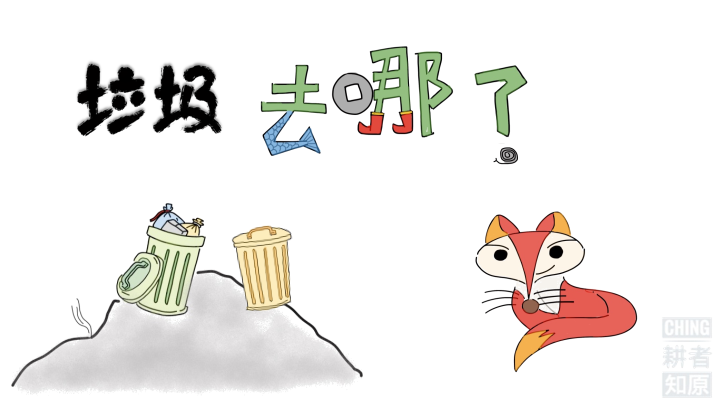
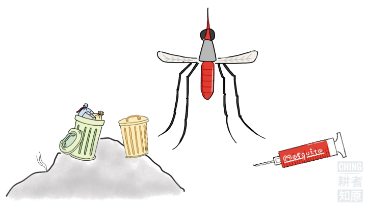

# 蒋小鱼讲故事 ① 垃圾去哪儿了？

去年11月，蒋小鱼去参加讲故事比赛，这是我们一起创作的故事底稿。

因为我拖稿拖得厉害，所以直到比赛前三天，蒋小鱼才拿到完整的稿子。在比赛现场，她的表现极好，比在家里任何一次排练的时候都要好，没有一个字讲错，没有一个字多余，连“俄罗斯的罗蒙诺索夫”都说对了，没有变成“俄罗斯的鹅”。可惜没有得奖，也许是因为，她讲得真的——有——点——儿——慢——！可是，我觉得很好，我就是喜欢她慢条斯理的样子，因为，我的性子也是极慢的。

亲爱的宝贝，我永远不会因为你太慢了而生你的气。

故事开始了——

  
01. 今天，我给大家讲的故事，名字叫《垃圾去哪儿了》

  
02. 我们的生活中会产生许多垃圾。比如——易拉罐，旧电池，玻璃瓶，旧报纸……

  
03. 还有——鱼骨头，香蕉皮，苹果核，旧纸箱……

  
04. 乱扔垃圾，不仅会污染环境，还会吸引各种坏蛋。

  
05. 就像——老鼠！

  
06. 还有——蟑螂！

  
07. 还有——苍蝇！

  
08. 还有——蚊子！

  
09. 以及——很多看不见的细菌和微生物。

  
10. 那么，垃圾都去哪儿了呢？

  
11. 是被恶魔吃掉了吗？

  
12. 是长上翅膀飞走了吗？

  
13. 是装进火箭送往太空了吗？

  
14. 是被巫师变没了吗？

  
15. 都不对！

  
16. 战国时期的列子爷爷说过，物质是不灭的！

  
17. 俄罗斯的罗蒙诺索夫说过，质量是守恒的！

  
18. 垃圾不会凭空消失。为了保护我们的家园，妥善处理垃圾，首先要对垃圾进行分类。

  
19. 普通垃圾和可回收的垃圾，要分开放！

  
20. 有毒有害的垃圾，要小心放！

  
21. 这是厨余垃圾筒，放在厨房，专门用来放有机垃圾。

  
22. 经过分类的垃圾，可以运往不同的地方分别进行处理。

  
23. 有的可以填埋。

  
24. 有的可以焚烧。

  
25. 有的可以用来制造沼气。

  
26. 有的可以回收再利用。

  
27. 让我们一起行动起来，垃圾分类，保护人类！

[版权声明](../LICENSE/zh_cn.md) | [LICENSE](../LICENSE/en_us.md)