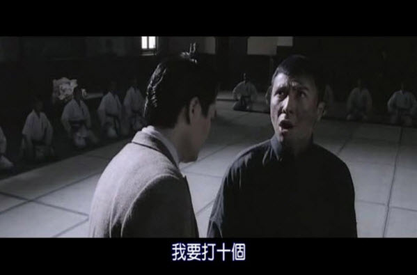
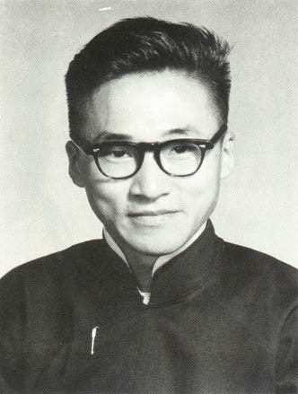
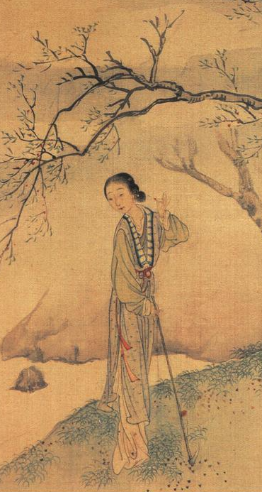

# Y & Y, H & M

标题看不懂？没关系，跟我念：

> Year Year Have Me

这是一句祝福的话，放在逢年过节的时候说，中国人一听就懂。放在这里，就当是给大家拜个晚年。说英语的西洋人可能不明白，我给翻译成中文，他们也就懂了：
> Year Year Have Me  
> 年年有余

还不明白？我只好瞎说大白话了：__没关注的赶紧关注，关注了的千万别取关。__

波谲云诡的 Dogyy Year 刚刚过去，我从狗肚子里写起，一直写到了狗尾巴。再过几天出了正月，Piggy Year 就要上轨道了，是时候做一个总结了。

过去一年，是狂飚突进的一年。我的公众号完成了 10X 增长。有些事看上去很难，如果你不抛弃，不放弃，顶着三姑六婆的冷嘲热讽，不松口，不松手，你就会发现，这件事真的很难。

别嫉妒我，我做到了！别不相信，起初我的关注用户只有一个——没什么不好意思承认的，就是我自己——，但是现在我有十个！

  
《叶问》剧照（图片源于网络）

过去一年，也是跌宕起伏的一年。10X 增长的过程，并不是一路坦途，有时候一天涨个两成，跌个三成，也是常有的事。自从开了这个号，我就不怎么关注股市了，几个点的涨跌，从来不过一成，不够刺激，没啥意思。反而是被取关的心理创伤，已然胜于股票跌停。

卢梭的忏悔是写给世人的，不是写给上帝的。蒋公的日记是写给国民的，不是写给自己的。都是殚精竭虑得来的文字，伟大的人物不能免俗，我更不能。我比他们来得坦诚，我不羞当面，每每不耻下问：__你觉得我写得怎么样？__ 读者们热情地给予我各种鼓励，归纳下来有三种：
*	好！
*	很好！
*	特别好！

这么苍白的评价，显然并不能让我满意：你得告诉我，到底好在哪里？！

他们都不好意思直说。中国的文化讲究含蓄，褒扬的话要放在背后说，所以我从间接渠道得来的风评就生动得多。

__有人说我闲得蛋疼。__

这话我听了脸红，只能笑纳一半。

> 每次到了夜深人静的时候，  
> 我总是睡不着。  
> ——李宗盛，《我是一只小小鸟》

我其实一点也不闲。多少个子时，我就这样蜷缩在阳台的角落里，一边瑟瑟发抖，一边涂涂画画，一边幻想明天，一边迎来丑时。真的，我并不闲。要是有，也就是偶尔忙里偷闲，喂一喂我的小鸡，收两把绿色能量。
	
> 我们有些干部缺乏勇气，  
> 没有卵子，不像个男子汉。  
> ——刘伯承，在大别山区某次会议上的讲话

至于说蛋疼，我觉得，那是在夸我的文字有种。毕竟有卵子才会疼，对不对？话是好话，我受之有愧。

  
青年李敖（图片源于网络）

李敖写过一本书，叫做《活着你就得有种》。他是真的有种，敢骂能让他坐牢的人。我其实谁都不敢骂，也就是现在，气不顺的时候，敢损一损我的读者。不是我胆肥，就这么些个，扳着指头数得过来，一人一口唾沫也淹不死我。万一哪天我声名鹊起，有那么一群乌合之众整天追着我、要给我“好看”，我也就不敢骂了。

__有人说我无病呻吟。__

> 侬今葬花人笑痴，  
> 他年葬侬知是谁？  
> ——曹雪芹，《红楼梦·葬花吟》

  
《黛玉葬花》局部（清·费丹旭）

在中国的文学史上，最最有名的无病呻吟，非黛玉莫属。原本，没有几分婀娜的身段，不是我见犹怜的模样，是配不上这四个字的。既然有人这么抬举我，我就沐猴而冠一把。过把瘾，也无妨。

__有人说我用力过猛。__

这是很多影评人用来评价莱昂纳多·迪卡普里奥的词汇。少年得志是他，大器晚成是他。他屡屡与小金人擦肩而过，他也是实至名归的奥斯卡影帝。2016年，经过一次次的志在必得和一次次的铩羽而归之后，他终于凭借《荒野猎人》摘得了第88届奥斯卡最佳男主角奖的桂冠。这一年，他42岁。

我还有什么话说呢？

  
莱昂纳多：嗯？你们在说我吗？  
（图片源于网络）

遗憾的是，上面这些评价，大都是转述，我不曾亲见，不免贬损了许多快感。好在当面锣对面鼓的表扬，也是有的。

__Q总点评说，我的文字有王小波的风范。__ 我觉得他是低估了我：小波是我同事，就坐在我背后一丈远处，他曾亲口对我承认，完全看不懂我写的是什么玩意儿。我和Q总没有面对面地吃过饭，没有手挽手地喝过酒，他对我不够了解，也是情有可缘。

__W哥感慨道，从狗肚子到狗尾巴，就楞没看出来我的文字有哪怕一丢丢进步的迹象。__ 他的意思是，我的水平一出道就已经登峰造极，再也没有向上的空间了。W哥一向快人快语，我认识他也有五年了，没听他奉承过谁，于我，想来也没有曲意迎合的必要。

然而，然而，然而，然而，有限才华，难填欲壑。我的雄心壮志，到了你们的眼皮底下，却再也无法前进一步。而你们在自己的城堡中向外张望，只见旌旗遍野，只闻锣鼓喧天，却并不知远处的帷幄中，所坐何人？

有时兴味索然。写作不如聊天，聊天不如跳舞。

> 不如跳舞  
> 聊天倒不如跳舞  
> ——林夕，《不如跳舞》

这是一条孤单的路，犹如穿过密密的丛林，去探索失落的文明。丛林的深处，也许有玛雅人的遗迹，也许什么也没有。

> 十年寒窗无人问  
> 一朝成名天下知  
> ——元·高明，《琵琶记》

我还会继续写下去。我并不在意天下知否，却十分渴望一人知己。不用怀疑，说的就是你啊！
