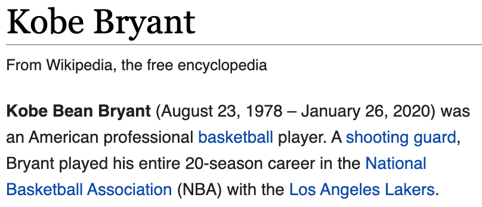

#   No.24

这个世界，每天都有人来人往。

昨天，科比走了。

他乘坐的西斯科基 S-76B 型直升飞机在洛杉矶郊区失事坠落，所有乘客不幸罹难。同在飞机上的，还有科比年仅十三岁的女儿 Gianna。

据说，S-76B 的 S 代表 Spirit。

##  很帅的得分后卫

科比被认为是 NBA 历史上仅次于乔丹的得分后卫，这是 ESPN 评的。

很帅，这是我以为的。

我算不上正儿八经的球迷，虽然上学的时候玩过篮球，但是很菜，青菜的菜，不是蔡徐坤的蔡——我比人家差远了。甚至，我都搞不懂为什么一个后卫能得分，还能得 NBA 史上排名前三的33643分。也是在昨天，2020年1月26日，湖人队的勒布朗·詹姆斯刚刚拿到33644分，超越了他的前辈科比。

喜欢科比，是因为他打球很帅，长得也很帅。如果不打球，科比没准也可以成为像威尔·史密斯或者丹泽尔·华盛顿那样的电影明星。事实上，退役后他还真拍了一部动画，*Dear Basketball*，并且获得了第90届奥斯卡最佳动画短片奖。

科比17岁就加入 NBA，成为一名职业球员。也就是说，科比没上过大学，不过他参加过 SAT——也就是美国的高考——，成绩是1080分，而那一年 SAT 平均成绩是1013分。对于学霸来说，也许不算什么，但是想想，如果现在把你提溜起来做一套高考试卷，能不能比平均分多考60分？你就知道对于一个以训练和比赛为重的运动员来说，这个成绩意味着什么。

帅且有才，这是科比。

##  凌晨四点的洛杉矶

> Do you know what Los Angeles looks like at 4 o’clock in the morning? It is still in the dark at 4 o’clock, but I had already gotten up by then and was walking in the dark streets. The days passed and the darkness did not disappear. More than 10 years passed and the darkness in the streets of Los Angeles was still there at 4AM, but I had become a basketball player with strong muscles, excellent physical fitness, strength and a high field goal percentage.  
by Kobe Bryant

> 你知道凌晨四点钟的洛杉矶是什么样子吗？  
> 四点钟的时候，天还是黑的，  
> 而我已经起床，走进了黑暗的街道。  
> 日复一日，黑暗依旧。  
> 十多年过去了，黑暗仍然盘踞在凌晨四点钟的洛杉矶街道上，  
> 而我已经成了一个肌肉发达、身强力健、投篮准确的球员。  
> ——科比·布莱恩特

勤奋和天赋同样毋庸置疑，这是科比。

##  毛建军

Kobe 是日语神户的译音。据说，科比的父亲很喜欢神户牛肉，于是给自己的儿子取了这个名字。

科比很牛，但是在中文世界，他还有一个更酷的绰号——毛建军。

2006年1月22日，洛杉矶湖人队主场对阵多伦多猛龙队。科比出场42分钟，46投28中，其中三分球13投7中，另加罚球20罚18中，总共拿下81分，帮助湖人以122比104赢得比赛。

单场81分！

从此以后，科比的粉丝在网络上拥有了一种大杀四方的神器，足以让他们立于不败之地。不管面对什么样的对手，最后都可以用这样一句来结束论战：

「** 算个毛，科比一场得过81分！」

久而久之，毛八一成了科比的别号。按照众所周知的逻辑，进一步演绎成更接地气的「毛建军」。

爱你只需要一个理由，这是科比。

##  未及完成的传承

科比本人是史上最伟大的 NBA 球星之一，他长达二十年的职业生涯，全部贡献给了洛杉矶湖人队。

他的父亲 Joseph 也曾是一名 NBA 球员，退役后曾在 WNBA 球队洛杉矶火花队担任教练。

科比有四个孩子，都是女儿。二女儿 Gianna 遗传了父亲的篮球天赋。科比还在 NBA 打球的时候，常常会把 Gianna 带到赛场，小娃娃还会在球队热身的时候练习投篮。退役后，科比还亲自执教 Gianna 所在的中学女子篮球队。

科比在接受采访时，曾有这么一段话：

> The best thing that happens is when we go out and fans would come up to me and she'll be standing next to me, and they'll be like, 'You've gotta have a boy, you and V gotta have a boy. You gotta have somebody to carry on your tradition, the legacy.' She's like, 'Oy, I got this.' I'm like, 'That's right. Yes, you do, you got this.'

> 最有意思的是，我们外出的时候，粉丝们围住了我，而她就站在我身边。他们会说，“你得生个男孩，你和 V（指 Vanessa Bryant，科比的妻子）得生个男孩。得有人继承你的衣钵，你的传奇。”她是那么说的，“哦，我已经得到了。”我说，“没错，你已经得到它了。”

那时那刻，作为一名父亲的自豪溢于言表。

这是传奇的传承，因为这次事故，戛然而止。这是真正的不幸！

##  References

*   [科比·布莱恩特](https://zh.wikipedia.org/wiki/%E7%A7%91%E6%AF%94%C2%B7%E5%B8%83%E8%8E%B1%E6%81%A9%E7%89%B9)
*   [‘You got this:’ Kobe Bryant was grooming his daughter, Gianna, to carry on his legacy](https://fox6now.com/2020/01/26/you-got-this-kobe-bryant-was-grooming-his-daughter-gianna-to-carry-on-his-legacy/)
*   [Four things Kobe teaches us on how to have a successful career](https://www.morganmckinley.com.cn/en/article/what-kobe-teaches-us-how-have-successful-career)