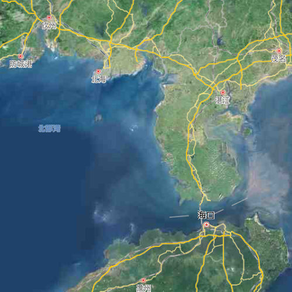
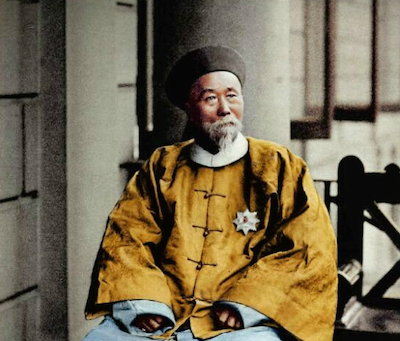
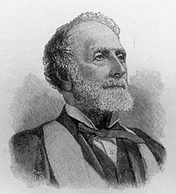
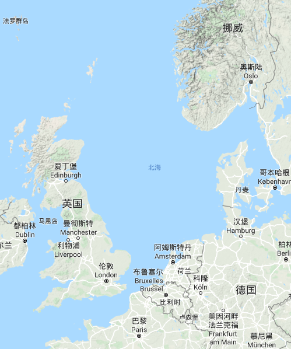

#   人间的北海

2019年已经过去，北海道终究是没有去成。然而，人间并非只有一个北海。

##  Pak Hoi

北海的北，固然是东南西北的北，可是境内的北海，却在南方。

位于大陆最南端的雷州半岛，是我国的第三大半岛，与海南岛仅一衣带水之隔。半岛与岛的东侧是南中国海，而西侧是北部湾。

在大陆架的衬托下，北部湾的平均水深不过四十余米，水底地势平坦。冬季风和日丽，在地球自转所形成的科利奥里力的影响下，海流沿着湾区的东侧北上，沿西边南下。进入夏季，西南季风的到来逆转了海流的方向，开始沿岸顺时针流动。浅浅的海湾，往复的海流，加上又有南流江、钦江、防城河、北仑河等多支淡水河的注入，北部湾海域因此饵料丰富，乃是优良的天然渔场，大有「水浅鱼争跃」之意。

北海就在此地。它紧邻雷州半岛，是由东向西伸入北部湾的一块海岬。大约在十七世纪，渔民们在海岬北部避风港的周边，聚成村落，因为北面濒海，所以称为北海村。蒋委员长说，「地无分南北」。也对，不论多么南的地方，都能找得着北！

  
*北海隶属广西，  
广西归入华南，  
华南亦是中国，  
中国地处东亚。  
东西南北中，尽在此地。*

今天的北海与桂林同为国家历史文化名城，也是知名的旅游城市。在北海市北部湾中路一带，座落着若干保存完好的西洋楼栋，合称「北海近代建筑」，既是全国重点文物保护单位，也是颇受欢迎的景点。然而这些建筑的来历，却并不全是美好的回忆。

​1876年，也就是光绪皇帝登基的第二年，李鸿章与威妥玛（Sir Thomas Francis Wade）签订『中英烟台条约』。李中堂大名鼎鼎，威公使相形黯然，然而他发明的威妥玛拼音，却要比『李文忠公全集』流传更广。

这种拼音，你可能打过，比如：  
Tai-chi（太極）
    
也可能抽过，比如：  
Chunghwa（中華）

有人说，我还上过，比如 Tsinghua（清華）。这是不对的！Tsinghua 和 Peiking 所依据的，是经1906年帝国邮电联席会议决定的拉丁化汉名拼音方案，俗称邮政拼音。不过，邮政拼音与威妥玛拼音虽然不能混为一谈，但是确有渊源：前者以翟理斯（Herbert Allen Giles）的『华英字典』为基石，而『华英字典』所采用的 Giles-Wade 拼音——看名字就知道是继承了后者的衣钵，所以两者算得上是传承有绪。总之，在现代汉语拼音颁布之前，粤语腔浓浓的威妥玛拼音已经沿用了近百年，并且直到今天也仍然没有彻底退出历史舞台。

  
*李鸿章，人称「东方俾斯麦」，自叹「大清裱糊匠」。从创建淮军，跟随曾国藩镇压太平天国起，他很努力地裱啊裱啊，直到1895年——也就是农历甲午年——，终于糊了。两个甲子过去了，就连大清这栋破屋都已经坍塌了一个世纪有余，而甲午战争惨败的余波，却至今未平。*  

  
*虽然知名度远不能与李鸿章相提并论，但在晚清的政经圈中，威妥玛其实是重量级人物。1854年，也就是李鸿章因对太平天国作战有功而升任道台的同一年，西方列强接管了江海关（上海海关），威妥玛任税务司，这比赫德加入清政府海关、担任粤海关副税务司的时间还要早五年。1869年至1882年，威妥玛任英国驻华公使，是他仕途的巅峰。*  

『烟台条约』当然不是一份关乎拼音的协议。条约上说：

> 所有现在通商各口岸，按前定各条约，有不应抽收洋货厘金之界，兹由威大臣议请本国，准以各口租界作为免收洋货厘金之处，俾免漫无限制；随由中国议准在于湖北宜昌、安徽芜湖、浙江温州、广东北海四处添开通商口岸，作为领事官驻扎处所。

西夷「议请」在先，天朝「议准」在后，字里行间依然流露着一切尽在掌握的自信，仿佛舍予皆是你情我愿。

1877年4月1日，北海开埠。​

这里是古代海上丝路的始发港之一，曾经向西方输出了不可胜数的丝绸、瓷器和茶叶。此后，大量英货开始经由北海输入中国，其中最著名的大宗商品，就是不列颠东印度公司的——鸦片。

##  Noordzee

威妥玛的故乡，原本不缺北海。域外的北海，就在大不列颠岛的东侧。怎么不叫「东海」？因为这名字是从荷兰语中泊来的。

  
北海是谁的北海？地图上看更清楚。

阿Q从前不叫阿Q，「他似乎是姓赵，但第二日便模糊了」，到底姓不姓赵，鲁迅先生也没有把握。在英语中，北海从前不叫 North Sea，而是叫 German Ocean，这事儿却是有证可考的。在英国据有统治地位的盎格鲁-撒克逊民族，本来就是大迁徙时代横渡北海而来的日耳曼部落的后裔。

日耳曼人鸠占鹊巢，这是公元五世纪的事。此后的一千多年，欧洲大陆的各方势力从未停止对这爿岛屿的觊觎，瑞典人、挪威人、丹麦人、法国人纷至沓来，盎格鲁-撒克逊人的日子过得并不消停。

1588年，效忠伊丽莎白一世女王的皇家海军，在家门口一举击败了入侵的西班牙/无敌舰队。不过，大英帝国想要继承「日不落帝国」的地位，尚需假以时日。十七世纪当之无愧的海上霸主，既不是西班牙，也不是英国，而是欧洲大陆的新兴势力——荷兰。

整整一百年后的1688年，不列颠再次祸起萧墙，新教徒控制的国会罢黜了信奉天主教的国王詹姆斯二世，国王的女婿、荷兰执政威廉三世趁机率领舰队抵达英伦，取而代之。二十多年前，英国人抢了荷兰人的「新阿姆斯特丹」，用海军大臣约克公爵的名字重新命名为「纽约」，这位约克公爵，就是后来的詹姆斯二世。如今，强势的「北海」渡过北海，将「日耳曼海」湮没在史籍中，也算是礼尚往来。在威廉三世的心中，或许也有一个「车同轨，书同文」的梦。

北海徜徉在西欧的大陆架上，大部分区域水深不过百米，也是一片浅海。北上的北大西洋暖流与南下的北冰洋寒流在此交汇，成就了北海渔场，得以与北海道渔场平起平坐，同为世界四大渔场之一。这里盛产鳕鱼、鲐鱼、鲽鱼、鳘鱼……，也不乏群众喜闻乐见的龙虾和牡蛎。其中最有名的，还是当初荷兰人赖以发家致富的鲱鱼。

除了这些虾兵蟹将，北海还出产一种闻名于世的自然资源——北海布伦特原油，简称布油。起初，布油特指英国 Brent 油田出产的原油，后来又逐步纳入了同在北海海域内的 Forties、Ekofisk、Oseberg 和 Troll 油田的产物。自开采之日起，布油的产量始终徘徊在全球的百分之一上下，但由于其极高的品质和特殊的地缘，始终在国际原油期货交易市场中占有举足轻重的地位。据估计，全球有近七成的原油交易是参照布伦特原油定价的。

> 甲：您这油咋卖？  
> 乙：我也不知道卖多少钱合适。要不，你就看着布油的价给吧。  
> 甲：布油啥货色，你啥货色。卖一样价，合适吗？  
> 乙：那给您打个八折？  
> 甲：成交！

什么叫定价权？这才是啊。同样是女王陛下的子民，南半球的那位铁矿石巨头，却只会靠山吃山，向东方大国漫天要价，从不计长远。相比之下，布油真是高明得太多了。不得不说，宗主国就是宗主国。

2017年，英荷合伙的荷兰皇家壳牌公司宣布 Brent 油田全面停产，这意味着从此不会再有一滴「正宗」的布油流向市场，但是以其命名的原油价格体系依旧存在。什么叫定价权？这才是啊。同样是女王陛下的子民，南半球的那位铁矿石巨头，只会靠山吃山，向东方大国漫天要价，从不计长远。相比之下，布油真是高明得太多了。不得不说，宗主国就是宗主国。

只不过，南半球的铁矿石还有得挖，北海的石油已经不多了。无论英国人怎样勉力维系，布油终有一天将退出国际商品舞台。这一天，可能不会太远。