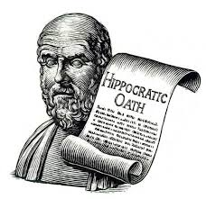
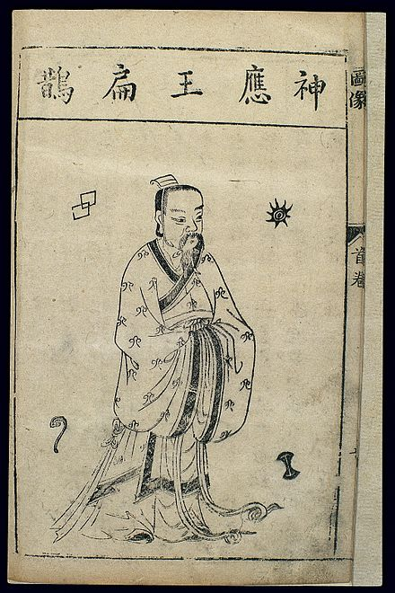
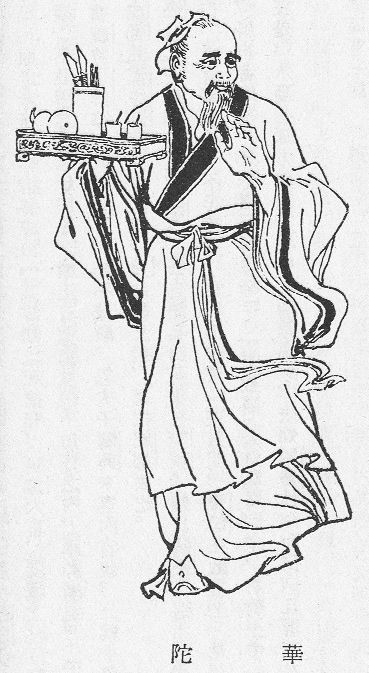

#   对医生好点儿

并非所有的职业都需要宣誓才能上岗。

有的职业，不止是一份工作，还是一种使命，比如医生。不论战争与和平，医生这个职业，始终承载着我们对于生的希望。

然而医者不能自医，有时，甚至也不能自保。

##  扁鹊、蔡恒公和秦武王

“扁鹊”原本是传说中上古轩辕时代的游医，人面鸟身。战国时期的扁鹊，「勃海郡郑人也，姓秦氏，名越人」，记载于《史记·扁鹊仓公列传》。这是信史，可见确有其人。

> 扁鹊名闻天下。过邯郸，闻贵妇人，即为带下医；过雒阳，闻周人爱老人，即为耳目痹医；来入咸阳，闻秦人爱小儿，即为小儿医：随俗而变。  
> --《史记·扁鹊仓公列传》

看来，越人先生是广受人民群众喜爱的全科医生，妇科、儿科、五官科，没有他不善长的。

__安土重迁，黎民之性__，然而总有人为了天下黎民而四海为家。在那个医疗资源极度稀缺的年代，扁鹊带领的小型医疗队伍周游列国，挽救了许多人的生命，有名的如晋大夫赵简子和虢太子​。​

走啊走啊，到了齐国，生出了韩非子笔下《扁鹊见蔡桓公》的故事。扁鹊再三警告桓侯：有病，得治！桓侯不以为然，还揶揄扁鹊「好治不病以为功」，摆明了说他过度医疗。后来桓侯的病发作，那会儿想起扁鹊了，「使人索扁鹊，已逃秦矣，桓侯遂死」。

扁鹊虽然和孙武不是一个专业，但是毕竟行走江湖多年，深谙三十六计走为上计，知道此地不可久留，便跑到秦国去了。要是不跑，少不了要背锅。

遗憾的是，扁鹊跑对了时机，却跑错了方向：「秦太医令李醯自知伎不如扁鹊也，使人刺杀之」。

结合《战国策》的记载推测，李醯是秦武王嬴荡的「左右」，很可能根本不是什么正经的医生。与其说这是一个同行相杀的故事，不如说是外行逆向淘汰内行的悲剧。嬴荡二十出头，「有力好戏」，没什么心眼儿，扁鹊的死不大可能出于他的授意。可是，如果不是因为他模棱两可的态度，李醯未必敢对扁鹊下手。对于嬴荡不信任医生的问题，扁鹊曾经予以严厉的批评：

> 君与知之者谋之，而与不知者败之。使此知秦国之政也，则君一举而亡国矣！  
> --《战国策·秦策二》

「亡国」的话，是扁鹊言重了。但是扁鹊一死，李醯又没本事治嬴荡的伤，结果可想而知。没多久，这个因为和手下比拼举鼎而把自己整骨折了的耿直男孩，死了，「享国四年」。

##  华陀和曹操

华（huà）陀是华陀的本名，东汉末年安徽人，在中国医学史上的地位仅次于扁鹊。

华陀也是一位全科医生。特别之处在于，他是古代罕见的外科手术专家，还发明了名为「麻沸散」的麻醉药，也是有记载的第一位施行麻醉手术的医生。

> 若病结积在内，当须刳割者，便饮其麻沸散，须臾便如醉死，无所知，因破取。  
> --《三国志·华佗传》

​《三国演义》第七十五回「关云长刮骨疗毒 」的故事，只能说是演义罢了。如果这台手术真的是华陀主刀，他一定会建议上麻沸散，怎么可能会提出「于静处立一标柱，上钉大环，请君侯将臂穿于环中，以绳系之」这么蠢的主意？

> To cure sometimes.  
> To relieve often.  
> To comfort always.  
> by Dr. Edward Trudeau

然而，即便是神医如华陀，也不是无所不能的。1600多年后，大洋彼岸的特鲁多医生说，「有时治愈，常常帮助，总是安慰」，对此，华陀一定深有体会。

曹操有头风病，病得很重，找华陀来看。华陀委婉地对他讲，「此近难济，恒事攻治，可延岁月」，大白话说就是：​这病根治不了。患者对此显然极为不满，甚至说「佗能愈此，小人养吾病，欲以自重」。曹操的怀疑精神，和几百年前的蔡桓公倒是一脉相承。

话说得难听，倒也罢了，曹操倒好：治不好我的病，我就不放你走。后来，因为华陀请假回家，逾期未归，曹操竟然派人把他抓进大牢，折磨死了。荀彧为华陀求情，标榜爱才的曹操竟然神经质地叫嚣，「不忧，天下当无此鼠辈耶」。

曹阿瞒一世枭雄，杀人如麻。别说是给自己盖被子的区区侍卫，就算是杨修那样的才子能臣，说杀也就杀了。在这许多无辜的、以及也许不那么无辜的亡灵中，华陀可能是唯一让他后悔的那个。

> 及后爱子曹冲病困，太祖叹曰：“吾悔杀华佗，令此儿强死也。”  
> --《三国志·华佗传》

曹操的头疯病终究没有好，如果他最爱的孩子没有早夭，他或许还能活得久一点。

##  尾声

扁鹊和华陀的遭遇，虽然见诸于信史，毕竟年代久远，或不可全信。然而像这样的例子，在近代也不罕见，太近的事儿，就不说了。

对医生好点儿，也是为自己好。