#   静源深流

__——静态资源服务及其在携程的演进__  
转载自微信公众号[「携程技术」](https://mp.weixin.qq.com/s/Tlt1ZZ0wPTgt67KybZCL1w)

##  转载附言

这篇文章原本只打算写二千字，够交差就行。结果初稿八千有余，二稿又多一半。定稿后，传阅于我的搭档大飞哥。他若有所思地对我说，“问你一个问题……”，我以为他会说，吃什么撑着了写这么长？结果他问的是：“想这个标题，你花了多长时间？”大飞哥果然是明白人，总能拨开迷雾，抓住本质。

标题是我在梦里得来的。有道是南柯一梦二十年，梦里的事，岂能以人间论短长？我爱这个名字，胜过下面全部文字。也许，它更适合用来写我和蒋小鱼的故事。

言归正传。全文近13,000字，分八个小节：

*   __先有“静”，还是先有“动”？__  
    静态资源的由来
*   __不可或缺的 CDN__  
    内容传输网络及其对静态资源的意义
*   __破“窗”之役__  
    源站去 Windows 化的实施过程
*   __分久必合__  
    静态资源的拆分与合并
*   __对啊，为什么不更新？__  
    静态资源的更新流程
*   __上云，上云！__  
    源站的云服务化
*   __国际化背景下的布局 __ 
    如何更好地服务于遍及全球各个角落的用户
*   __未来向何处去？__  
    对「静态资源」存废问题的一点思考

以下正文：

----

上世纪八十年代末，不列颠的伯纳斯-李爵士发明了万维网，距今已有三十年。万维网并非互联网的全部，然而它的出现，为普罗大众开启了新世界的大门。从此之后，互联网的风口轮动不休，静态资源这棵门前的早树却安静如故。许多年过去了，静态资源服务的基础构架没有发生大的改变，改变的只是它所承载的内容和服务的对象。

作为万维网的基石，HTTP 协议的版本号也曾停滞在 1.1 达十八年之久，期间经历了两次迭代。2015年除夕，HTTP/2 终于正式获批。这一协议在继承 HTTP/1.1 绝大部分语义的前提下，改革了传输方式， 其效率接近 TCP 协议的能力极限。它将在未来几年内，挑战关于 Web 性能优化的许多陈规俗制。然而我们围绕着静态资源基础设施的工作，在那个春天才刚刚起步。几年来所取得的进展很难说尽如
人意，谨以此文作一注脚。

##  先有“静”，还是先有“动”？

在万维网面世的头几年，网页就是电子化、通过互联网传输的 HTML 页面，除了支持超文本链接、可以天马行空地从一个网页跳转到另一个网页之外，它们和你翻开书本或杂志所见的页面、以及商店橱窗或影院门口张贴的海报，就浏览体验而言，不见得有什么了不起的优势。我的互联网启蒙，居然还是通过一份名为《计算机世界》的纸质报纸完成的——这种报纸价格便宜量又足，一块钱就能买上沉沉的一叠，而且质地良好，很受同学们的欢迎。

那个时代，动态或静态的说法还不怎么流行，大部分以 http:// 为前缀的 URL 是可以作为固定的参考文献地址来引用的。

1996年，李爵士领衔的万维网联盟（W3C）从 IETF 手里赢回了 HTML 标准的主导权。也就是在这一年的12月，微软公司推出一种名为 Active Server Pages 的脚本语言，便是日后大名鼎鼎的 ASP 语言。在 PHP 这种“全世界最好的语言”大杀四方之前，ASP 一度是 Web 技术的代名词。

❶ 打开 Notepad，写下一行 `<% Response.write "Hello world!" %>`，❷ 把这个文本文件命名为 `index.asp`，保存在 IIS 的工作目录下，❸ 然后打开 IE，输入 `http://localhost/index.asp`，☺「友好的世界」就此呈现。

简单吗？是的，就像把大象放进冰箱一样简单。Notepad、IIS、IE，所有的工具都是现成的，只需要一台安装了 Windows NT 操作系统（即 Windows 操作系统的早期服务器版）的个人电脑，你就可以在一分钟内创建自己的服务端动态网页。与名字晦涩难懂、令人望而生畏的公共网关接口（CGI）相比，不得不说，这太酷了！

脚本语言的介入，使得服务端编程技术迅速走上了平民化的康庄大道。与此同时，浏览器端也在发生着天翻地覆的变化，DOM、JavaScript/JScript、CSS 相继被主流厂商接纳，DHTML 技术初具雏形。之后数年间，动态网页取代静态网页，Browser/Server 架构取代 Client/Server 架构，分别成为万维网和网络应用的主流。

动态网页大行其道之后，“静态资源”的概念方才渐渐显露轮廓。所谓动静分离，起初只是 Web 程序员们的一种自发的、朴素的实践。起手建好 static 目录，下设 css / imgs / js 子目录，顺带斟酌下 img 和 imgs 哪个更妥，乃是一枚老鸟的自我修养的体现。随着 Web 站点或应用的结构日益庞杂，服务端程序和那些仅供浏览器下载、无须在服务端执行或运行的——也就是“静态”的——文件之间显然存在着重大的分歧。即使是泾渭分明的目录，也不足以容纳这种分歧。于是，架构师们开始将这些“静态”文件部署在独立的 Web 容器中，一则可以提升服务性能，二则方便开发和运维，“动静分离”逐渐成为一种被普遍接受的顶层设计模式。

动静分离的模式一直沿用至今，但是它的内涵已经发生了深刻的变化。今天，服务端中间件的性能优劣不再成为瓶颈，客户端（不局限于通用浏览器）的用户体验才是亟需关注的重点。因此，我们也不再纠结于内容在服务端以什么样的形态存在，而是站在客户端的角度，去观察 HTTP 请求和响应的特点，以此作为界定静态资源的依据。

从客户端看 HTTP 请求和响应，静态资源通常拥有这样的侧写：
*   __其请求指向固定的地址（URL）；__  
    这是“静态”的题中之义，但是，也不尽然。

*   __其请求经由安全的 HTTP 方法执行；__  
    所谓安全，是指这种请求不会尝试写入或变更服务端所存储的数据，通常仅限于 GET / HEAD / OPTIONS 方法。

*   __其响应具有特定的内容类型（Content-Type）；__  
    常见的静态内容类型有 application/*、image/*、text/*，其中就包括了级联样式表、图片和脚本。

*   __其响应与上下文无关；__  
    因此静态资源通常部署在  Cookie-Free 的域名下，请求与响应中均不携带任何个性化的 cookie 信息。

然而这些是界定静态资源的必要充分条件吗？并不是！现实往往会超越我们最初的想象，以至于上述看似全面和严谨的描述，也不过是盲人摸象、想当然耳。比如，Polyfill 脚本的内容并不固定，依请求方的浏览器型号而变，显然不合乎“上下文无关”的要求，但在实践中，我们又的的确确是将它作为静态资源来处理的。这并不是仅有的例外。

  
Polyfill.js 的内容依浏览器型号而定

那么，究竟什么是静态资源？我们认为：凡是固定的内容，如果拥有较长的生命周期、面向较多的用户，即可视为广义的静态资源。这样的内容，必然可以、也应当按照 HTTP 协议的约定，在客户端、代理和反向代理层面将其缓存。

__正所谓，一动不如一静。将可以静态化的资源，尽可能实现静态化，对于提升用户访问体验大有裨益。__ 但是，如果没有下节将要讲到的 CDN，这个结论的说服力恐怕就要大打折扣了。

##  不可或缺的 CDN

客户端下载资源所消耗的流量（Traffic）和时间（Time）——我称之为 T2 ——，是衡量静态资源服务优劣的核心指标。几十年来，许许多多的研究人员，孜孜不倦地撰写了许许多多的论文，反反复复地论证以及量化了用户等待时间对于体验质量（QoE）的影响，结论是：越快越好！很好，至少他们的研究成果没有颠覆我们的常识和经验。

1994年，对 IETF 的效率深感失望的李爵士决定另起炉灶。他飞越大西洋，转投有 Georgia Tech of the North 之称的麻省理工学院，并在此创建了 W3C。次年，受到李爵士的启发，应用数学教授 Tom Leighton 着手研究网络拥塞问题的解决方案。1999年4月，一家名为 Akamai Technologies 的初创公司推出了一种分布式内容传输服务，并自豪地宣布方式当时如日中天的雅虎为其“特许客户”。Leighton 教授正是这家公司的联合创始人。巧合的是，就在一个月后，毕业于正牌乔治亚理工学院的梁建章先生在太平洋彼岸和他的伙伴共同创建了携程，多年之后也成了 Akamai 的客户。对于互联网公司，1999年也许不是一个创业的好时机，能够穿越世纪之交的 .com 泡沫，其存在本身就是价值的明证。南乔北马，名不虚传。

Leighton 教授领导的团队通过在互联网的“边缘”——也就是靠近终端用户的地方——部署服务器并缓存响应内容，从而减轻内容网站的负荷，同时提升终端用户的访问速度。一举两得！当然了，得花钱。这极有可能是云计算技术成功应用于商业领域的最早的案例。2002年，该公司首席架构师 John Dilley 在其撰写的 Globally Distributed Content Delivery 一文中披露，Akamai 已经在1,000个以上的网络节点中部署了逾12,000台服务器。这在当时是一个非常可观的数字，相比之下，截止到2002年年中，我国联网计算机的总量也不过1,613万台，其中多数还是个人电脑。

由 Akamai 公司首创的这一系统，后来被称为 CDN，其全称是内容交付网络（Content Delivery Network）或内容分发网络（Content Distribution Network）。分发是手段，交付是目的，一个宗旨，两种表述。这类系统迅速成为改善网站 QoE 的极为重要的工具，几乎所有不甘于偏安一隅的互联网企业在达到一定用户规模之后，都会认真地思考 CDN 服务哪家强的问题。

虽然 Akamai 系统传输的内容很快就从“Web 对象”——也就是图片和文本——，拓展到了动态内容和流媒体，但是时至今日，静态资源仍然是体现 CDN 优势的最佳标本，而大多数商业化 CDN 也依然因循边缘缓存（Edge Caching）的思路来处理针对静态资源的请求。

通常，网站租用 CDN 服务后，供应商会为其分配一个自己名下的专用子域名，由网站管理员自行将该专用子域名设置为网站域名的别名（CNAME）。这意味着由 CDN 供应商指定的——通常是其自有的——域名解析服务（ DNS） 将接管针对网站域名的解析请求，选择距离较近的边缘服务器，将其 IP 地址返回给发起解析请求的一方，也就是终端用户所使用的本地 DNS 服务器，再由其反馈给终端用户。经过这样一番操作之后，用户浏览器上发出的访问请求，就将被发送到相应的边缘服务器（Edge Server）并由其进行响应。这是通过 CDN 实现就近访问的基本原理。

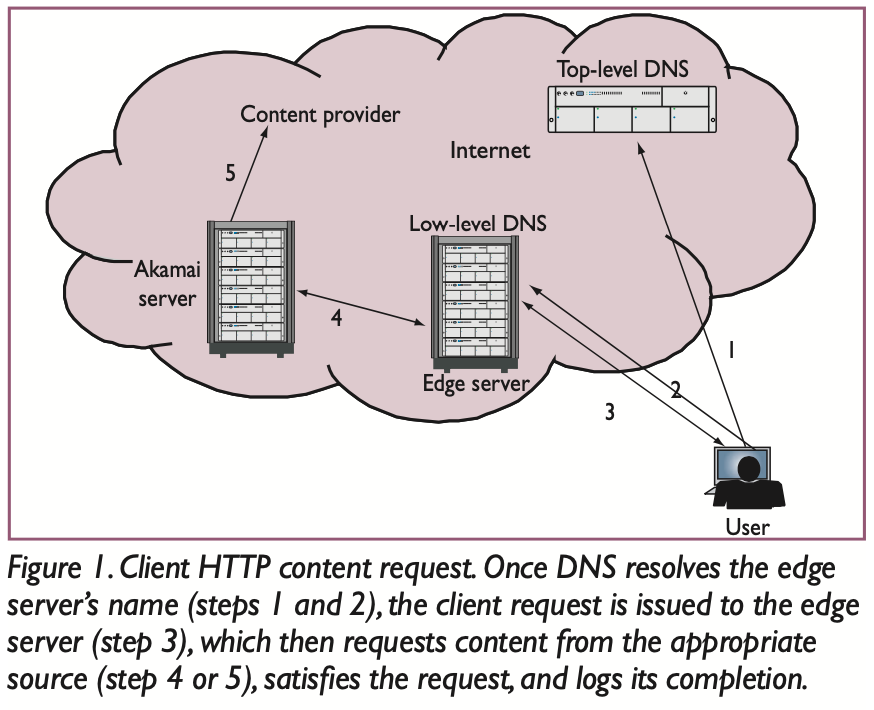  
（图片引自 Globally Distributed Content Delivery）

这种技术客观上达到了在广域网络上由多个服务分担流量的效果，因此术语也称之为全球服务负载均衡（Global Server Load Balance），简称 GSLB。

边缘服务器如果发现可用的缓存，则直接以缓存的内容响应，称为“命中”（hit）缓存，或“卸载”（offload）流量；否则，请求将在 CDN 内部上行（upstream），直到命中合适的缓存或抵达内容网站自有的服务器，由其进行响应，称为“回源”（back-to-origin）。源服务器（Origin，也称源站）处理完回源请求后，其响应将循原路返回，途中，CDN 各级节点将按照约定的方式对其进行缓存，以备下次使用。这是 CDN 执行响应的基本流程。

在这个机制下，作为内容提供商的源站通常处在一个被动的位置。有时，我们也需要主动通知边缘服务器，提前创建或者删除缓存，这两种操作，分别称为“预取”（prefecth）及“清理”（purge）。

__边缘缓存的技术路线，决定了这是一个规模致胜、易守难攻的领域。__ 现在，除了传统的专业厂商之外，从国外的 AWS、Azure，到国内的阿里云、腾讯云，几乎所有重量级的公有云服务供应商都提供 CDN 服务，这是它们在自身庞大的规模基础上顺势而为的选择；而众多的电讯运营商也纷纷凭借其基础设施的便利，亲自上阵，提供地区性乃至洲际的 CDN 服务，统称为 Telco CDN。这些新兴厂商的涌现，的确给志在八方的互联网企业提供了更多的选择。除了绝对的规模之外，地理分布的广泛性是决定 CDN 服务质量的另一要素，而这正是传统厂商长期深耕之处。已在全球拥有1,500+网络节点的 Akamai 依然是行业的佼佼者，也是携程在全球化进程中的技术合作伙伴。

在上一节的末尾曾提到反向代理。对于代理（Proxy），我们都不陌生。浏览器的学名是用户代理（当然严格来说 Agent 和 Proxy 是有一定区别的），家用无线路由器也是代理，大家喜闻乐见的 Shadowsocks 则是一种基于 Socket 的代理，它们所代表的都是客户端。那么反向代理，顾名思义，就是代表服务端的代理。Nginx 充当负载均衡设备时，扮演的就是反向代理的角色。

现在我们知道，__CDN 也是一种反向代理。对于静态资源服务来说，它的地位无可取代。__

##  破“窗”之役

有了 CDN 的加持，静态资源站点就不再是一般的网站，叫做“源站”（Origin）。这一节，说的是源站的事儿。

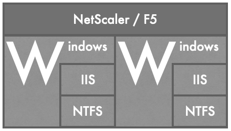  
实施迁移前的源服务架构

曾经，携程的静态资源服务是按1+n模式部署的，即一个负载均衡设备（Load Balancer），挂载若干台服务器。负载均衡设备可能是 NetScaler，也可能是 F5，而服务器是 Windows 操作系统的，上面运行着 IIS，所有进入的 HTTP 请求被直接映射到服务器的本地文件系统。这是一个传统意义上的静态站点，简单，纯粹，一眼看得见底。NetScaler 和 F5 是业界知名的硬件，Windows 是天下闻名的软件，这样的强强联合，自然没有什么不好，只是稍贵罢了。之所以 SLB（软件负载均衡）替代了 NetScaler 和 F5，而服务端去 Windows 化也呈大势所趋，显现的软硬件成本只是一个因素，更重要的原因是 __虚拟化技术和弹性计算解决方案日益成熟，颠覆了原有的基础设施结构和运维模式。__

迁移势在必行。

首节结尾已经明确，服务端采用什么样的技术，不影响静态资源服务的本质。略为遗憾的是，此时我们依然将源站应用定位成静态 Web 应用，沿袭了中间件 + 本地文件系统的架构，只不过操作系统换成了 CentOS，而中间件换成了 Nginx，并按域名拆分成若干独立的应用。从保证服务延续性和稳定性的角度来说无可厚非，但也就此错过了一次重构的契机。

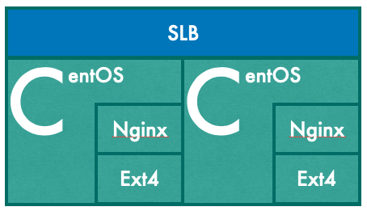  
实施迁移后的源服务架构

迁移中遇到的棘手问题之一，是 URL 的大小写兼容问题。按照 RFC3986 的描述，URL 的路径部分应当是大小写敏感的。然而，Windows 文件系统在缺省状态下是大小写不敏感的，结果就是，不管 HTTP 请求中的路径怎样颠倒大小，只要文件系统中存在不区分大小写的同名文件，IIS 一概照单全收。但是 Linux 系统恰恰相反，不仅严格区分文名称中的大小写，而且允许大小写不同的同名文件并存。延续过去的逻辑，且不说技术上的实现难度——请注意这是一个依赖本地文件系统的静态站点——，还会埋下引发歧义的隐患；若拒绝将错就错，又势必将导致大量 404 错误。

进退两难间，我们不得不采取以空间换时间的办法。在搬迁时，所有的文件一式两份，一份保持原有的大小写名称，放在常规目录下；另一份则采用全小写的名称，放在保底目录下。通过 Nginx 的内部重定向，将路径大小写混淆的请求匹配至保底目录下的文件，以确保基于既有 URL 的请求仍可得到预期的响应内容。保底目录中的文件不允许修改，也不作增删，希望随着静态资源的持续迭代，倒逼那些不规范的 URL 退出使用。

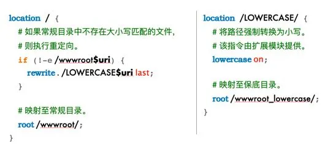  
实现 URL 大小写向后兼容的伪代码

上述策略即使在后来的重构中依然保留了下来，但它真的我们所能采取的最佳策略吗？也不尽然。尽管事前作了充分的解释工作，依然有些开发人员不明就里，疑窦丛生。“静态资源服务支持 URL 大小写混淆吗？”这个问题至今仍呆在我们的 FAQ 列表中。

大小写的混淆，并非是 URL 与文件系统映射关系问题的全部。因为某种过于久远而不可考的原因，相当一部分文件路径中包含了特定的间缀，而这个间缀在 URL 中是不存在的。为此，IIS 中曾维护了大量的虚拟目录配置。因为要与发布系统兼容的关系，服务迁移后，文件系统中必须继续保留这个间缀。我们没有在 Nginx 配置中逐条堆砌 location 指令，而是通过正则匹配、文件探测和内部重定向等一系列指令的协作，解决了这一问题。

  
文件路径与资源路径不一定完全匹配

因为是静态 Web 应用，源服务端没有一行代码可供调遣，Nginx 配置文件几乎是所能转圜的全部空间，我们也把这种以指令为核心的配置语言，当作一门领域脚本语言来学习和运用。随着需求的累积，整个配置文件的有效行数达五百行之多。

这一阶段，在携程的技术生态中，静态资源服务是一组非标准的 HTTP 应用。它们在 Web 中间件之外没有一行服务端代码，同时又捆绑了大量资源文件，体型臃肿，根本没办法通过常规的应用发布系统对其进行全方位的管理。为此，我们不得不基于 Ansible 建立了一个微型的服务器间协同系统，协调位于多个数据中心的数十台服务器，以应付诸如 Nginx 配置升级、资源文件批量管理、服务集群扩容等等任务。

Ansible 是一个基于 SSH 协议的中心化运维工具，只要拥有 SSH 访问权限，就可以通过脚本（Playbook） 安排远端服务器完成任何算力能及的工作，而不需要在服务器上额外安装任何客户端或代理软件。我个人非常喜爱这款轻量化的 DevOps 工具，只是相见恨晚。后来源站应用标准化 + 容器化了，Docker Container 取代了 Virtual Machine，而 DockerFile 取代了 Playbook，真真是长江后浪推前浪、不许英雄见白头啊。

##  分久必合

系统迁移这件事，说破了天也只是清理技术债。没有哪个正常人类能够分辨水电和火电对于 HiFi 音质的影响，同理，后台架构和运维技术的改变也无法直接提升用户体验。因此，在消化沉疴的同时，我们也力争有所输出。静态资源在线合并功能（res-concat），就是与系统迁移同时期的产物。

分久必合，合久必分。还是要从“分”说起。

HTTP Archive 的抽样报告显示，今天（2020年4月）一个网页平均消耗的流量高达2MB，这在使用电话线上网的年代，简直无法想象：56kbit/s 的“猫”（MODEM）就算拿出吃奶的劲儿，也得花上5分钟才能把这么多内容扒拉下来，搁现在短视频都已经刷完一打了。

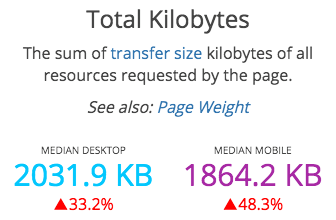  
（图片截取自 httparchive.org）

带宽如此宝贵，发布在万维网上的每个字节都值得掂量。图片是首当其冲的节流对象。在次世代的 Web 论坛中，时常能看到标题中带有「大图杀猫」警示字样的帖子，表示帖子里含有字节可观的图片，爱惜流量者应审慎点击。那种欲拒还迎的气质，和时下公众号里出没的「长文慎入」如出一辙。

使用模拟信号的电话线路带宽有限，丢包率更是高得可怕。访问大码资源不仅极度考验用户的耐心，中途失败、前功尽弃的可能性也不容忽视。所以严肃的商业网站在使用大幅背景图片时，会选择渐进式 JPEG 格式，或者将图片切分后装进表格布局，有点像当今微博或票圈的图片九宫格。甚至在2014年，我们还研究过如何在浏览器端通过精益控制渐进格式图片的下载，来提升移动设备跨网络条件（2G / 3G / WIFI）下的访问体验。毕竟，过独木桥的时候，小步快走是一种理性的姿态。

控制资源单体尺寸的考虑，对于文本格式的 JS / CSS 同样适用。将代码按照功能拆分成若干文件，有利于资源下载成功，有利于资源重复使用，有利于防止 CPU 在等待资源下载期间闲得发慌……就没什么坏处吗？当然有。

内容总量不变，文件粒度越小，请求次数越多。每一次 HTTP 请求背后，都有附带的流量成本和时间成本。仅仅是请求首部中一条用来表明浏览器身份的 User-Agent 字段，往往就有一百多字节，请求和响应首部加起来超过 1KB 是稀松平常的事。而且，在 HTTP/2 之前，HTTP 首部是不支持压缩的。（User-Agent 字段为什么这么长？它们你中有我，我中有你，根本就是一个无间道的故事。）

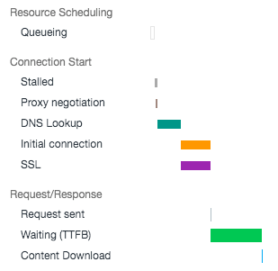  
一个 HTTP 请求的时间瀑布图（图片截取自 Chrome 开发者工具）

重新建立 TCP 连接也是颇费周折的，如果是 HTTPS 请求就更麻烦一些。启用长连接会有帮助吗？会，所以 HTTP/1.1 已经默认这么做了。但是，长连接中的序列化请求会遭遇队首阻塞（HOL blocking），即使是管线化（pipeline）请求也要遵循先入先出的原则，不能从根本上解决这个问题。

一个长连接不够，多建几个可不可以？作为 HTTP/1.1 规范文本的 RFC 2068 和 RFC 2616 均规定：单个客户端与任意服务器或代理之间的并发连接不得超过2个。不过浏览器厂商们对此不以为然，争相放宽限制，以免在“全世界最快浏览器”的竞争中落入下风。允许浏览器最多和同一服务端同时建立6个长连接，几乎成了事实上的标准。因此后来连 W3C 也不再坚持原来的说法， 在 RFC7230 中只是含糊其词地表示，“客户端应当（ought to）限制与特定服务器之间的并发连接”。同样是“应当”，ought to 和 SHOULD 可不止是大小写的区别。然而并发连接数终归没有彻底失控，惟恐触发 DDoS 攻击防御机制是一方面，另一方面也说明长连接并非是万灵药。

总之，虽然有佚失的风险，可要是每笔汇款不论多少都固定收取一分钱的手续费，那么一毛一毛地打钱也太不划算了。__买东西要凑单，静态资源要合并，都是自然而然的选择。__

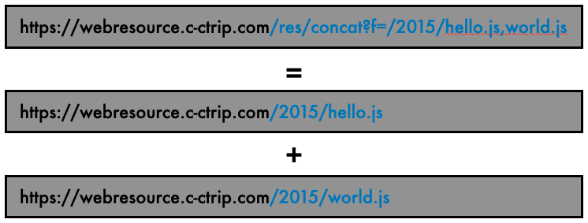  
res-concat 示例

2015年，gulp / grunt / webpack 等等前端构建工具已如雨后春笋般崭露头角，JavaScript Bundle 渐渐深入人心。不同于这些大刀阔斧的构建工具，我们的静态资源在线合并功能是一场润物细无声的毛毛雨，强调的是“在线”二字，针对的是存量资源。只需要调整一下 URL 的写法，就可以实现资源合并的目的，不需要投入学习成本，也不涉及任何代码重构。

在线合并看起来就像 1+1=2 那么简单，事实上它就是那么简单。至于加法背后的 Nginx 模块开发（专司 /res/concat 路由）、Protocol Buffers 协议应用（解决源站应用和提供合并功能的服务集群之间的通讯问题）、原始资源混淆压缩结果的缓存结构设计……等等，不过是细节。

不要过分关注那些细节，因为，HTTP/2 已经来了。相比于 HTTP/1.1，前者虽然在语义上一脉相承，但从网络传输的角度看，则是一个全新的协议：基于流 / 消息 / 帧的多路复用设计，彻底解决了队首阻塞问题，同一域名下的并发 TCP 连接已经没有必要；而 HPACK 的引入，不仅借助静态字典大幅压缩了首部尺寸（比如 Access-Control-Allow-Origin 这么长的字段名，直接用编号 20 替代了），而且利用先入先出的动态字典节省了多个请求 / 响应之间重复首部所耗费的字节（简而言之，如果下一个请求中不加说明，那就默认其首部“同上”）。这就意味着，合并资源的现实基础不复存在了！

站在2015年的春风里向前眺望，HTTP/2 的大规模落地，也就只剩三、五年的光景。缝缝补补的在线合并功能，并不能满足大家对于静态资源解决方案的预期。在线生意日益繁荣，背后的开发迭代速度越来越快，业务条线的同事于是也越来越多频繁地发出直击灵魂的质问：明明已经发布了，浏览器端的静态资源为什么不更新？

##  对啊，为什么不更新？！

遇到疑难杂症，前端写手们有一句口头禅：清一下缓存！似乎，没有什么问题是 F5 解决不了的，如果有，那就 Ctrl+F5。F5 敦促浏览器询问服务器：自从我上次访问这个 URL 以来，它的内容有没有变过？请求首部中通常包含 If-None-Match 或 If-Modified-Since 字段，对应上次响应中的 ETag 和 Last-Modified。倘若有变，返回新的内容；否则返回 304 Not Modified。如果是 Ctrl+F5，便不啰嗦，就像一个从未谋面的陌生人那样生硬地说：拿来！于是就拿来了。

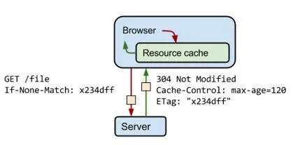  
（图片引自 Ilya Grigorik,  HTTP 缓存）

但是，被 CDN 横插一杠之后，屡试不爽的一指禅和二指禅，好像都不管用了。静态资源内容一旦离开源站，何时过期（Expires: <http-date>），又或者能活多久（Cache-Control: max-age=<seconds>），已是命中注定。虽然按照 HTTP 协议，作为客户端，是允许对着代理或者反向代理作（zuō） 的。

*   它可以在请求中委婉地说：  
    你帮我去问问源站有没有更新？  
    `Cache-Control: no-cache`  

*   它可以矫情：  
    快过期的缓存，我可不要！  
    `Cache-Control: min-fresh=<seconds>`

*   它可以年龄歧视：  
    太老的缓存，我也不要！ 
    `Cache-Control: max-age=<seconds>`

*   它甚至还可以不管不顾：  
    别拦我，我就是要去源站！  
    `Cache-Control: no-store`

没错，协议上是这么说来着。只是我不知道按哪一个键，可以让浏览器说出这样的话？说了，CDN 服务器未必肯听。上一节中也提到过，协议不是数学定理，也不是自然法则，它只是一份契约。就算代理肯听，源站未必答应。因为 CDN 同时还担负着保护源站、抵御 DDoS 攻击的责任，不大可能听任请求穿透代理。

于是，如何更新同名资源的内容，成了一件让人头痛的事。CDN 厂商急人所急，通常都会提供“清理缓存”的接口。但是，想象一下整个内容交付网络中数以千计的节点和数以万计的服务器，就知道这件事不像按一下 Ctrl+F5 这么轻松，可以偶尔为之，却不适合作为常规操作。何况，边缘节点的缓存可以清理，可是终端用户浏览器上的缓存，依然无解。

所以，__必须尽力避免覆盖同名静态资源。__ 这是共识！

很久很久以前，在静态资源文件和虚拟目录之间，还有一层特殊的目录，称为“槽位”。每个虚拟目录下，默认设置 R0 至 R9 共计十个槽位。每次发布时，目标槽位依次向前递进，用尽之后再从头开始，如此更新周而复始，以求资源万古长青。

缺点是显而易见的，最大的问题是不支持增量更新，哪怕只是修改了某个脚本中的一行代码甚至一个字符，客户端和 CDN 都需要重新下载整个目录下的所有资源。但是评价方案的优劣，不能脱离时代背景。毕竟，当下国内首屈一指的 CDN 厂商网宿公司直到2005年才推出自己的 CDN 系统，而携程在两年前就已经上市了。有些古老的办法，因为简单，因为可靠，往往能够在新兴技术的冲击下顽强生存，保有一席之地。比如纸笔，比如槽位。

不过，全量更新实在太不经济了。去 Windows 完成之后，我们就尝试优化。Ilya Grigorik 在《HTTP 缓存》中这样写道：“如何才能鱼和熊掌兼得：客户端缓存和快速更新？您可以在资源内容发生变化时更改其网址，强制用户下载新响应。 通常情况下，可以通过在文件名中嵌入文件的指纹或版本号来实现—例如 style.x234dff.css。”

就这样？就这样。Ilya 的这篇文章最后更新于2019年初，可见这些年来，对于如何解决缓存冲突，依然没有什么更好的办法。Webpack 是这么干的，我们也是。

有时候，一行代码所包含的逻辑，千言万语也诉说不尽。有时候，一句话能说明白的方案，实施起来却千头万绪。下面这张图，粗略描述了我们的静态资源增量更新流程。

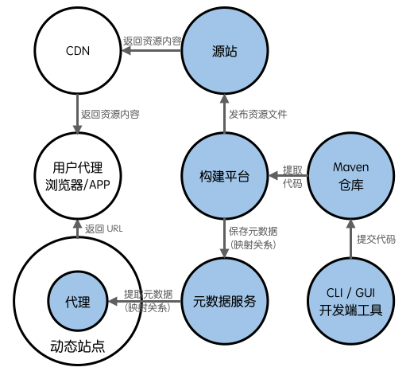  
携程“静态资源模块”方案构成（第一版）

在文件名称中嵌入“指纹”，对于图片、文档这类资源轻而易举，只需用 MD5 或类似的数据摘要算法计算出内容摘要即可。但是对于 JS、CSS 这类可能涉及资源嵌套的前端代码，就麻烦了。比如，对于 CSS 文件，需要 ❶ 解析代码，找到其中涉及的图片、字体文件等关联资源的文件名称，❷ 获取关联资源嵌入指纹后的文件名称，❸ 替换 CSS 文件内容，然后计算内容摘要。❹ 假如 CSS 文件中还依赖（include）其他的 CSS 文件，那么还要注意先后顺序。对于 JS 文件，情况就更复杂一些，不仅要 ❺ 事前用特定的宏方法界定关联资源名称（因为我们无法通过语法分析来判断哪些字面量代表资源名称），如果提交的是已经混淆过的代码，还需要 ❻ 考虑 SourceMap 文件的重构问题。其中，第5点尤其令前端开发人员不满。鱼和熊掌兼得？不付出点代价怎么行呢。

在实施增量发布的过程中，“静态资源模块”的概念代替了原来的虚拟目录。同时，引入语义化版本（Semantic Version）来控制模块的更迭，希望借此推动跨团队的静态资源共享。但是这件事并不顺利，直到2019年借国际化的东风，推出第二版的携程静态资源模块化方案之后，情况才有所好转。

##  上云，上云！

程序员们勤耕不辍，静态资源的数量每天都在增长，服务器磁盘的剩余空间渐渐归零。虽然是虚拟服务器，磁盘空间的扩容依然不易，而且受宿主机的约束，可以腾挪的余地有限。分拆应用虽然能解燃眉之急，实现难度也不大，却势必加剧日常运维的难度，也非一劳永逸之策。幸好此时，有了云存储！

这一次我们放弃了静态应用的执念，大胆 __采用了 Nginx + Node.js + CEPH 的应用架构。__ 作为一种分布式对象存储系统，CEPH 的读写性能、可用性和可扩展性，都合乎静态资源内容存储的需求。而选择 Node.js，是因为它更靠近前端技术栈，并且携程的技术团队在利用 Node.js 开发 Web 应用方面也已经积累了不少经验。为了将两者相结合，我们事前作了认真的准备，开发了以下 NPM 模块：

*   ceph  
    云存储访问 SDK。基于 CEPH Web API，提供对象读写和查询功能，目前已兼容 AWS S3 和 Aliyun OSS。

*   ceph-sync  
    云存储同步 SDK 及命令行工具。可在本地文件系统和云存储之间、以及不同厂商的云存储之间实现容器级别的数据同步，支持断点续传。

*   ceph-cli  
    云存储管理工具。提供在命令行中完成容器创建和清理、对象查询和删除、文件（对象）上传和下载等功能。

*   ceph-agent  
    云存储浏览器。该模块可以启动一个 Web 服务，方便开发者在浏览器中浏览存储中的内容。

上述模块目前都已开源。

所谓欲善其事，先利其器。这些工具在我们的工作发挥了重要的作用。利用 ceph-sync，我们顺利完成了千万量级静态资源文件的上云，差错率接近于零。在携程，ceph 模块日均完成数以万次计的对象写入和数以亿次计的对象读取操作，没有成为瓶颈，其可靠性也经受住了考验。

使用携程私有云存储的过程中所积累的经验，为过渡到公有云存储铺平了道路。现在，我们已经实现了 __Ceph（携程私有云）+ Aliyun OSS（境内）+ AWS S3（境外）三位一体的静态资源同步存储方案。__

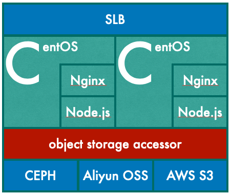  
基于存储的源服务架构

经过这次重构，静态资源服务也完成了另一种意义上的动静分离，即数据（资源文件）和应用的分离，从而实现了应用的标准化，可以借助携程的 PaaS 系统轻松完成应用部署。换句话说，源站应用也真正地上云了。有了基于 Node.js 开发的源站应用，我们足以应对有关静态资源服务的种种个性化需求，再也不需要在中间件配置这个逼仄的空间中苦苦挣扎。原先分拆的若干应用，也重新合兵一处，不仅节约了可观的硬件资源，也终于消化了长期以来的运维压力。

大家都松了口气。感谢 Ceph 运维组的张先生和周先生，从来有求必应，不曾嫌我麻烦。

##  国际化背景下的布局

随着携程业务日趋国际化，境外用户的访问体验越来越受到重视。在新的背景下，用户的地域分布越来越广泛，而集中程度疏密不一，如何面向全球用户提供更好的静态资源服务，需要我们作出一些改变。

尽管 CDN 可以显著提升终端用户获取静态资源的速度，但是它不可能卸载所有的请求，仍然有一部分请求需要回源。同时，在新场景、新业务的需求驱动下，应用程序的迭代更快，相关的静态资源也在不断推陈出新，从而触发更多的回源请求。针对回源请求的优化，是一个长尾问题。美洲、欧洲、非洲国家与我国地理上的遥远距离，无论怎么优化路由，网络响应都存在100~200毫秒的延时。虑及于此，我们决定 __将源站建在离 CDN 边缘节点更近——也就是离我们的终端用户更近——的地方。__

2019年中，依托于 AWS 公有云平台，携程的前端基础设施团队已在法兰克福、蒙特利尔、新加坡城部署静态资源源站，分别连接欧洲和非洲、美洲、东南亚地区的 CDN 边缘节点，形成了一个微型的内容传输矩阵。上一节中提到过三位一体的静态资源同步存储方案，其中位于 AWS S3 的部分包括三个相应区域（Region）的存储容器，就是作为上述源站应用的配套数据源而存在的。这些源站虽然不直接面向终端用户，但确实改善了一部分人的访问体验，也减缓了发布期间的网页性能波动。

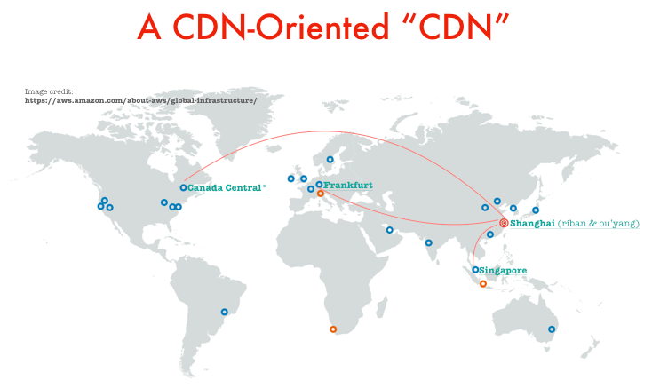
源站矩阵
（背景世界地图引自 AWS 官方网站）

国际化带来的另一个改变，是互联网企业需要 __寻求与不止一家 CDN 厂商合作，通过多个厂商在不同国家和地区的优势互补，达到更好的全球覆盖的效果。__ 那么，如何达成区域与 CDN 的匹配呢？

我们知道，在整个 DNS 体系中，域名所有者指定的 DNS 是掌握域名最终解释权的一方，被称为权威服务器；而网络中其他的 DNS 则会缓存权威服务器的解释，它们所给出的答案，被称为非权威应答。在“不可或缺的CDN”一节中提到过，DNS 是帮助用户实现就近访问的关键，其奥义就在于资源站点域名的权威 DNS 会根据本地 DNS 的位置，就近分配 IP 地址。“本地”，是此法行之有效的前提，也就是终端用户与其所使用的 DNS 须同处一隅。

也许是疏于防范，也许是有意为之，域名劫持现象屡见不鲜，侵蚀了作为互联网基石的 DNS 体系。主打安全的公共 DNS 越来越受欢迎，许多用户开始放弃 ISP 提供的本地 DNS，转而使用公共 DNS。有名的如 IBM 的 9.9.9.9，Google 的 8.8.8.8，以及中国电信的 114.114.114.114，这些 IP 地址远比大多数域名更加令人过目难忘，用作公共 DNS 地址，再合适不过了。采用任播（AnyCast）技术的公共 DNS 面向全球用户提供域名解析服务，其自身不具有地域特征，这就使得上游的权威 DNS——即 CDN 厂商的 DNS——难以判断域名解析请求的真实来源，也就无法为其分配就近的边缘节点地址。尽管随着 EDNS0 协议的落地，有望缓解这一矛盾，但是要求公共 DNS 为每一个客户端单独缓存解析结果，从而百分之百地忠实于权威 DNS，这在技术上是不太现实的。因此，当 GSLB 遇到公共 DNS 时，DNS 污染的问题不可避免。

公共 DNS 所引发的边缘节点错配，对于 CDN 是一个严肃的问题。对于网站来说，如果坚持使用单一域名提供静态资源服务，依靠 DNS 来选择 CDN，则可能导致更为严重的供应商错配的故障。因此，我们需要以“动”制“静”，在服务端动态页面程序中引入特定的 API，具体分析每一个用户请求，❶ 根据其来源 IP 地址判断终端用户所在区域或网络情况，❷ 根据预先确定的策略分配静态资源域名，生成最终的静态资源 URL 返回给浏览器，❸ 再由相应的 CDN 提供资源访问服务。该接口的时间开销被限制在1毫秒以内（实际低于这个值），这个代价是可以承受的。

采用多域名策略，不仅可以规避 DNS 污染的风险，还有利于减少客户端在域名解析（DNS Lookup）环节的时间开销。DNS 是一个层层递进的系统，遇到一个全新的域名时，客户端从发起解析请求到获得 IP 地址，中间消耗的时间可能长达数百毫秒甚至更久，关键的因素在于权威服务器的距离远近。单一域名在全球不同区域的解析时间，势必有长有短。而使用区域相关域名，比如国别域名，可以显著降低解析时间，这算是一个附带的好处。

站在开发人员的角度，依赖服务端 API 动态生成 URL，当然不够直观。然而，服务端的一刹那，换来的不止于更好的静态资源服务性能，也让我们具备了静态资源灰度发布能力，以及 CDN 级别的容灾能力，可谓一举多得。应国际化而生的“动静结合”的理念，已孵化出一个集发布、部署、运维于一体的全新的静态资源解决方案。

从动静分离到动静结合，始于动态，归于动态，真是天道好轮回。

##  未来向何处去？

爱因斯坦说过：时间是种幻觉。然而，这种幻觉实实在在地驱动着我们的工作。互联网让信息的传播速度出现了质的飞跃，却刺激着受众的灵魂，变得更加迫不及待。4K 解析度和 120FPS 帧率超高清电视的出现，似乎在宣扬人类对于感官极限的追求永无止境。

HTTP Archive 的报告显示，当前 PC 端 Web 页面的 onLoad 时间平均超过6秒，而移动端更是接近20秒。作为全球领先的 OTA 公司，携程的数据要好看得多，这是自然的，也是应该的，但是秒级和百毫秒级的页面加载时间，距离已知的极限还很远。HTTP/2 和  HTTP/3 不断挖掘现有传输网络的潜力，而我们的静态资源解决方案也会随之修正。看起来，似乎还可以沿着当前的道路走很久。

不过，__比 HTTP 协议升级更值得关注的，是以超高带宽和超低延迟为核心的 5G 网络大规模商用已经箭在弦上，而骨干网络必然也会升级换代。__ 诚然，5G 不是为任何一种现有的成熟的互联网业务模式准备的，它有着更重要的使命。对于传统的 Web 而言，5G 网络所代表的未来趋势是带宽近乎无限，而光速可能成为影响延迟的主要因素。那么，事情会变得怎样？囿于地球尺度的限制，CDN 的边缘节点依然有用，但是动静分离的模式是否还有存在的必要，静态资源的概念会不会就此湮没在历史的尘埃中，将是值得思考的问题。

##  尾声：关于 ARES

ARES 是静态资源服务在携程内部的代号。

有一段时间，部门内部鼓励大家参照希腊神话中诸神的名字，统一项目命名，以求流传有序。我们对 ARES 一见钟情，因为看起来很像 A Resource。刚开始，我兴致勃勃地来了一个全称演绎：an A-class WebREsource Solution，大张旗鼓地写在文档的首页上。没多久，就悄无声息地地改成了递归演绎：ARES is a WebResource Elevating Solution。

什么一流？不存在的。能进一步，也就够了！本文首发于微信公众号「携程技术」。

##  参考文献
1. John Dilley. GloballyDistributed Content Delivery[J]. IEEE InternetComputing.September/October 2002
2. CNNIC. 第十次中国互联网络发展状况统计报告. 2002年7月

