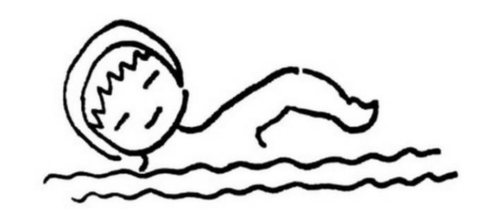
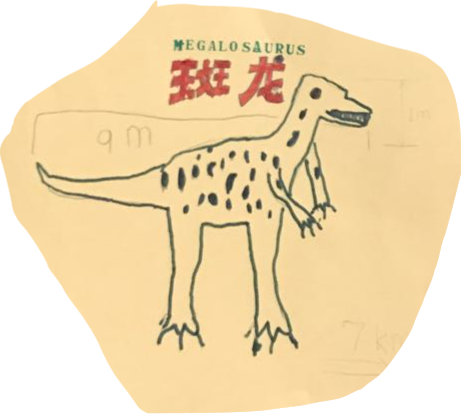
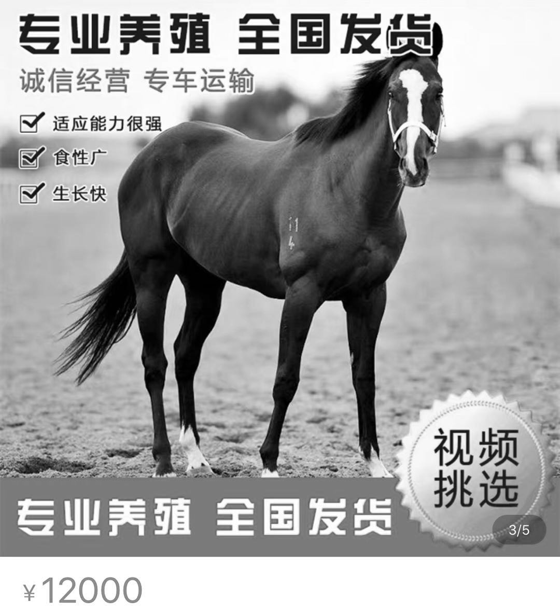
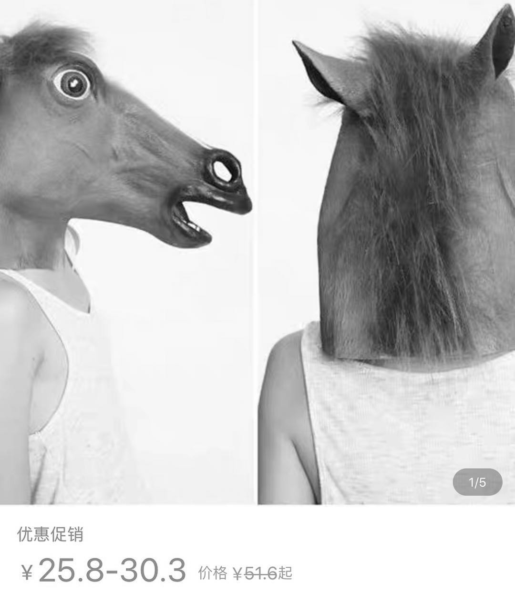

#   我的爱好（来自新晋小学生的第一记重锤）

幼儿园毕业生蒋小鱼要去新单位报到。班主任请每位同学准备一份自我介绍，主题是「我的爱好」。

这件事照例由我执笔。为了避免弄巧成拙，我决定先摸一摸她的路数。

「宝贝啊，你最喜欢做什么？」

她就像一台古旧的计算机一样没有反应，经过了漫长的沉默，才缓缓地抬起了头，开始输出：「我喜欢——游泳。」

很好！我念念有词地扩写起来：
> 我叫蒋小鱼，蒋是蒋小猫的蒋。  
> 我属马，可是——   
> 比起奔跑，我更爱游泳。  
> ……

意犹未尽，又选了一张她游泳的照片贴了上去。

  
这张简笔画和她游泳的样子大差不差，将就看吧。

感觉内容还是有些单薄，于是我接着问：「还有呢？」

「我喜欢阅读和画画。」

非常好！我继续写道：
> 我爱阅读，也爱画画。  
> 如果你也是，  
> 我们可以分享最喜欢的故事。  
> 我也可以给你看看，  
> 我画过的可怕的怪兽  
> ……

  
她画的这头恐龙到底哪里可怕？我说不上来。也许是丑得可怕吧。不过没关系，瑕不掩瑜。

采访进展到此时，我有一种「点到哪里读哪里」的感觉，SO EASY！游泳、阅读、画画，这些爱好虽然一点儿也不特别，但是胜在有益身心，也能上得了台面，关键是——不费钱！

差不多了，就这样吧！看来是我多虑了，培养一个小学生，并没有想象中的那么难。我满意地搓了搓手，思绪已然穿过窗户、越过马路，飘向了半里开外的小学校园。

然而这件事情并没有到此为止！

她放学回家后，我抓住她，有的没的，闲聊起来。

「老师有没有让大家作自我介绍？」

「有啊——」

「你怎么说的？」

「我说，我的爱好是骑马。」

我一惊，心想，你怎么不按剧本来呢？

蓦地想起了《教父》中，电影大亨沃尔茨的那匹价值六十万美元的骏马。哇哦，那可是上世纪四十年代的六十万美元！谁敢随随便便把骑马当作爱好呢？！

我整理了一下自己的思绪，不动声色地点拨起来：「宝贝，你不是喜欢游泳吗？」此时此刻，我一心想让她变成一天到晚游泳的鱼，忘掉骑马的事，阅读啊、画画啊，也顾不上了。

「我也喜欢骑马。」

「可你都没有骑过马！」

「我在草原上骑过的。你忘了吗？」

呃，是有这么回事，那是在青海湖边的草甸子上。我们俩一前一后坐在马背上，我抓着缰绳，你抓着我，就这么晃晃悠悠地走着。如果不是牧民阻止，我们也许会一路向西，走过海西，走过昆仑山，走过柴达木盆地，一直走到阿富汗。

我又想起你一岁多的时候，只比我的膝盖高一点点，就喜欢让我把你抱上木马，摇啊，摇啊，摇到木马就像要飞起来一样。马背上的你咯咯咯咯地笑个不停，马脖子下的铃铛丁丁当当响个不停。

看来，你是真的喜欢骑马！

「那个，你不是有自行车嘛。下次老师再问你的时候，你就说，你的爱好是骑自行车，行不行？」

「不行！说出去的话，是不能改的。」

唉，小学生没有经受过生活的重锤，不晓得人生的反复无常。我无奈地搓了搓手，转头问老陈：「咱家的木马去哪儿了？」

木马还在，铃铛也在。只是木马不会长个儿，已经载不动天天向上的小学生了。看来，我得想别的办法。

我在万能的淘宝上搜索一番，发现了这个：

好像没有我想象的那么贵吔。可是，我连自行车也没地儿停，更不要说一匹马了。把它安置在哪儿呢？我思索了很久，还是没有答案。

我继续搜索，接下来这个东西给我很大的启发：

对啊，谁说爸爸马就不是马呢？虽然我也像木马一样，已经不再长个儿了，不过，只要俯首甘为孺子马，再让小学生骑上几年，还遭得住。

要不，就是它了？
