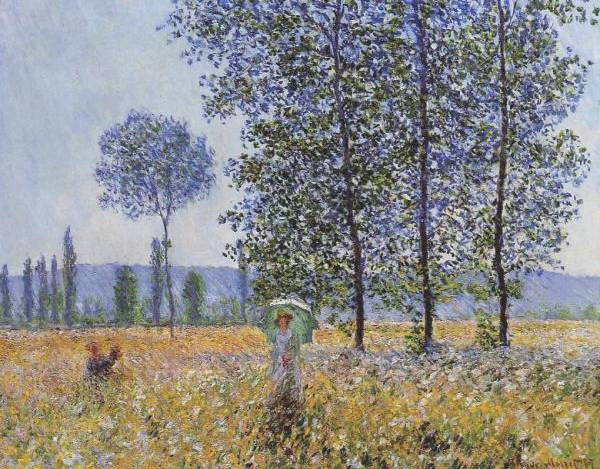

#   青森林的牙仙子 之 食物的蜕变

在青森林里散步，是牙仙子每天必修的功课。

##  Day One

  
| 莫奈  
| 玉米田（1881）

有一天，牙仙子在散步的时候，看到猴子正在津津有味地吃东西。她就问了：「猴子姐姐，你吃的是什么？能给我尝尝吗？」

猴子心里有点舍不得。不过，她觉得牙仙子个子辣么小，想必胃口也不会辣么大，就把手里的东西放在她面前：「这是玉米啊，你尝尝。」

牙仙子围着玉米左看看，右看看，念念有词。突然，嘭——地一声，玉米消失了，香喷喷的爆米花却撒了一地。

牙仙子摆了摆手：「这不是我想要的食物。」

猴子从来没有见过爆米花，扑鼻的香味让她不能自已。他吃了一粒又一粒，一边吃一边忍不住大声赞叹：「啊，太好吃了！」

##  Day Two

  
| 让-弗朗索瓦·米勒  
| 收获土豆（1855）

第二天，牙仙子在散步的时候，看到猫子正在慢条斯理地吃东西。她就问了：「猫子哥哥，你吃的是什么？能给我尝尝吗？」
​
猫子心里有点舍不得。不过，他觉得牙仙子个子辣么小，想必胃口也不会辣么大，就把手里的东西放在她面前：「这是土豆啊，你尝尝。」

牙仙子围着土豆左看看，右看看，念念有词。突然，嗞——地一声，土豆消失了，金灿灿的炸薯条却撒了一地。

牙仙子摆了摆手：「这不是我想要的食物。」

猫子从来没有见过炸薯条，扑鼻的香味让他不能自已。他吃了一根又一根，一边吃一边忍不住大声赞叹：「啊，太好吃了！」

##  Day Three

  
| 约翰·布莱克·怀特  
| 马里恩将军邀请英国军官分享膳食（1837）  
| General Marion Inviting a British Officer to Share His Meal   
| 又名：甘薯大餐  

第三天，牙仙子在散步的时候，看到野猪正在呼哧呼哧地吃东西。她就问了：「野猪先生，您吃的是什么？能给我尝尝吗？」

野猪没什么舍不得的，他指了指身边堆成小山一样的食物，热情地说：「这是地瓜啊，你想吃多少就吃多少！」

牙仙子围着地瓜左看看，右看看，念念有词。突然——，这回倒是没什么惊人的动静，脆脆的地瓜也没有消失，而是变成了软软糯糯、热乎乎的烤地瓜。

牙仙子摆了摆手：「这不是我想要的食物。」

野猪从来没有见过烤地瓜，扑鼻的香味让他不能自已。他吃了一个又一个，一边吃一边忍不住大声赞叹：「啊，太好吃了！」

##  Hence

  
| 弗朗索瓦·布歇  
| 胡萝卜男孩（1837）​

公元时代的北方岛屿诗人乔治·赫伯特写道，唯「爱情与咳嗽无法掩饰」。其实同样无法掩饰的，还有气味。

让猴子、猫子（zǐ）和野猪这些老牌吃货都欲罢不能的香味，像牙仙子的笑声一样传遍了整个青森林。很快，动物们都知道了这几天里发生的不同寻常的事情。

知名的美食家兔子女士对此不屑一顾，在她眼里，只有胡萝卜是永恒的世间绝味。我不得不承认，胡萝卜这种东西，生也好，熟也罢，永远都是那个味儿。然而，并非所有的动物都像她那么偏执。

##  Day Four

  
| 乔治斯·拉孔贝  
| 拾栗子的人（1893）

第四天，牙仙子在散步的时候，松鼠突然背着一个鼓鼓囊囊的袋子，从树上敏捷地跃了下来，吓了她一跳。

松鼠把袋子里的东西一古脑儿倒在地上，然后说：「牙仙子，这些都是我最喜欢的栗子。你尝尝？」

牙仙子围着栗子左看看，右看看，接着她就津津有味地吃了起来。一边吃一边忍不住大声赞叹：「啊，太好吃了！」

​栗子就这样一颗接一颗地消失了。目睹「永远优雅、永远淡定」的牙仙子一反常态的样子，松鼠的内心颇为不安，她惴惴地问：「然后呢？」

「谢谢你，亲爱的松鼠，我吃完了。」牙仙子心满意足地说，「这正是我想要的食物！」

##  Then

然后就没有然后了。
牙仙子大概不知道，就在同时代的人间，有一种可与糖醋肋排比肩的食物，叫糖炒栗子，几乎所有的小朋友都爱吃。

##  The End

这个故事记载在《蒋小猫公元纪略·牙仙子本纪》中，而《蒋小鱼百科全书·饮食篇》中也有所提及，两相印证，想必确有其事。青森林里不似人间，这里禁止火烛，自然也就不食烟火。但是对于牙仙子来说，此事「非不能也，实不为也」。同时也足以说明，有关精灵们餐风饮露的传说，并不完全符合事实。

如果你生活在公元时代，如果你认识某位精灵，如果你从未亲眼见她吃过东西，那或许是因为，你们还不够熟！