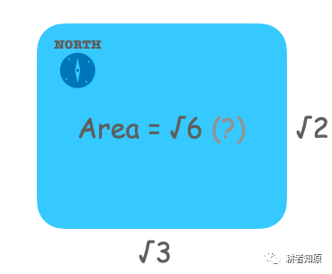
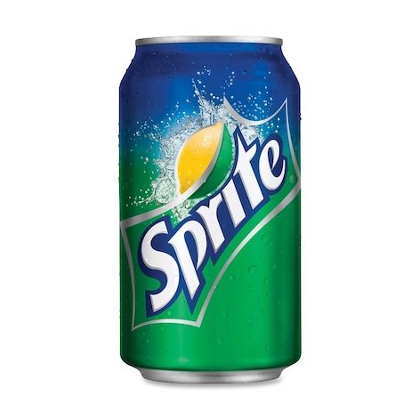
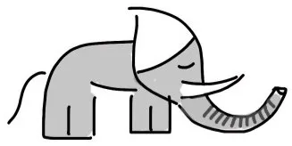

#   青森林的牙仙子

我不知道「这里」是哪里。

很久以前，从这里出发，沿着大河向西两千里，再沿着大山向北两千里，有一座青色森林。据《蒋小猫公元纪略》记载，青森林「东西约根号二，南北约根号三」。用无理数来度量现实存在的事物，这在公元时代多少有些古怪，尽管它可能无限接近于真相，并且形式上也更优美。举例来说，蒋小猫的确切身高是根号三米，然而据我考证，他从未使用过这种表述，反而总是啰哩叭嗦地说自己「一百七十三厘米」，有时也用「一米七三」这种拿度量衡当小数点的奇怪用法。可他在有关青森林的记录中，却一反常态地用上了无理数，这又是另一个相当古怪的现象。这并不妨碍我们得出青森林的面积约根号六，可惜的是，只有数字，没有单位，这片森林究竟是大是小，也就无从知晓了。

  
喏，权当这就是青森林吧

公元时代的人啊，一定对我们隐瞒了许多东西。遥远的侏罗纪的恐龙，遥远的赛伯坦的金刚，这些都是公元时代见所未见的，他们都可以研究得明明白白，就连幼儿园的小朋友也能够如数家珍。一旦论道人类自己的起源，这些家伙就开始装傻充愣了，一会儿说是泥做的，一会儿说是水做的，一会儿说是骨头变的，一会儿说是猴子变的……我很难相信他们不是故意说谎。既然不想说，那就算了，好在并非所有的事情都是不可道破的天机，精灵就是公元时代公开的秘密。呃，不，我说的可不是怀特先生的童话故事《精灵鼠小弟》里那种会开车的老鼠，而是真正的精灵，SPRITE！

  
像这样的精灵图腾，在公元时代随处可见

《蒋小猫公元纪略》中总结道，「凡是森林，必有精灵，有且只有一个」，何况是色彩奇异的青森林呢？因为身材袖珍，青森林的精灵被叫做「牙仙子」。看得这里，我下意识地咂摸着嘴，用舌尖点了一遍自己的牙齿。呀，就这么点地方，虽然连一个桃子都容不下，却足可以整整齐齐地安顿一个班级的牙仙子。我忍不住笑了起来，露出了坐在前排的『牙仙子』们。

不过，真实的牙仙子，果然只有石榴籽那么大吗？我不确定。大家都知道，「拇指姑娘」的身高不及我们大拇指的一半长，可是「豌豆公主」的个子却和普通的公主没什么两样，有时候仅凭一个名字，说明不了什么。何况，与长势均匀的人类不同，森林里的动物们生长起来，可就随心所欲得多了。高兴起来，长得比树还要高，不高兴的话，也可以缩在树洞里不出来，它们才不在乎 [√2，2](m) 的区间守则。自然的，它们的牙齿也不一般大。所以，我虽然并不怀疑牙仙子的的确确名副其实，她真正的身高却依然是个谜。

  
谁说森林里没有大象？

除了个子有些特别，身为精灵的牙仙子，看模样却是个普普通通的小女孩。她甚至连翅膀也没有，平时来来去去，都是靠走的。更糟糕的是，牙仙子还喜欢用芦荟汁把自己的头发染成绿色！在青森林的背景下，真的很难分辨，那究竟是轻舞飘扬的牙仙子，还是被风赶着的一团草。为此，动物们许多次提出抗议，可她还是我行我素。于是，大家不得不慢一些，再慢一些，生怕一不留神踩到了牙仙子，青森林就要失去它的精灵了。考虑到牙仙子娇小的身材，我说的「大家」，可不仅仅指体型硕大的老虎和熊，也包括松鼠和兔。久而久之，兔子的眼睛也熬红了，而松鼠索性搬到了树上。

动物们如此小心翼翼，青森林因此格外地安静。牙仙子咯咯笑的时候，她的笑声可以传得很远很远，一直传到森林边缘。

你大概觉得，一个不会飞的牙仙子，和自己家里被宠溺的娃娃没有分别，根本就不是什么有魔力的精灵。也许就连牙仙子自己，也不知道所谓「精灵」是怎么回事。只是，公元时代曾经出现过那么多的精灵，只有她出现在了《蒋小猫公元纪略》和《蒋小鱼百科全书》里，多少是有些原因的。

B612(C) 号小行星的夜已经很深了。晚安，关于牙仙子的故事，我们改年再聊！