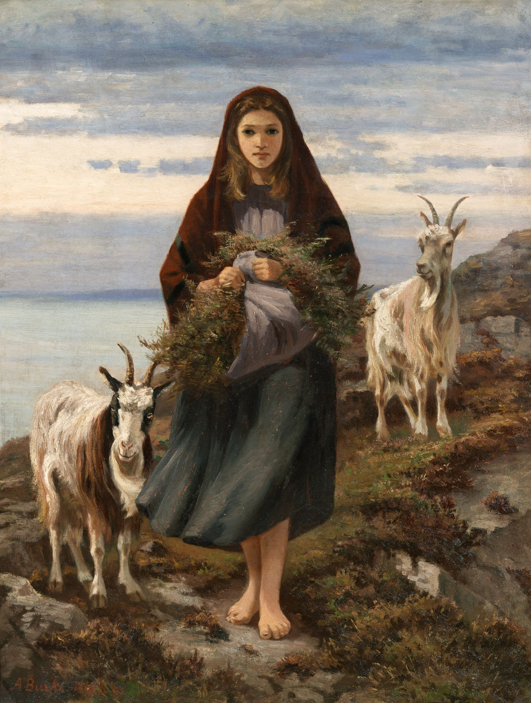
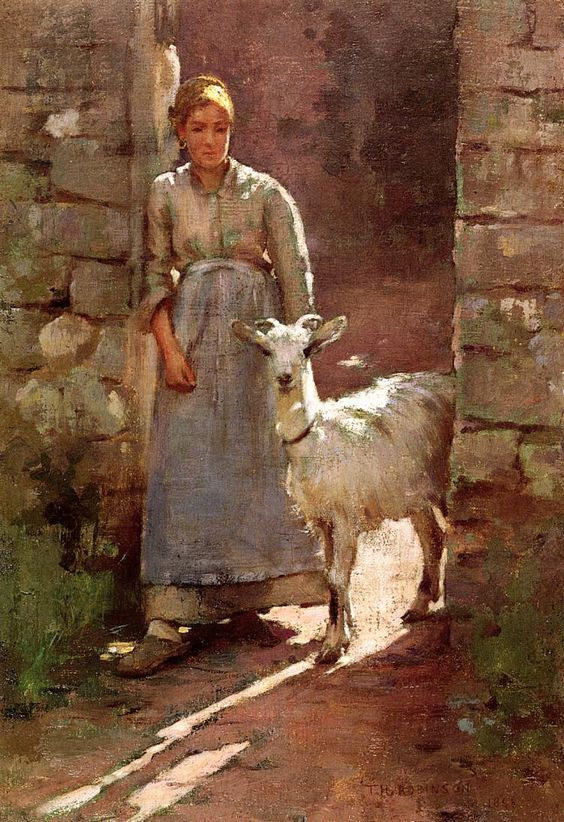

# 远山的黑与白，羊

  
| Ireland, Augustus Nicholas Burke (1838-1891)   
| Connemara Girl (1886)

故事发生在一个偏远的山村。

山村里住着一个孤苦伶仃的老奶奶，春天里，老奶奶从集市上带回了一只白色的小羊羔。除了黑眼仁和黑蹄子，白色的小羊羔哪儿哪儿都是雪白雪白的，连藏在白色羊毛里的小羊角尖都是雪白的。山村里还住着一个脾气暴躁的老爷爷，春天里，老爷爷从集市上领回了一只黑色的小羊羔。除了白眼白和白蹄子，黑色的小羊羔哪儿哪儿都是乌黑乌黑的，连藏在黑色羊毛下的小羊角尖都是乌黑的。

小白羊和小黑羊就在山村里一起长大。老奶奶把小白羊照顾得很好，他的毛每天都梳理得很整齐，他的蹄子每天都擦得乌黑发亮，他总是有足够的青草吃。小黑羊就不那么幸运了，他浑身上下搞得脏兮兮的，连雪白的蹄子也变得灰不溜秋的，每天不挨骂就算走运，吃得也很少。不过两只小羊却是最好的朋友，每一个白天，不论刮风下雨，也不论烈日炎炎，他们总是在一起玩。他们最喜欢的游戏，就是一边咩咩地叫，一边比赛奔跑。小黑羊很羡慕小白羊，小白羊很同情小黑羊，也幸亏有小白羊分享的食物，小黑羊才不至于成天饿肚子。

日子就这样一天接着一天。春天过去了，小羊们长大了一些。夏天过去了，小羊们又长大了一些。很快，秋天也过去了，冬天来了，天愈来愈冷，雪也越积越厚。小白羊的毛已经长得又长又密，在他看来，这个冬天似乎并不那么寒冷。

有一天，小白羊正在村里的小溪边等，小黑羊得得得得地冲了过来，却没有像往常那样咩咩地叫。他滚倒在小白羊身边，气喘吁吁地说：「快逃跑吧……我，我听他们在说，到过年的时候，就要把我杀掉，吃我的肉，还要用我的皮毛做羊袄。」这些可怕的话，让小白羊呆住了，他呐呐地说：「可是你要逃到哪里去呢？冬天山里没有草，羊没有草吃，会饿死的。」小黑羊很生气，「我宁可饿死，也不愿意把自己交给这些可恶的人类。」小白羊低下了头，黑眼仁盯着黑蹄子。他想，虽然小黑羊是我最好的朋友，可是，难道真的要和它一块儿逃跑、一块儿冒险吗？何况，老奶奶对我这么好，她怎么会舍得吃我的肉？

小黑羊看穿了小白羊的心思，冷冷地说道：「你别以为那老太婆对你有多好。她把你喂那么饱，不过是想你的肉更加肥美。她用心地整理你的皮毛，不过是想让她的羊袄更加漂亮。」说罢，他呼地站直身，看了小白羊一眼，便向着大山深处走去。他没有像来时那样奔驰，不徐不疾地走着，却再也没有停下脚步。

雪地里，小黑羊的背影变成了一块模糊不清的灰色，又变得一个灰点，直到再也看不见。小白羊记住了小黑羊消失的方向，心事重重地回到了家。他问老奶奶：「奶奶，你冷吗？」老奶奶回答说：「有时候，会有一点儿。」「那你吃过羊肉吗？」「小时候，也许……」老奶奶猛然明白，他一定是听到了村里那些可怕的传言，她没有再说话，只是慈爱地抚摸着小白羊的身体。

小白羊嘤嘤地哭了：「亲爱的奶奶，如果你要杀了我，请不要将我的肉分给别人，请不要让我的皮毛穿到别人身上。」老奶奶难过地说：「傻孩子，我那么爱你，怎么会那样对你。但是村子里的人，他们需要食物。」她拿出了一个褡裢，里面装满了干草，「我已经给你准备好了，够你捱过冬天。明天黎明前，你就背上这些，躲得远远的吧。」

随后，奶奶又拿出了一把挫刀，「来，让我把你的角磨得尖尖的，万一碰到饥饿的野兽，你也可以抵挡。」小白羊顺从地把头伏在奶奶腿上，挫刀一下一下，他的心也一紧一紧。天亮前，小白羊背上褡裢，离开了奶奶的的屋子。月色下，小白羊的背影很快就白雪混为一色。

  
| America, Theodore Robinson (1852-1896)   
| Girl With Goat (1886)

这个冬天后来格外地冷，狂风暴雨把村里的人都困在家里，无法靠外出打猎补充积蓄的食物，所有人都在挨饿。还没到过年，老奶奶家里已经没剩多少食物了。可是有一天早晨，她意外地在院子里拣到了一小堆摆放得整整齐齐的肉干。这些肉干，让老奶奶又勉强度过了这个可怕的冬天。

然而，老奶奶再也没有见过她的小羊，直到去世。

好多年后，村子里有人在老奶奶的坟前看到一个面容陌生的、身材瘦削的白衣青年。只是那么一次，后来就再也没有见过。
