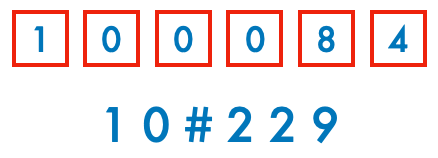

#	斯是陋室

谨以此文献给我亲爱的同学们！

1997年的夏天，发生了两件意义深远的事。其一是香港回归祖国，日期是七月一日。其二是我告别南方的小镇，去往了北京的大学，时间在两个月后。按照法律，这两件事都发生在我具备完全的民事行为能力之前，所以，我仅仅是作为一个历史的不成熟的见证者，置身其中。

##	100084

大学很大，大到一个邮政编码，堪堪能容下。举凡 100084 所指称，皆为广义的校园之范畴。

若大的校园内，自然有着许多的楼堂馆舍。照外观式样看，中式的，西式的，苏式的，一应俱全；按落成时间分，近代的，现代的，当代的，各领风骚。数以百计的各式建筑，大致均匀地座落在东西宽逾三里、南北长约六里的围城里，尽管风格年代不一而足，然而砖红色的基调和规圆矩方的棱角却一脉相承，韵味相似。从西门倘佯至东门，恍若辗转百年，却不觉得违和。以梁思成先生为嚆矢的建筑学院久负盛名，本校幸而没有砸了学院的招牌，先生当可以宽心了。

校园建筑的命名，看似漫不经心，其实也有独特的章法。大类分为楼、馆，小类则有园、堂、院、所、厅、室、斋等等，各有各的渊源。

举例来说，所谓园者，通常就是餐厅，譬如年高德昭的荷园，又譬如当年还不曾有的观畴园。不过，「园」字之所以在本校的建筑分类中独占鳌头，显然并非因为好吃，而是要归功于清华园的存在。如今，清华园既是校园的别称，也是一个法定的行政区划（街道）的名字，辖区的范围起初与校园的周界严丝合缝，后来又向东延伸了一段。对于在此地埋藏了四年或更久的青春的人们来说，这更是一个文化和精神层面的概念。晚清名人叶赫那拉·那桐在辛亥革命那一年所题写的「清華園」三个字，不仅仅镌刻在毁而复建的二校门上，也深深烙印在灵魂底处。有的人走进来，又走出去。有的人走进来，再也没有走出去。

现实中悬挂着咸丰手书「清華園」牌匾的清代园林建筑，学校官方的称谓却叫做工字厅，因其内部主体建筑的布局形似工字而得名。这样的命名，尽管多少有些强拗的意思，毕竟免去了许多身在园中不知园的尴尬，可以算是一种务求实用的为尊者讳。当时另一个有名的「厅」，是西大饭厅。那里早已不再供应饭菜，改作了乒乓球和羽毛球馆，同时也是一年一度的跨年舞会——西大狂欢——的主场。后来，在校园西部大开发的过程中，名存实亡的西大饭厅终于不复存在，就在其原址东侧，规模宏大的饮食广场拔地而起，俗称万人大食堂。再后来，饮食广场更名为「观畴园」。一拆一建，算是为「园」扳回一城。

我对西大饭厅谈不上有很深的感情，拆了也就拆了。倒是不远处的西区体育馆，让我常常怀念。馆内有一个游泳池，长约廿码（不足二十米），在其初建成的年代，每位学生必须能够游过这个距离，才准予毕业。西体泳池以今天的标准来说堪称迷你，却一度是国内最先进的室内游泳池，据说设计师墨菲也对这个小巧精致的池子颇感得意。第一节游泳课伊始，教练郑重地宣告，「这里是毛主席游过泳的地方」，引得同学们啧啧称奇。九十年代末，这个泳池已是耄耋之年，冬天的水温相当感人，更衣室的暖气也不给力，但还是容纳着从小在水乡长大却只会于浅处摸鱼的我，勉力习得了蛙泳和仰泳。每每回忆起来，深感与有荣焉。

「馆」是指安置了特定的设备或设施，服务于特定的教学与科研目的的场所，在校园内最具悠久的历史。如果论资排辈，西区体育馆本不需要以「西区」自谦，因为它和图书馆（老馆）、科学馆、大礼堂，三馆一堂，并称为学校早期四大建筑。四大之中，尤以后者最为闻名，我在那里留下了在校园内的第一张和最后一张照片，第一张是独照，最后一张是合影。这座兼有罗马和希腊风格的古典式建筑，不仅仅是颜值担当，也是举行全校学生代表大会及举办各大院系一二·九晚会的当然之选，地位很不一般。大礼堂的堂，不是堂·柯里昂的堂，也不是堂·诘诃德的堂，这个名字朴实无华，却隐隐流露着一种中流砥柱的气质和舍我其谁的自信。除食堂之外，大礼堂和清华学堂，以及作为工字厅附属建筑的古月堂，是仅有的三个称之为堂的建筑。

比「馆」还要多得多的，是「楼」。有的楼以捐赠人命名，如蒙民伟楼。有的楼以用途命名，如第三教学楼。有的楼以院系命名，如文西楼。若以数量计，几十栋没有名字、只有编号的宿舍楼，才是主流，如 10 号楼。当图书馆、实验室、自习室的灯光渐次熄灭，整座校园的热血都回流到了这些编号建筑内。深夜在此或酣睡、或卧谈、或焚膏继晷的所有人，将在十年、二十年之后，左右这座学校的运势。

##	10

我被报考的，是自动化系的自动化专业。经过88年和93年的两次专业合并后，这也是当时自动化系本科唯一一个专业。

在社会分工日益精细的背景下，自动化专业是一个颇为特殊的存在，专业口径极宽，机械、电子、信息、控制、智能，无所不教，似乎意在培养全栈型的工程人才。起初，我对这个专业的力量一无所知，父亲很有把握地断定：自动化就是机器人。自动，控制，Automation，Astro Boy，…… 听起来像是那么回事，我于是怀着对变形金刚的憧憬去报到了。

现实与想象的关系，就像 TOM and JERRY。四年间，我没有见过任何一个变形金刚，也没有认识钢铁侠或者阿童木，甚至没有看到一部像样的人形机器。不过这也没什么，八十年代初的杂志上曾经预言，到本世纪初，人类将开始大规模的外太空殖民。现在呢？二十一世纪已经进入第三个十年了，地球上的发达国家还在为碳排放的额度扯皮。所以，科学文明演进的过程中有些偏差，是完全可以理解的。大学期间，我的确选修过一门有关机器人学的课，讲授多余度机械臂的运动控制理论。今天，同学们有的在特种机器人领域孜孜以求，有的在无人驾驶行业乘风破浪，他们无不在实践着我当初对于自动化的想象。

回到1997年的夏天，自动化系的 7 字班新生共一个学科，一个专业，五个班级，合一百五十名。如此实力，即使在甲组院系中，也是睥睨群雄的角色。在我的印象中，惟计算机可以在生员数质上与自动化一较高下。

每班三十名同学中，均有男生二十七名，女生三名。我们知道，比例控制远比总量控制要困难得多。在限制重重的招生计划下，究竟怎样才能实现如此精确的配比？在我心里这是个谜，也从一个侧面反映本系对于控制理论的痴迷，以及凡事务求精确的态度。

整整一个连的自动化系男生，换上了草绿色的军训服，就此在 10 号楼驻扎了下来。

我就住在 229 寝室。如果你给我写信，地址只需要这样写：

再添一笔都是多余。我觉得这非常酷，像是欣赏一场由国家邮政系统和学校收发室以及宿管阿姨共同演绎的行为艺术。然而并没有什么人通过这个渠道向我递送秋波，因为互联网信息时代就要来了。我曾经对此非常抵触，因为信息传播与知识迭代的速度不断提升，这让反应迟钝如我，感觉很不适应。

所幸我们仍然活在现实世界里。就地理意义来说，自动化系本部所在的中央主楼，并不在校园的正中央，反而是 10 号楼的位置更接近园心。从这里，若是向东，穿过干道就是东区体育馆和东大操场；若是向南，步行五六分钟可抵第三、四、五教学楼；若是向北，下了坡就是八食堂；若是向西，一拐弯就是学生超市；总之是哪哪都近，学习、锻炼、生活、饮食，一应俱全。10 号楼的西侧，由北向南依次排列着 5、6、7、8 号楼，本校女生集中居住于斯，更佐证了此乃黄金地段的结论。

骑上我心爱的小黄车，从 10 号楼北坡飞驰而下，一路向北，凭惯性便可以直抵东区澡堂。「澡堂」其实是俗称，它的学名叫做东区浴室，是一座可同时容纳上百人的集体淋浴设施，可谓没有池的「华清池」。浴室须有热水，热水须用锅炉。东区澡堂，锅炉房，开水房，三位一体，这个终年袅袅的地带，是同学们每日打卡的胜地。大家只知道在马约翰教授主持学校体育的年代，同学们被要求必须学会游泳以图自保；却往往不晓得，当初「三日一洗澡」也是强迫性的规定。早年间《清華週刊》上还曾刊登《澡身須知》，详解「澡身」之妙与「雨浴」之法。

后来附带独立卫浴设施的学生公寓渐渐普及，“不合时宜”的东区澡堂门庭冷落，被迫倒掉了，原址上建起了苏世民书院。多年以后，不知大家会否记得，这个顶尖精英们你方唱罢我登场的舞台，曾经是芸芸众生赤诚相待的净地？洗澡这件事是如此重要，以至于某人有了心结 ，至今念念不忘，意图光复倒掉了的东区澡堂。

不过，对于自动化系的同学而言，这些统统都不重要。重要的是 9 号楼，它就站在 10 号楼之南，距离不过五十步。那里是 9#BBS 的发源地，是计算机科学与技术系的大本营。

计算机系与自动化系有着深厚的渊源。计算机系的前身即自动控制系，就连班号头文字「自」也曾归其所有。两个系都是属狗的，自动控制系创设于1958年，较工业自动化系（自动化系前身、创设于1970年）恰好年长一轮。自动化系受让的，不仅仅是一个头文字，还有包括大家熟悉的吴麒教授、郑大钟教授在内的一批宝贵师资。在上世纪晚期，受益于信息科学的进步，自动化系不断开拓着诸如 CIMS 和智能交通这样的新领域；与此同时，网络技术的发展与成熟，对于计算机系的意义同样不可限量。这样的背景，足以让 A(utomation) 和 C(omputer-science) 成为彼此一生的对手。

我当时并没有这样的觉悟，以为贵系除了全称比较长，并无特别的长处。这大概就是所谓的，格局太小。

##	229

229 很小，和我的格局一样小。

寝室南北长而东西窄，面积不足二十平方米。具体到每个人，仅能容一铺、一桌、一凳、两格，还有一个空闲的床铺，可供堆放行李箱和大件杂物。说是斗室，并不夸张。

床铺与书桌之间的空隙，只够一人侧身而过，需要伏案而作的时候，便直接坐在床沿上了。所以就连一凳也是多余的，只有当周末围坐在一起打牌的时候才用得上。在一年级新生的宿舍，打牌和看书，是唯二的消遣活动。

环境迫使我们过着极简主义的生活。虽然局促，却不觉得难耐，反而安之若素。是因为人的因素吗？也许是的。

五人为伍。229 这支队伍的成员，分别来自黑龙江省、北京市、山东省、上海市和广西壮族自治区，是名副其实的天南地北，而且同时包括省、直辖市和自治区三种不同的行政区划，这并不是巧合。

实际上，如何将学生合理分配到各个班级，是一个现实的运筹学问题。其约束条件，并不止于精确的男生和女生比例，生源地域分布的离散性也在其中。除非是北京当地学生，你很难在一个班级中找到自己的同乡。就算有，也绝对不会被安排在同一寝室。

甚至各省状元的分配，也在考虑之列，不会出现厚此薄彼的状况。我们班得到的两个理科状元，是黑龙江的吕和湖南的秦。黑龙江的吕，恰好也是 229 的吕，全班都管他叫吕老大。这倒并非由于他的状元身份，而是因为他气质粗犷且最年长。吕老大实际上排行老二，他还有个哥哥在本校化工系。尽管一向桀骜的他在哥哥面前温顺得像绵羊，但是在大学里还有哥哥罩着，本身就已经足够让人羡慕了。

上大学前，吕老大是学俄语的，英语也许是他大学期间最为用心的课程。后来他渐渐掌握了英语，而我从他那里学会的最复杂的俄语，就是一句「呀，溜不溜，姐，别呀」（我爱你）。你还别说，一点儿用也没有。

来自北京的范，是我们的足球队长，高瘦而腼腆，有一种偶像男孩的范儿。「哎哟，我去」是他的口头禅，他会和着各种抑扬顿挫的声调，来表达不同的心情。我现在还能非常清晰地回忆起他的声音，就仿佛刚刚在我耳边念叨过一样。那会儿他的绰号是猫；现在，我的也是。

来自山东的齐，一开口就脸红，曾经有着和我一样敏感而脆弱的自尊心。最近翻看群芳同学的毕业寄语，才知道他原来还有妙语连珠、谈笑风生的另一面。毕业后，他投身于清洁能源行业，再见时，那遥远的风与光的洗礼，已经把他变成了一个地地道道的山东汉子。

来自广西的刘，魁梧的身材里住着一个不曾长大的小孩，和我一样爱做白日梦。他是寝室里爱笑的胖子，也是西大羽毛球场上灵活的胖子，水平近乎专业。每当球拍在手，他就变得面色沉着、目光坚毅、不苟言笑，好似换了内胆。不知道他现在放下球拍的时候，长大了没有？

曾经以为我们每个人都不一样，现在才明白，他们每个人身上，都有一种我自己的模样。

我每天都能看到自己的模样，但我已经很久很久没有见过他们了。

##	廿

今年是 97 级同学毕业二十周年，故作此文。

实际上，100084 10#229 在我的生命中成为历史，已经二十三年了，我应该表达怀念。写到这里，我竟真的怀念了起来。

（2021年3月）

附：几年来，我第一次在写作的过程中受到如此多的鼓励，也是第一次在成文后收获如此多的肯定。感谢各位同学的指正，特别是廖同学的指点，让这篇作文有了内涵，也就有了生命。
