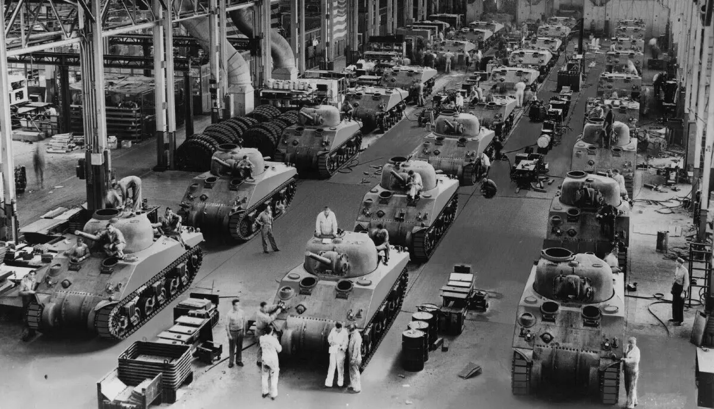

# 论法的不「经济」与经济中的不法

##  目录

1.	中国是一个法制国家
1.	一夜暴富的「秘诀」，也写在《反不正当竞争法》里
1.	比不正当竞争更糟糕的是没有竞争
1.	反垄断的难度（du）、难度（du）与难度（duo）
1.	「不得」与「禁止」（上）
1.	「不得」与「禁止」（中）
1.	「不得」与「禁止」（下）
1.	高，实在是高！
1.	第五十二条是一条红线
1.	他山之石，可以为错
1.	时代，时不我待

##  一

> 夏有乱政而作禹刑  
> 商有乱政而作汤刑  
> 周有乱政而作九刑  
> 《左传·昭公六年》

__12月4日是国家宪法日。__

中国是一个法制国家。不仅现在是，不仅自1982年[1]以来是，不仅自1954年[2]以来是，不仅自1949年[3]以来是，甚至也不仅自1912年[4]以来是。上溯到夏商周以降，郑子产铸刑鼎，魏李悝著《法经》，秦始皇推制诏，汉高祖颁《九章》，魏晋唐宋，各有其律，及至《大明律》和《大清律例》，彳彳而亍亍，断断而续续。换而言之，自秦之后，有汉以来，直到晚清，华夏绵延两千年的封建王朝史，虽然宣扬的是君君臣臣，然而上至帝王将相，下至士子庶民，皆以法统为正统。__凡有文字记载的中国文明史，同时也是一部法制史，这一点毋庸置疑。__

  
《大明律》文本  

今天，《宪法》是国家的根本大法，《刑法》是最重要的部门法。包括这两部法律在内，全国人民代表大会及其常务委员会制定的、现行有效的法律合二百七十余部[5]；国务院制定的行政法规，国务院下属各部门制定的部门规章，各省、自治区、直辖市及较大的市的人民代表大会及其常务委员会制定的地方性法规，经济特区所在地的省、市的人民代表大会及其常务委员会制定的经济特区法规，各民族自治地方的人民代表大会制定的自治条例和单行条例，各省、自治区、直辖市及较大的市的人民政府制定的地方政府规章，及由各特别行政区立法会制定的法律，不计其数。上述所有，都属于广义的法律范畴。__无论是从数量上看，还是从质量上看，中国是世界上法律体系最完备的国家之一，这一点毋庸置疑。__

> 社会主义制度是中华人民共和国的根本制度。  
> 《中华人民共和国宪法》第一章第一条

世存良法，史有恶法，「法」这个字是中性的，关键要看站的是谁的立场，维护的是谁的利益。西洋人信奉我强我横我有理，东洋人同意谁强谁横谁有理。这样的思维方式，既不合乎中国的传统价值，也有违于当代的政治伦理，行不通的。今日之中国，乃是社会主义国家，不是社会达尔文主义国家！__今日之中国的法律，体现人民的意志，代表最广大人民群众的根本利益，这一点毋庸置疑。__

  

在中华民族深陷侵略与内战之苦的1934年，鲁迅先生曾经这样写道：
> 我们从古以来，就有埋头苦干的人，有拼命硬干的人，有为民请命的人，有舍身求法的人，……虽是等于为帝王将相作家谱的所谓“正史”，也往往掩不住他们的光耀，这就是中国的脊梁。  
> 鲁迅，《中国人失掉自信力了吗》

「舍身求法」的「法」，原指佛法，后喻真理，和我们现在所理解的「法」在字面意思上固然有所区别。但是，__以「奉公守法」为是，以「不法法」为非，历来都是国人道德观的重要内涵，这一点同样毋庸置疑。__

##  二

遗憾的是，任何时代也都不乏损人利己的人，不乏为非作歹的人，不乏铤而走险的人，不乏无法无天的人。__在某些人眼里，一夜暴富的「秘诀」，不仅写在《刑法》里，也写在《反不正当竞争法》里。__ 他们充分”领会“了法律的奥义，把法条当成”教材“，不惜充当反面教材，活成了孟子笔下「好为人师」的榜样。

《反不正当竞争法》的文本并不冗长，连同标点符号在内，统共只有四千二百五十九个字。关于「不正当竞争行为」的定义，陈列在该法第二章中，共有七条。仅以领衔的第六条为例，我们来品一品：
> 第六条　经营者不得实施下列混淆行为，引人误认为是他人商品或者与他人存在特定联系：  
>（一）擅自使用与他人有一定影响的商品名称、包装、装潢等相同或者近似的标识；  
>（二）擅自使用他人有一定影响的企业名称（包括简称、字号等）、社会组织名称（包括简称等）、姓名（包括笔名、艺名、译名等）；  
>（三）擅自使用他人有一定影响的域名主体部分、网站名称、网页等；  
>（四）其他足以引人误认为是他人商品或者与他人存在特定联系的混淆行为。  
> 《中华人民共和国反不正当竞争法》第二章

法条的措辞是非常审慎的，该原则的地方原则，该具体的地方具体。除了兜底的第四款，上面这几款显然是非常之具体了，具体到不需要依赖任何法律专业知识，仅凭常识就足以判断孰是孰非。那么，有谁那么干过，有谁在那么干？常说「互联网是有记忆的」，太过久远的事情或许已经不可考了，那么自打有了互联网之后，对于这个问题，群众的心里或多或少是有点数的。如今，人工智能可以轻而易举地在一回眸间，从十数亿人群中锁定你的身份。有了这般先进的技术，却还是分不清李鬼和李逵？孟子曰：「非不能也，实不为也。」

##  三

__比不正当竞争更糟糕的是没有竞争。__

「战争」的反义词是「和平」。不过在市场经济领域，「竞争」的反义词却往往不是「合作」，而是「垄断」。健康和可持续的市场经济，应当是充分竞争的，这一点得到了普遍的认可。只是，对于企业经营的相对方——比方说消费者，尤其是患有选择障碍症的消费者——而言，处于「完全竞争」状态下的市场经济，未必是最好的市场经济。

百花齐放的场景固然赏心悦目，有时却也令人眼花缭乱、不知所措。作为相对方，当你感觉选择变得简单、舒服，非但不必劳心费神，反而有一种渔翁得利的优越感油然而生时，市场却有可能正在向「竞争垄断」大踏步迈进。当你感觉还有选择，可是怎么选都差不多的时候，市场或许已经行至「寡头垄断」的阶段。当你在市场上已经别无选择的时候，这样的局面就称之为「完全垄断」。

垄断这件事，格调甚高，门槛甚高。纽约黑帮的橄榄油生意，虽然也是一家独大，却并非市场经济范畴下的垄断，不过是不讲武德的欺行霸市罢了。那样营生，不分古今中外，哪朝哪代，都属于刑事法律严厉打击的范畴。现代市场经济理论中的所谓垄断，源于生产和资本的高度集中。这种垄断，不是柯里昂老头子拿枪干成的，而是竞争、竞争、反复竞争的结果。易言之，此非霸道，实乃王道。占据垄断地位的，不是黑手党或三合会，而是辛迪加、卡特尔、康采恩和托拉斯。竞争形成垄断，垄断反噬竞争，就是那么地让人惊诧，又是如此地自然而然。

##  四

> 子贡问：师与商也孰贤？  
> 子曰：师也过，商也不及。  
> 曰：然则师愈与？  
> 子曰：过犹不及。  
> 《论语·先进》

__垄断和竞争存在这样的天然联系，反垄断的难度（du）、难度（du）与难度（duo），想当然耳。__ 

中国于1992年正式提出发展社会主义市场经济[6]，次年即发布了《中华人民共和国反不正当竞争法》。此时，距离第十届全国人民代表大会常务委员会第二十九次会议首次通过《中华人民共和国反垄断法》，尚有十四年之远。

两部法律在各自的第一章第一条，开宗明义，均以「促进社会主义市场经济健康发展」为己任，以「公平竞争」为要务。不过，两者的区别也是显而易见的。与前者相比，《反垄断法》共计六千三百六十五字，恰好多出一半。前者分为总则、行为、调查、责任、附则五章，而后者在总则、调查、责任、附则四章之外，又分「垄断协议」、「滥用市场支配地位」、「经营者集中」及「滥用行政权力排除、限制竞争」四章，对涉及或可能涉及垄断的事项和行为予以阐明及约束。这样的行文设置，显然不是随意为之。反垄断的复杂性，可见一斑。

__除了篇幅和结构上的差异，更重要的区别体现在两部法律对于违反义务之行为的界定上。__

《反不正当竞争法》第六、七、八、九、十、十一、十二条，连续使用了七个「不得」，措辞不可谓不严厉。其对于不正当竞争行为的定义刚性十足，凡此七条所述及的行为，不论身份，不问原由，只要做了，就是违法。

而观《反垄断法》，就没有这般一概而论。

##  五

在《反垄断法》中，「不得」的说法当然也是有的，尤以第五章为醒目。此间，为约束「行政机关和法律、法规授权的具有管理公共事务职能的组织」，防范他们「滥用行政权力排除、限制竞争」的行为，连续使用了六个「不得」。都知道行政机关是硬核桃，这里有必要解释一下立法机关和行政机关之间的渊源。按照《宪法》规定，「全国人民代表大会是最高国家权力机关」，拥有国家立法权，包括《反不正当竞争法》和《反垄断法》在内，所有狭义的法律，也就是有资格以「法」字作为后缀的规范性文件，只能由全国人民代表大会及其常务委员会制定。与此同时，作为「国家最高行政机关」的国务院，其定位则是「最高国家权力机关的执行机关」，「对全国人民代表大会负责并报告工作；在全国人民代表大会闭会期间，对全国人民代表大会常务委员会负责并报告工作」。懂得了这一层关系，更能体会这六个「不得」所彰显的严于律己的决心。

在第四章中，针对达到申报标准而未经申报的，以及国务院反垄断执法机构在规定期限内未审查完毕的经营者集中行为，三次重申「不得实施集中」，体现了立法机关对于「集中」的谨慎态度。注意，不是排斥。此处的三个「不得」，针对的都是程序性问题，并不代表对于「集中」这件事本身持肯定或否定的立场。竞争和集中，一时之瑜亮，此消而彼涨。如果这种消涨顺应市场进化的自然规律，那也未尝不可。允许适度的集中，也符合《反垄断法》「保护市场公平竞争，提高经济运行效率」的宗旨。

如果说「集中」包含着对效率的考量，那么「垄断协议」和「滥用市场支配地位」在字面上就透着贬义。故而在第三章和第二章中，话风明显有所不同：
> 第十三条　禁止具有竞争关系的经营者达成下列垄断协议：……  
> 第十四条　禁止经营者与交易相对人达成下列垄断协议：……  
> 第十七条　禁止具有市场支配地位的经营者从事下列滥用市场支配地位的行为：……  
> 《中华人民共和国反垄断法》

__禁止，禁止，禁止，__ 空气似乎陡然间凝固了。

##  六

孤立地看，「禁止」的语气较「不得」更重。但在实际运用中，往往能在「禁止」的上下文中找到前提或例外。

「禁」是一个象形字，东汉末年的大儒郑玄解释说，「禁，承尊之器也」，形似现代的茶几，主要用于摆放祭祀用的酒具。古时讲究君权神授，早在四千年前，当大禹按着跳棋的路数传位给儿子，从而建立起中国历史上第一个王朝时，就有好事者为其量身定制了「有夏服天命」的人设。祭祀负有上达天听的责任，乃是天大的事，所以朝廷即是庙堂，庙堂即是朝廷。如果说「鼎」是政权的象征，那「禁」就是政权合法性的象征。「禁」的位置如此重要，故而帝王应居于「禁中」，卫队则号称「禁军」，源出于此。 

  
（图片源自百度百科）

那么，「禁」这个字又是如何引申出「不许可」的意思的呢？说来话更长。

相传殷纣王「以酒为池，悬肉为林」，荒淫无度，以致误国。商朝历经五百余年，是中国历史上延续最久的朝代，到了这位子受先生的手里不幸断篇儿了。往事如烟，纣王是否真的糟糕透顶？史家有着不同的看法。武王出兵伐纣时，作《泰誓》以正其名，是这么批判纣王的：

> 今殷王纣乃用其妇人之言，自绝于天，毁坏其三正，离逷其王父母弟，乃断弃其先祖之乐，乃为淫声，用变乱正声，怡说妇人。故今予发维共行天罚。勉哉夫子，不可再，不可三！  
> 《尚书·泰誓》

以今时今日的眼光看，顶多就是纣王夫妇的艺术取向与众不同。为这么点事儿要去讨伐人家？管得够宽的。

姬发灭商后，不久于人世，四爷姬旦负起了监国之责。三爷姬鲜、五爷姬度、八爷姬处伙同纣王之子武庚发动叛乱，史称三监之乱。九爷姬封因为平叛有功，被封为卫公，将赴纣王故地朝歌履新。临行前，四爷作《康诰》、《酒诰》和《梓材》三篇，叮嘱他以殷为鉴。其中，《酒诰》乃是史上第一例成文的禁酒令，这件事确是公认的。为什么要禁酒？旦正言厉色，一言蔽之：

> 天降威，  
> 我民用大乱丧德，  
> 亦罔非酒惟行；  
> 越小大邦用丧，  
> 亦罔非酒惟辜。  
> [周] 姬旦·《酒诰》

就差说出一饮倾城，再饮倾国了。那么，当真是滴酒不许沾么？倒也不是，只说「无彝酒」，意思是别没事就喝；又说「祀兹酒」、「饮惟祀」，就是说，祭祀时喝两盅是天经地义的。可见作者在禁酒的同时，也充分评估了酒的积极作用，尤其尊重祭祀的需要，下笔留有余地，并未把话说死。

四爷真丈夫也，没有把亡国的责任推给妲己。更为可贵的是，他能够从实际出发，实事求是，审时度势，宽严相济，这是立法史上值得鼓吹的进步。《酒诰》全篇没有提到一个「禁」字，却为后世定下了「禁止」的基调。「禁而不绝」通常等同于执行不力，但如果从制度设计的角度理解，我倒觉得这是「禁止」的题中之义。

##	七

《反垄断法》的所谓禁止，也并非全然不可宽宥。

没有任何解释比法条本身更有说服力，不如把第二章有关「垄断协议」的豁免条款全文摘录如下：

> 第十五条　经营者能够证明所达成的协议属于下列情形之一的，不适用本法第十三条、第十四条的规定：  
> （一）为改进技术、研究开发新产品的；  
> （二）为提高产品质量、降低成本、增进效率，统一产品规格、标准或者实行专业化分工的；  
> （三）为提高中小经营者经营效率，增强中小经营者竞争力的；  
> （四）为实现节约能源、保护环境、救灾救助等社会公共利益的；  
> （五）因经济不景气，为缓解销售量严重下降或者生产明显过剩的；  
> （六）为保障对外贸易和对外经济合作中的正当利益的；  
> （七）法律和国务院规定的其他情形。   
> 
> 属于前款第一项至第五项情形，不适用本法第十三条、第十四条规定的，经营者还应当证明所达成的协议不会严重限制相关市场的竞争，并且能够使消费者分享由此产生的利益。  
> 
> 《中华人民共和国反垄断法》

幸亏还有要求经营者自证清白的第二款，否则，仅凭第十五条第一款所列举的七项情形——其中还包括一项余地极泛的其他——，几乎要将第十三条和第十四条的威慑力消解于无形。毕竟，很难想象有任何一位神智清醒的经营者代表，当他在一份垄断协议上签字的时候，会狂妄地表示自己所签署的协议不属于上述任何一项情形。

##  八

「中小经营者」或情有可原，第三章所称的拥有「市场支配地位」的企业，既有实施垄断的动机，也有实施垄断的能力，有「贼」心也有「贼」胆，理应是《反垄断法》的重点盯防对象，第十七条也一一描述了什么叫做「滥用市场支配地位的行为」。其中，既有羊毛党喜闻乐见的行为：「以低于成本的价格销售商品」；也有消费者深恶痛绝的行为：「对条件相同的交易相对人在交易价格等交易条件上实行差别待遇」。当然，必须是在「没有正当理由」的前提下，才可以定性为「滥用」。行为或许不难识别，行为的适格主体却不易确定。第十八条关于「认定经营者具有市场支配地位」的依据，都是原则性款项。第十九条第一款倒是提出了若干量化标准，只是这标准委实不低：

> 第十九条　有下列情形之一的，可以推定经营者具有市场支配地位：  
>（一）一个经营者在相关市场的市场份额达到二分之一的；  
>（二）两个经营者在相关市场的市场份额合计达到三分之二的；  
>（三）三个经营者在相关市场的市场份额合计达到四分之三的。    
> ......  
> 《中华人民共和国反垄断法》

二分之一和三分之二是什么概念呢？放眼全球，按照世界银行2019年度的统计数据，全球 GDP 总量接近八十八万亿美元。其中，美国作为唯一的超级大国，占全球 GDP 的比重不到四分之一；中国作为人口最多的国家，占全球 GDP 的比重不到六分之一；日本紧随其后，三大经济体加总，占比仍不到二分之一；继续下数至第十一名，恰好囊括了 G7 的全部成员国和「金砖四国」，十一国的 GDP 总和占全球的比重约为 68.8%，也仅仅比三分之二略强二个百分点，离四分之三还差着英国和法国。这十一个国家对世界经济的支配地位不言而喻，甚至用统治一词来形容也不为过。况且，全世界统共只有两百多个国家和地区，和熙熙攘攘的市场主体在数量上也不可同日而语。两厢比较，可知第十九条的门槛有多高，更何况即使跨过了这么高的门槛，也只是「推定」，而非断定。想要具备法定的「市场支配地位」，何其难也！有幸站在这个地位上「一览众山小」的同时，不能不叹一声：「噫吁嚱，危乎高哉！」

  
2019年度世界各国 GDP  
（图源：世界银行）

##  九

总而言之，言而总之，无论是出于对市场规律的尊重，抑或是出于对发展市场经济的诚意，立法机关在这部法律中确实表现了极大的克制。苦心孤诣，尽在法条之中，当是为国之计长远。对于潜在的垄断经营者而言，2008年版的《反垄断法》是一部相当温和的法律。事实上，它的宽容不止于此。

古体「法」字从「廌」，是一种传说中的神兽，「似鹿而一角，触不直」。所以法是规范，也是威慑。在我有限的认知中，《宪法》以下、《刑法》以外，各部门法都有联系刑法的条款，作为终极的威慑手段。以《反不正当竞争法》为例，以下法条在许多法律中都可以找到，只是序号不同，其余一字不差：

> 第三十一条　违反本法规定，构成犯罪的，依法追究刑事责任。  
> 《中华人民共和国反不正当竞争法》

你可以不管三七二十一，却不能不把这二十二个字符当回事。字越少，事越大。当然，构不构成犯罪，最终还得由刑法说了算，在《中华人民共和国刑法》中，很容易找到与不正当竞争行为显然相关的两类罪名，即列举在「破坏社会主义市场经济秩序罪」之下的「侵犯知识产权罪」和「扰乱市场秩序罪」。 

《反垄断法》中也有「构成犯罪的，依法追究刑事责任」这样的表述，却并非孑然一身，而是条分缕析的。其中，第五十四条是针对反垄断执法机构工作人员的，列举了四种可能构成犯罪的行为，即「滥用职权、玩忽职守、徇私舞弊或者泄露执法过程中知悉的商业秘密」，前三者较为笼统，后一者则明确是从保护经营者合法权益的角度出发的。剩下的一条，才是针对涉嫌垄断的经营者的：

> 第五十二条　对反垄断执法机构依法实施的审查和调查，拒绝提供有关材料、信息，或者提供虚假材料、信息，或者隐匿、销毁、转移证据，或者有其他拒绝、阻碍调查行为的，由反垄断执法机构责令改正，对个人可以处二万元以下的罚款，对单位可以处二十万元以下的罚款；情节严重的，对个人处二万元以上十万元以下的罚款，对单位处二十万元以上一百万元以下的罚款；构成犯罪的，依法追究刑事责任。  
> 《中华人民共和国反垄断法》

不计序号，共一百七十五个字符，是整部法律中最长的不含分项的一小节。尽管「或者」三连，归纳下来，只有一种情形可能构成犯罪，就是「拒绝、阻碍调查行为」。言下之意，垄断不等同于犯罪，即便真的构成垄断，只要别一意孤行，那么充其量也就是个民事责任，有则改之。第五十二条是一条红线，你可以理解为是一种威慑，也可以理解为是一种保护。

「经济基础决定上层建筑，上层建筑反作用于经济基础。」这不是一句空话。中国是一个大国，大陆人口超过十四亿[7]，国土面积逾一千万平方公里，在如此宠大的人口和地域基础上，适当的集中足以形成比较优势。一直以来，我们在经济领域始终孜孜以求于「做大做强」，而频频现在财经报道中露面的「规模以上工业」和「规模以上服务业」，能够取得长足的进步，多多少少得益于一个与之相适应的宽松的法制环境。

##  十

> …… 他山之石，可以为错。  
> …… 他山之石，可以攻玉。  
> 《诗经·小雅·鹤鸣》

然而，再温和的法律，也是统治阶级意志的体现。现行《反垄断法》外柔而内刚，清晰地表达了立法机关对于市场和垄断的基本立场。经济基础乃是国本，没有哪一个负责任的政府会任其自生自灭。

中美两国虽然远隔重洋，国体迥异，然而出于种种历史的和现实的原因，常常被放在一起比较。不妨参考一下美国人对待垄断的态度。

合众国的历史上有两样著名的谢尔曼，一样是谢尔曼坦克，一样是谢尔曼法案。

坦克所以名谢尔曼，是为着纪念威廉·特库赛·谢尔曼（William Tecumseh Sherman）将军。美国内战时期，他是北方联邦仅次于格兰特将军的重要将领，也是总体战的早期倡导者和积极实践者，战后官至陆军总司令。总体战不局限于消灭敌方的有生力量，更不拘泥于一城一地的得失，而是以摧毁敌方的经济基础和战斗意志为战略目标。谢尔曼将军用霹雳手段，维护了联邦的统一，成就了共和党的合众国，也给南方人民留下了难以磨灭的印象。他的胜利载入史册，和春秋时期宋襄公在泓水之战中的惨败形成了鲜明的对照。二次世界大战期间，美国人生产了近五万辆谢尔曼坦克，这些装备凭借着可靠的性能和令人咋舌的数量优势，横扫北非、西欧和太平洋战场，又成就了民主党的合众国。

威廉·特库赛·谢尔曼，俄亥俄州兰开斯特市人，据说是合众国开国元勋罗杰·谢尔曼的曾孙。

  

法案所以名谢尔曼，则归功于约翰·谢尔曼（John Sherman）参议员。1890年，那是所谓「镀金时代」的尾声，托参议员的福，美国国会通过了人类历史上第一部反托拉斯法案，全称《保护贸易及商业免受非法限制及垄断法》。为求严谨，我将该法案的起始部分摘录原文如下，方便大家原汁原味地品尝：

> *Be it enacted by the Senate and House of Representatives of the United States of America in Congress assembled.*
>
> Sec 1. Every contract, combination in the form of trust or otherwise, __or conspiracy__, in restraint of trade or commerce among the several States, or with foreign nations, is declared to be illegal. Every person who shall make any contract or engage in any combination or conspiracy hereby declared to be illegal shall be deemed __guilty of a felony__, and, on conviction thereof, shall be punished by fine not exceeding __$10,000,000__ if a corporation, or, if any other person, __$350,000__, or by imprisonment not exceeding __three years__, or by both said punishments, in the discretion of the court.  
> ...
>
> <small>AN ACT To protect trade and commerce againt unlawful restrains and monopolies.</small>

看吧，凡有「以托拉斯或其他形式的联合限制州际或与异邦之贸易和商业」之行为，但有白纸黑字的合同为证，概属「非法」（illegal）；就算没有合同，只有「阴谋」（conspiracy），也一样逃不掉。不知道这算不算是诛心呢？

illegal 这件事可大可小，过马路不走人行道也是 illegal，但这里的 illegal 非同小可，可是刑事犯罪，而且是「重罪」（felony）。

如果是个人犯罪，可判三年以下有期徒刑，或处罚金，或两者并处，而罚金可高达三十五万美元。1890年，美元兑换英镑的汇率差不多是五比一[8]，三十五万美元大致相当于七万英镑。七万英镑是多大一笔钱？​举个大家比较熟悉的例子，在差不多同时代的小说《八十天环游世界》里，福格先生这位上流社会的绅士毫不吝惜金元，骑的大象是花钱买的，乘的轮船也是花钱买的，靠着买买买路路通，才得以完成了史无前例的环球之旅。就这么挥金如土，总共也就「花了差不多一万九千英镑」，而已！

监狱蹲完了，人还在；钱没了，再挣就难了。如果三年有期徒刑还不够唬人，想想三十五万美元的罚金——约等于当年美国人均 GDP 的 1,635 倍[9]——，足以让绝大部分人倾家荡产，只是次数不等！在资本主义世界里，这后果恐怕是比坐牢还要可怕得多。

如果是公司犯罪，可处罚金上限为一千万美元，接近于当年美国 GDP 的千分之一[9]。如今，苹果公司是全美国最赚钱的公司，也是除了沙特阿美之外全世界最赚钱的公司，2019年它的利润接近六百亿美元，占 GDP 的比重仍然不到千分之三。也就是说，即使是富可敌国的苹果，若是真的当此一罚，失去的也远不止于 LOGO 上被咬掉的那一口。

整部《谢尔曼法案》共八条，不到一千个单词。除了开头那一句「呈美利坚合众国参议院和众议院一致通过」是例行公事的套话，全是干货。就是在这短短的篇幅里，上面标红加粗的句子原封不动地重复了三遍，占去了六分之一的篇幅。透过排比的修辞手法，威慑的意思溢于言表。

这部诞生于一百三十年前的法律，被认为是现代经济法的鼻祖，迄今依然有效。对于垄断，热爱自由的美国人民可以说是「终日乾乾，夕惕若厉」。像谷歌这样以 do not be evil 为标榜的公司，一样不能免于被调查、甚至是被起诉的噩运。__无它，垄断就是原罪，自诩的价值观当不了护身符。__

威廉·特库赛·谢尔曼是俄亥俄州兰开斯特市人，约翰·谢尔曼也是俄亥俄州兰开斯特市人。这不是什么巧合，威廉和约翰原本就是一母同胞的亲兄弟，合众国开国元勋罗杰·谢尔曼的曾孙，1820年出生的威廉排行老六，1823年出生的约翰排行老八。兄弟同心，其利断金！[10]

南北战争打烂了南方的坛坛罐罐，也让北方好一番伤筋动骨，看似不惜代价，本质上却是经济制度之争。反观谢尔曼法案，虽然只是薄薄的几页纸，但和谢尔曼坦克一般，字里行间洋溢着战斗的热情。谢尔曼兄弟武能上马定乾坤，文能提笔安天下，真乃合众国之栋梁也，唯大罗斯福和小罗斯福兄弟[11]可比。

P.S.
谢尔曼坦克的型号五花八门，其中相当大的部分产自克莱斯勒位于底特律的工厂。二次大战前夕的1938年，克莱斯勒的汽车年产量已经占到全美的四分之一；战争期间，该公司不仅生产了数以万计的坦克，还生产了数以十万计的军用卡车——这是名副其实的工业巨头。2014年，克莱斯勒公司因违反了我国《反垄断法》第十四条，被上海市物价局课以 3,168.2 万元的罚款。

##  十一

> 世异则事异，事异则备变。  
> 《韩非子·五蠹》

《谢尔曼法案》出台伊始，蜇伏了近十二年，直到西奥多·罗斯福（Theodore Roosevelt ）总统上台之后，才真正开始大动干戈。历经十年，终于瓦解了两大传奇——洛克菲勒和摩根——的工商业和金融帝国。此后不久，借着第一次世界大战的东风，美国一跃而成为英国的债权国，标志着前者对后者的全面超越。英镑兑美元的汇率踏上了长达一个多世纪的漫漫熊途，而美利坚合众国从此坐稳了世界第一强国的宝座，至今已逾百年。

  
一英镑兑美元的历史走势  
（图源：Exchange Rates UK ）

像克莱斯勒这样的案例，过去并不常见。《中华人民共和国反垄断法》自2008年8月1日施行以来，鲜有大张旗鼓地出手的机会，也不怎么在媒体上抛头露脸。这般引而不发，恰恰表明推出《反垄断法》，并非临渊结网，而是未雨绸缪。十二年恰好是一个轮回，在这个特殊的子年，在这个料峭的冬天，围绕着这部法律的讨论突然间热闹了起来。这或许意味着，中国的经济即将或者已经跃升到一个新的层次。__三十年从无到有，三十年从有到大，三十年变大为强，百年宏图，已在眼前。__

太白有云：「行路难！行路难！多歧路，今安在？」市场经济这条道路，看似无为而治，实则处处坎坷。在这条路上，曾经走在中国前面的大有人在，后来掉进沟里的也不在少数，没有人能够轻易地复制别人的成功。所以，越是此时，越需稳扎稳打，不可掉以轻心。

> 无序的竞争不加规制，则乱；  
> 有序的竞争失去约束，则断。  
> 蒋小鱼和蒋小猫 之 蒋小猫

__诚哉斯言，蒋小猫君！__

🐈   🐈   🐈   🐈   🐈   🐈

1. 1982年12月4日，第五届全国人民代表大会第五次会议通过了第四部《中华人民共和国宪法》，是为现行宪法。
1. 1954年9月20日，第一届全国人民代表大会第一次会议通过了第一部《中华人民共和国宪法》，史称五四宪法。
1. 1949年9月21日，中国人民政治协商会议第一届全体会议通过了《中国人民政治协商会议共同纲领》，「宣告中华人民共和国的成立，组织人民自己的中央政府」。
1. 1912年3月8日，中华民国临时参议院（南京）通过了由宋教仁起草的《中华民国临时约法》，此即五年后的「护法运动」之「法」。
1. 数据引自新华社有关第二十五次全国地方立法工作座谈会（2019年）的公开报道。
1. 1992年10月12日，在中国共产党第十四次全国代表大会上，江泽民代表十三届中央委员会作题为《加快改革开放和现代化建设步伐，夺取有中国特色社会主义事业的更大胜利》的报告，明确提出：「经济体制改的目标，是在坚持公有制和按劳分配为主体、其他经济成分和分配方式为补充的基础上，建立和完善社会主义市场经济体制。」
1. 数据引自国家统计局《中华人民共和国2019年国民经济和社会发展统计公报》。
1. 数据引自 Exchange Rates UK 网站。除美国内战时期之外，整个十九世纪，美元和英镑的汇率都稳定在五比一左右。《八十天环游地球》中关于汇率的记载，也与此吻合。
1. 根据 UCLA 网站资料，1890年，美国的名义（即以当时的币值计算）GDP 为 135 亿美元。该年度人均名义 GDP 为 214 美元，相当于1996年 3,430 美元。
1. 根据 Sherman House Museum 网站等在线信源资料整理。
1. 大罗斯福指第 26 任美国总统西奥多·罗斯福，小罗斯福指第 32 任美国总统富兰克林·德拉诺·罗斯福。他俩实际上是远房的堂兄弟，很多地方误传他俩是叔侄，一方面是因为两人的年龄差距，另一方面也可能是因为小罗斯福娶了大罗斯福的侄女安娜·埃莉诺·罗斯福的缘故。