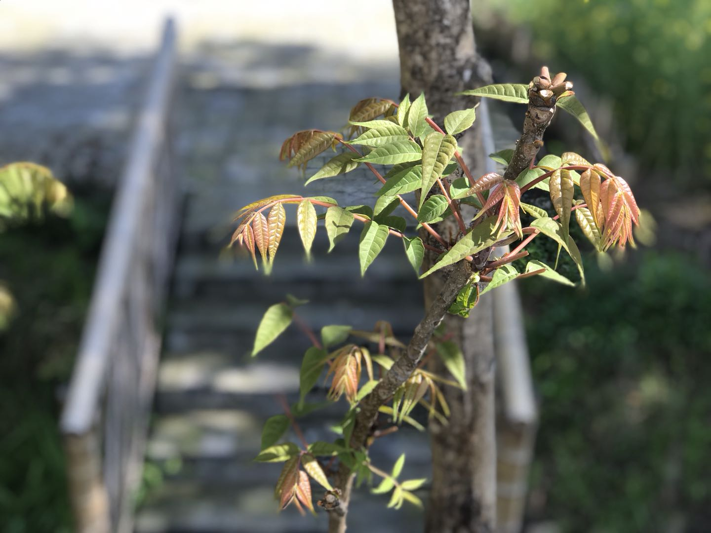
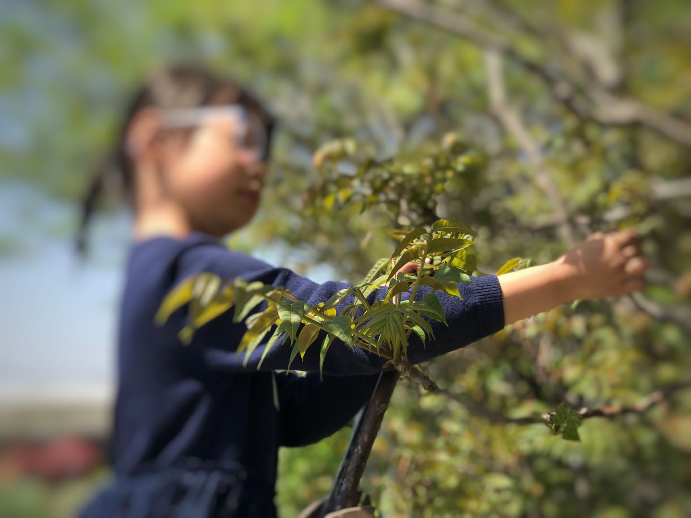
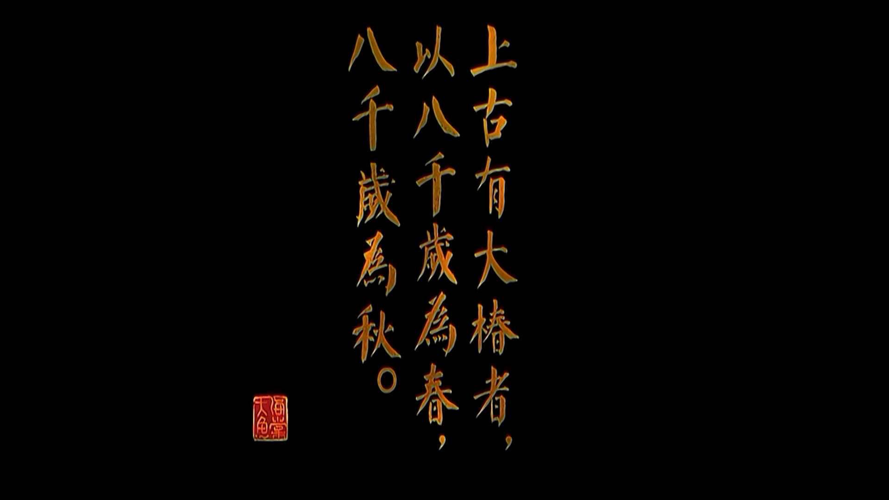

#	乡村的春天和春天的香椿

> 新年都未有芳华，  
> 二月初惊见草芽。  
> 白雪却嫌春色晚，  
> 故穿庭树作飞花。  
> <small>[唐] 韩愈《春雪》</small>

有一种仓鼠叫冬白，随着日照变短，毛色会渐变白。不过，冬天就一定是白色的么？我看未必。

江南很少见白雪皑皑。间或有霜，拂晓还是白茫茫的一片，却也坚持不了多久，待到你能看清时，它便已经模糊了。

儿时的乡村，既是江南，也是「海里」。有明以来，西边镇上的人们就是这么称呼此地以东的。海里位于长江最下游，冲积平原的突出部，是一片向海而生的土地。万千年中，浪奔浪流，西土东渐，至今未休。东村与西镇之间，虽然只有廿里地的距离，却隔着几百年的沧海桑田。依我之见，这里拥有全世界最优质的土壤，适宜种植苹果、香蕉和哈密瓜之外的所有，即使是在冷天，照样不会无所作为。

寒日里生长的青菜，堪称上品。大年初一的油豆腐粉丝炒青菜就白米饭，尽是纯素的搭档，然而滋味不输昨夜的盛宴。屋后的竹，屋前的冬青，不因季节而颓败，院子周边的柏树也是，门口的棕榈亦然。各种的绿，或深或浅，或疏或密，只是不曾无。我在这样的乡下懂得了世间的冷暖，不觉冬去与春来。

立春有时来得比春节迟，有时来得比春节早。正月里的人们，还畏畏葸葸地裹在厚实的棉衣里，趿拉着笨重的蒲鞋。若说这个样子便是春天，我是不信的，更别说那让人瑟瑟发抖的腊月了。春分固定是在阳历的三月，有时是廿日，有时是廿一。太阳的视线在这一天掠过遥远的南回归线，又徐徐地瞄向了北温带。若是天气晴好，下到沟渠里摸上几两田螺也是可以的。布谷布谷的叫声已在耳边，蝉鸣与蛙声渐渐从冰封的记忆里苏醒过来。此时才醒悟春天到了，又未免过于后知后觉。迟钝如我，就这样懵懵懂懂地过了一年又一年。

光阴或可虚度，味道不能辜负。清明前后的香椿芽，气郁芬芳，浓而不腻，是春天的味道无疑。

最嫩的芽，茎连着叶都是紫红的，又沿着叶的脉胳泛出淡淡的青色。小而修长的叶片形似鹅羽，充盈着水分，而边缘微微卷曲，在明暗色彩的衬托下，呈现出小儿肌肤般富有弹性的质感。摘三四片，连着嫩茎揉碎了，凑近了闻一闻，似有草的清新，又有鱼的鲜腥，仿佛还有肉的荦辛。哎，真香！

疏影横斜与暗香浮动，哪样更让人倾倒？我以为还是后者。世上的「香」何止千百种，我不知道该拿什么来比拟香椿。

也许是物以稀为贵，寻常百姓的餐桌上，香樁难得独味。不晓得是从什么时候开始，香椿炒鸡蛋就成了约定俗成的配搭。艾葛是广受好评的大众食材，在饮食界的地位毋庸置疑，大概是觉得用它来打底，对得起香椿的味？我却很不以为然。炒鸡蛋可以配小葱，可以配韭菜，可以配口蘑，可以配番茄，增益彼此的鲜香；唯独配香椿，却是过犹不及。顶级的食材，应该是耐得住寂寞的。香椿焯过之后，拌少许生抽和麻油，足矣。倘若非得要搭点儿什么，那么豆腐是一个不错的选择。

香椿的品级，与采摘的关系极大。小囡摘得的，往往最佳，因为她总寻着最嫩最嫩的芽尖儿掐，全是精华。当这些香椿芽刚从枝头折下，手掌的温度与周遭的氧气还不及渗透的那一刻，以齿为臼，舂而食之，愈发妙不可言。这种最朴素、最自然的加工方式，或许才最能发扬香椿的独特风味。

  
| 图自电影《大鱼海棠》

《逍遥游》中传说，椿的寿命极长久，近乎与天地同寿。人间的香椿，确是一种不可多得的多年生木本蔬菜。香椿树喜光而耐湿，适宜临河而植。我家的香椿，就生长在院周的小河岸边。虽则是一株一株的乔木，栽培了也有十余年，然而高不过一丈，粗不及一握，丝毫没有急着要长大成树的意思。

倘若世事如椿，岂不善哉？
