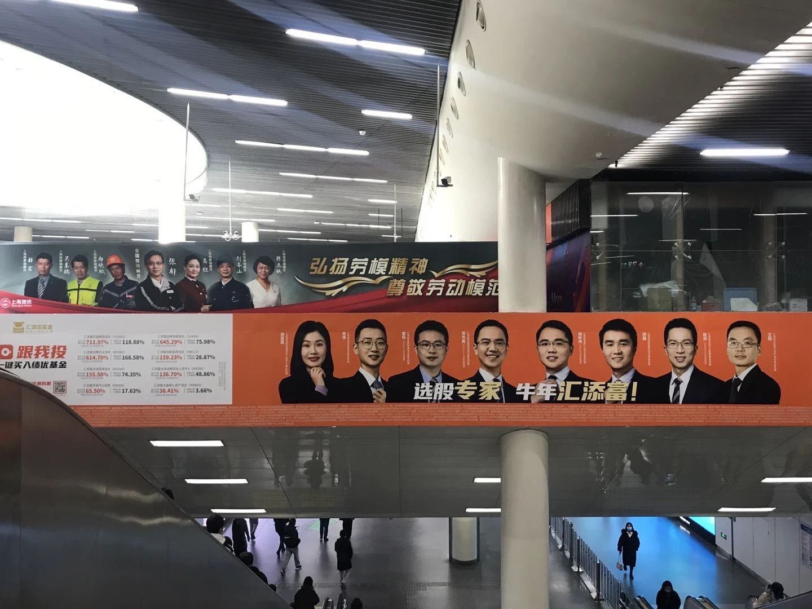
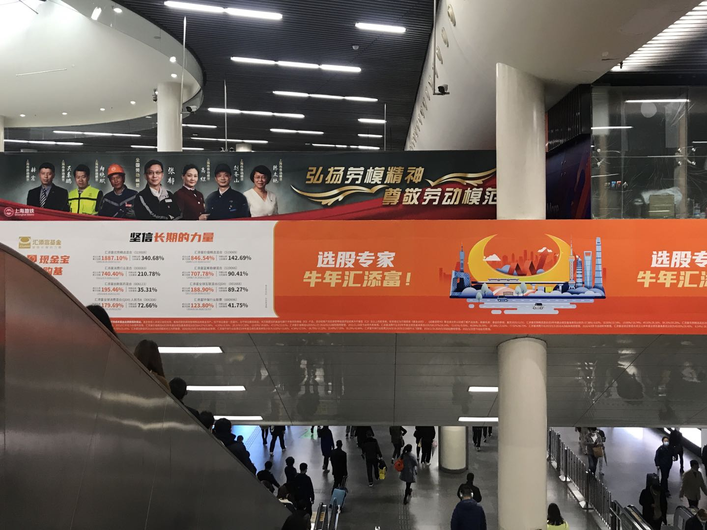

#	谁主沉浮？

放两张自己觉得蛮有意思的照片，附一小段胡思乱想。原本只想写几句话，140 字写不下，才写成一则短文。

  
| 摄于上海地铁人民广场站  
| 2021年3月上旬

两张照片的主角，一望而知，是两条紧挨着的横幅广告。上面这张摄于三月上旬，实际上这个状态保持了有一段时间了，至晚于牛年伊始，就已经是这样了。下面这张是今天刚刚拍的。

单独看第一张照片，意思相当耐人寻味。我们中国人是很讲究的，吃一桌饭，座位要分主次，上一条鱼，头尾须有方向，凡事不能乱了章法。要说这大庭广众的，上上下下会没个谱？

投资是一门高冷的技艺。从业者衣着光鲜，面子也大，自然不在话下。不过从远处着眼，劳动模范和选股专家，孰轻孰重？一目了然。

近年流行一句话，叫做「选择比努力重要」。然而，如果选对了便沾沾自喜，那么对也是错。若是选错了便愤愤不平，更是错上加错。其实不管选择做什么，大家最终多选择了努力，这是当代国人的底色，也是民族复兴的底气。

| 摄于上海地铁人民广场站  
| 2021年3月中旬

两张照片对比着看，就更有意思了。

明日即是春分。虽然阴有小雨，光线暗淡，劳动模范依旧笑春风。而几位选股专家可能自己也有些不好意思，不愿意再抛头露面了。

沿着台阶走下去，两侧是与墙齐高的电子屏幕和灯箱，交替延伸，非常耀眼。行走在五光十色之中，我常常会联想到自己从未到过的纽约时代广场。那里充斥着形形色色的大屏幕，其实都是门户开放的，给钱就能上，而且毕竟是长久的生意，价格也并非贵到涸泽而渔的程度。不过，「登上纽约时代广场大屏幕」依然成了家喻户晓的广告用语，也一度被当成荣誉和实力的象征。或许不用太久，「上海人民广场地铁站的屏幕连廊」，也会在别的国度成为传奇。

几天前，屏幕上还活跃着几张代表基金经理的年青面孔，用手指画出向上的曲线，信誓旦旦地要「用长期业绩说话」。这两天也不说话了，取而代之的是新款的手机广告。

广告从来都要讲究精准投放，把每一分成本花在刀刃上。投放在地铁中的广告，想来他们的目标客户并非传说中的高净值用户。依赖地铁通勤的股民或基民的本金有限，节后股票市场不怎么景气，财富自由的迷梦渐行渐远。剩个大几千，买个手机倒也是个不错的选择。千鸟在林，不如一鸟在手。毕竟，握在手里的幸福，是真实的。